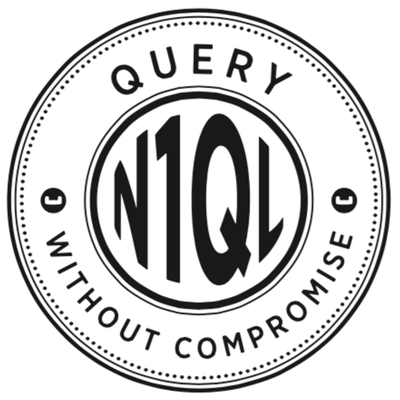

 
 

* Latest: [Query README](https://github.com/couchbase/query/blob/master/README.md)
* Modified: 2015-04-25

## Introduction

This README describes the source code and implementation of the N1QL
query engine and components.

## Goals

The goals of this implementation are:

* Language completeness

* GA code base

* Source code aesthetics
    + Design, object orientation
    + Data structures, algorithms
    + Modularity, readability

## Features

This N1QL implementation provides the following features:

* __Read__
    + __SELECT__
    + __EXPLAIN__

* __DDL__
    + __CREATE / DROP INDEX__
    + __CREATE PRIMARY INDEX__

* __DML__
    + __UPDATE__
    + __DELETE__
    + __INSERT__
    + __UPSERT__
    + __MERGE__

    The ACID semantics of the DML statements have not yet been decided
    or implemented. Nor has the underlying support in Couchbase
    Server. At this time, only the DML syntax and query engine
    processing have been provided.

## Deployment architecture

The query engine is a multi-threaded server that runs on a single
node. When deployed on a cluster, multiple instances are deployed on
separate nodes. This is only for load-balancing and availability. In
particular, the query engine does __not__ perform distributed query
processing, and separate instances do not communicate or interact.

In production, users will have the option of colocating query engines
on KV and index nodes, or deploying query engines on dedicated query
nodes. Because the query engine is highly data-parallel, we have a
goal of achieving good speedup on dedicated query nodes with high
numbers of cores.

The remainder of this document refers to a single instance of the
query engine. At this time, load balancing, availability, and liveness
are external concerns that will be handled later by complementary
components.

## Processing sequence

* __Parse__: Text to algebra. In future, we could also add JSON to
  algebra (e.g. if we add something like JSONiq or the Mongo query
  API).

* __Prepare__: Algebra to plan. This includes index selection.

* __Execute__: Plan to results. When we add prepared statements, this
  phase can be invoked directly on a prepared statement.

## Packages

### Value

The value package implements JSON and non-JSON values, including
delayed parsing. This implementation has measured a 2.5x speedup over
dparval.

Primitive JSON values (boolean, number, string, null) are implemented
as golang primitives and incur no memory or garbage-collection
overhead.

This package also provides collation, sorting, and sets
(de-duplication) over Values.

* __Value__: Base interface.

* __AnnotatedValue__: Can carry attachments and metadata.

* __CorrelatedValue__: Refers and escalates to a parent Value. Used to
  implement subqueries and name scoping.

* __ParsedValue__: Delayed evaluation of parsed values, including
  non-JSON values.

* __MissingValue__: Explicit representation of MISSING values. These
  are useful for internal processing, and can be skipped during final
  projection of results.

* __BooleanValue__, __NumberValue__, __StringValue__, __NullValue__,
  __ArrayValue__, __ObjectValue__: JSON values.

### Errors

The errors package provides a dictionary of error codes and
messages. When fully implemented, the error codes will mirror SQL, and
the error messages will be localizable.

All user-visible errors and warnings should come from this package.

### Expression

The expression package defines the interfaces for all expressions, and
provides the implementation of scalar expressions.

This package is usable by both query and indexing (for computed
indexes).

Expressions are evaluated within a context; this package provides a
default context that can be used by indexing. The context includes a
statement-level timestamp.

Expressions also provide support for query planning and processing;
this includes equivalence testing, constant folding, etc.

The following types of scalar expressions are included:

* arithmetic operators
* CASE
* Collection expressions (ANY / EVERY / ARRAY / FIRST)
* Comparison operators (including IS operators)
* String concat
* Constants (including literals)
* Functions
* Identifiers
* Navigation (fields, array indexing, array slicing)

### Algebra

The algebra package defines the full algebra and AST (abstract syntax
tree) for all N1QL statements (using the expression package for scalar
expressions).

It includes aggregate functions, subquery expressions, parameter
expressions, bucket references, and all the N1QL statements and
clauses.

#### Aggregate functions

* __ARRAY\_AGG(expr)__

* __ARRAY\_AGG(DISTINCT expr)__

* __AVG(expr)__

* __AVG(DISTINCT expr)__

* __COUNT(*)__

* __COUNT(expr)__

* __COUNT(DISTINCT expr)__

* __MAX(expr)__

* __MIN(expr)__

* __SUM(expr)__

* __SUM(DISTINCT expr)__

### Plan

The plan package implements executable representations of
queries. This includes both SELECTs and DML statements.

When we implement prepared statements, they will be represented as
plans and stored as JSON documents or in-memory plan objects.

Plans are built from algebras using a visitor pattern. A separate
planner / optimizer will be implemented for index selection.

Plans include the following operators:

* __Scans__

    * __PrimaryScan__: Scans a primary index.

    * __IndexScan__: Scans a secondary index.

    * __KeyScan__: Does not perform a scan. Directly treats the
      provided keys as a scan.

    * __ValueScan__: Used for the VALUES clause of INSERT and UPSERT
      statements. Treats the provided values as the result of a scan.

    * __DummyScan__: Used for SELECTs with no FROM clause. Provides a
      single empty object as the result of a scan.

    * __CountScan__: Used for SELECT COUNT(*) FROM bucket-name. Treats
      the bucket size as the result of a scan, without actually
      performing a full scan of the bucket.

    * __IntersectScan__: A container that scans its child scanners and
      intersects the results. Used for scanning multiple secondary
      indexes concurrently for a single query.

* __Fetch__

* __Joins__

    * __Join__

    * __Nest__

    * __Unnest__

* __Filter__

* __Group__: To enable data-parallelism, grouping is divided into
  three phases. The first two phases can each be executed in a
  data-parallel fashion, and the final phase merges the results.

    * __InitialGroup__: Initial phase.

    * __IntermediateGroup__: Cumulate intermediate results. This phase
      can be chained.

    * __FinalGroup__: Compute final aggregate results.

* __Other SELECT operators__

    * __Project__

    * __Distinct__

    * __Order__

    * __Offset__

    * __Limit__

    * __Let__

    * __UnionAll__: Combine the results of two queries. For UNION, we
      perform UNION ALL followed by DISTINCT.

* __Framework operators__

    * __Collect__: Collect results into an array. Used for subqueries.

    * __Discard__: Discard results.

    * __Stream__: Stream results out. Used for returning results.

    * __Parallel__: A container that executes multiple copies of its
      child operator in parallel. Used for all data-parallelism.

    * __Sequence__: A container that chains its children into a
      sequence. Used for all execution pipelining.

* __DML operators__

    * __SendDelete__

    * __SendInsert__

    * __Set__: Used for UPDATE.

    * __Unset__: Used for UPDATE.

    * __Clone__: Used for UPDATE. Clones data values so that UPDATEs
      read original values and mutate a clone.

    * __SendUpdate__

    * __Merge__

### Execution

The execution package implements query execution. The objects in this
package mirror those in the plan package, except that these are the
running instances.

Golang channels are used extensively to implement concurrency and
signaling.

#### Subquery execution

The __Context__ object supports subquery execution. It performs
planning, execution, and collection of subquery results. It also
performs plan and result caching for uncorrelated subqueries.

### Datastore

The datastore package defines the interface to the underlying database
server.

Some key differences from the previous datastore API (previously
catalog API):

* DML support

* Use of channels for error handling and stop signaling

* Generalized index interface that supports any combination of hash
  and range indexing

### Parser

This package will contain the parser and lexer.

### Server

This package will contain the main engine executable and listener.

### Clustering

This package defines the interface to the underlying cluster management
system.

It provides a common abstraction for cluster management, including
configuration of and the lifecycle of a cluster.

### Accounting

This package will contain the interface to workload tracking and
monitoring. Accounting data can cover metrics, statistics, event 
and potentially log data.

It provides a common abstraction for recording accounting data and
services over accounting data.

### Shell

This package will contain the client command-line shell.

### Sort

This package provides a parallel sort. It was copied from the Golang
source and basic parallelism was added, but it has not been
fine-tuned.

### cbq

This package provides a client library that will be used by the
command-line shell to encapsulate cluster-awareness and other
connectivity concerns.

The library will implement the standard golang database APIs at
[database/sql](http://golang.org/pkg/database/sql/) and
[database/sql/driver](http://golang.org/pkg/database/sql/driver/).

The library will connect using the [Query REST
API](http://goo.gl/ezpmVx) and the [Query Clustering
API](http://goo.gl/yKZ6v5).

## Data parallelism

The query engine is designed to be highly data-parallel. By
data-parallel, we mean that individual stages of the execution
pipeline are parallelized over their input data. This is in addition
to the parallelism achieved by giving each stage its own goroutine.

Below, N1QL statement execution pipelines are listed, along with the
data-parallelization and serialization points.

### SELECT

1. Scan
1. __Parallelize__
1. Fetch
1. Join / Nest / Unnest
1. Let (Common subexpressions)
1. Where (Filter)
1. GroupBy: Initial
1. GroupBy: Intermediate
1. __Serialize__
1. GroupBy: Final
1. __Parallelize__
1. Letting (common aggregate subexpressions)
1. Having (aggregate filtering)
1. __Serialize__
1. Order By (Sort)
1. __Parallelize__
1. Select (Projection)
1. __Serialize__
1. Distinct (De-duplication)
1. Offset (Skipping)
1. Limit

### INSERT

1. Scan
1. __Parallelize__
1. SendInsert
1. Returning (Projection)

### DELETE

1. Scan
1. __Parallelize__
1. Fetch
1. Let (Common subexpressions)
1. Where (Filter)
1. __Serialize__
1. Limit
1. __Parallelize__
1. SendDelete
1. Returning (Projection)

### UPDATE

1. Scan
1. __Parallelize__
1. Fetch
1. Let (Common subexpressions)
1. Where (Filter)
1. __Serialize__
1. Limit
1. __Parallelize__
1. Clone
1. Set / Unset
1. SendUpdate
1. Returning (Projection)

## Build

The N1QL query engine build is part of the [couchbase cluster build](https://github.com/couchbase/tlm).

