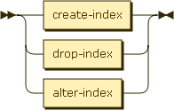
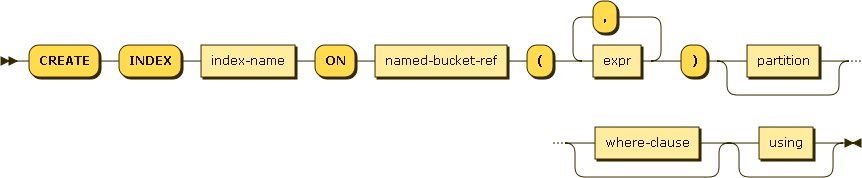
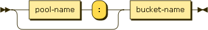
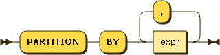

# N1QL&mdash;Query Language for N1NF (Non-1st Normal Form): DDL

* Status: DRAFT/PROPOSAL
* Latest: [n1ql-ddl](https://github.com/couchbaselabs/query/blob/master/docs/n1ql-ddl.md)
* Modified: 2014-11-17

## Summary

N1QL is a query language for Couchbase, and is a continuation of
[UNQL](https://github.com/couchbaselabs/tuqqedin/blob/master/docs/unql-2013.md).
This document builds on the [N1QL
Select](https://github.com/couchbaselabs/query/blob/master/docs/n1ql-select.md),
[N1QL
DML](https://github.com/couchbaselabs/query/blob/master/docs/n1ql-dml.md),
and [N1QL
Logic](https://github.com/couchbaselabs/query/blob/master/docs/n1ql-logic.md)
specs.

This document describes the syntax and semantics of the DDL statements
in the language.

ddl-stmt:

## Indexes

Indexes always use **case-insensitive** matching to match field names
and paths.

Index names are unique per bucket.

__index-stmt:__

__create-primary-index:__

__create-index:__

_index-name:_

_bucket-spec:_

bucket-name:

_partition:_

_where-clause:_

_using:_

__drop-index:__

__alter-index:__

## About this Document

The
[grammar](https://github.com/couchbaselabs/query/blob/master/docs/n1ql-ddl.ebnf)
forming the basis of this document is written in a [W3C dialect of
EBNF](http://www.w3.org/TR/REC-xml/#sec-notation).

This grammar has not yet been converted to an actual implementation,
ambiguities and conflicts may still be present.

Diagrams were generated by [Railroad Diagram
Generator](http://railroad.my28msec.com/) 

### Document History

* 2013-07-30 - Initial checkin
* 2014-06-18 - Syntax updates
* 2014-06-24 - Bucket spec
    * Factor out bucket spec in syntax diagrams
* 2014-06-24 - named-bucket-ref
    * Renamed bucket-spec to named-bucket-ref
    * Factored out index-name
* 2014-06-24 - CREATE INDEX
    * Added WHERE clause to CREATE INDEX
* 2014-09-08 - CREATE PRIMARY INDEX
    * Added CREATE PRIMARY INDEX
* 2014-11-17 - DROP PRIMARY INDEX
    * Added DROP PRIMARY INDEX
* 2014-11-17 - ALTER INDEX
    * Removed ALTER INDEX (not currently in scope)

### Open Issues

This meta-section records open issues in this document, and will
eventually disappear.
