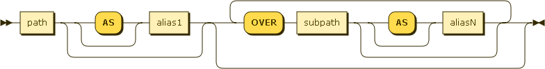

# N1QL&mdash;Query Language for N1NF (Non-1st Normal Form): DML

* Status: DRAFT/PROPOSAL
* Latest: [n1ql-dml](https://github.com/couchbaselabs/query/blob/master/docs/n1ql-dml.md)
* Modified: 2013-07-07

## Summary

N1QL is a query language for Couchbase, and is a continuation of
[UNQL](https://github.com/couchbaselabs/tuqqedin/blob/master/docs/unql-2013.md).
This document builds on the [N1QL Select
spec](https://github.com/couchbaselabs/query/blob/master/docs/n1ql-select.md).

This document describes the syntax and semantics of the DML statements in the language.

## Datasets

N1QL DML statements allow for mutations of entire documents, and of
fragments within documents.  As such, N1QL DML statements use
path-based datasets to identify the data to be mutated.  The dataset
can be as simple as a bucket name, in which case entire documents will
be mutated; or as complex as a nested path within each document, in
which case the actual document fragments identified by the nested path
will be mutated within each document.

dataset:

## UPDATE

The UPDATE statement has the additional ability to UNSET fields, which
removes the entire field, including its name, from the containing
object.

update:

## DELETE

The DELETE statement can delete entire documents or fragments within
documents.  However, when deleting fragments, the DELETE statement
does not UNSET fields in the containing object.  Array-valued fields
are left as empty arrays, and scalar-valued fields are set to NULL.
In other words, DELETE is always schema-safe for containing objects
(unless NULL is a schema violation).

delete:

## INSERT-VALUES

INSERT-VALUES inserts documents or fragments specified in its VALUES
clause.

If the dataset identifies a bucket, each expr in VALUES is inserted as
a new document in that bucket.

If the dataset identifies a path within documents, the expr VALUES are
evaluated in the context of each document and inserted as fragments at
that location within each matching document.

insert-values:

## INSERT-SELECT

INSERT-SELECT is currently limited to bucket-scope inserts of full
documents.  This is to prevent users from inadvertently running
correlated subqueries.

insert-select:

## About this Document

The
[grammar](https://github.com/couchbaselabs/query/blob/master/docs/n1ql-select.ebnf)
forming the basis of this document is written in a [W3C dialect of
EBNF](http://www.w3.org/TR/REC-xml/#sec-notation).

This grammar has not yet been converted to an actual implementation,
ambiguities and conflicts may still be present.

Diagrams were generated by [Railroad Diagram
Generator](http://railroad.my28msec.com/) 

### Document History

* 2013-07-07 - Initial checkin
    * UPDATE, DELETE, INSERT-VALUES, and INSERT-SELECT
    * Datasets
    * WHERE clauses in INSERT statements
    * RETURNING clauses

### Open Issues

This meta-section records open issues in this document, and will
eventually disappear.

1.  DELETE of array-terminated paths deletes elements inside the
array, potentially leaving an empty containing array.  DELETE of
scalar-terminated paths sets the field to NULL.  Is this consistent?

1.  INSERT into array-terminated paths inserts into the array; INSERT
into scalar-terminated paths converts the field to an array.  Should
it be disallowed instead?  DELETE and INSERT should behave somewhat
inversely, and certainly predictably and intuitively.
