# N1QL&mdash;Query Language for N1NF (Non-1st Normal Form): Logic

* Status: DRAFT/PROPOSAL
* Latest: [n1ql-logic](https://github.com/couchbaselabs/query/blob/master/docs/n1ql-logic.md)
* Modified: 2013-07-14

## Summary

N1QL is a query language for Couchbase, and is a continuation of
[UNQL](https://github.com/couchbaselabs/tuqqedin/blob/master/docs/unql-2013.md).
This document builds on the [N1QL Select
spec](https://github.com/couchbaselabs/query/blob/master/docs/n1ql-select.md)
and the [N1QL DML
spec](https://github.com/couchbaselabs/query/blob/master/docs/n1ql-dml.md).

This document describes the syntax and semantics of the logic
statements in the language.  These are sometimes called procedural or
compound statements in other datqbase systems.  DDL for stored
programs (procedures and functions) is defined in a separate spec.

N1QL logic statements can be submitted directly or embedded in stored
programs.

## Motivation

There are several reasons for providing these logic capabilities in
the query language:

* Application developers sometimes want to push logic and processing
  down into the database.  This could be to reduce network traffic, to
  leverage database hardware, and to avoid complexities and risks of
  managing connections, connectivity, etc.
* We could (and might) also embed host languages in the database
  server to get similar logic capabilities.  However, application
  developers would still be left with the impedance mismatches between
  the query language and the host language (our host language bindings
  might mitigate this).  By providing logic statements in the query
  language, it is very natural and convenient for application
  developers to combine queries and logic.
* These capabilities are well validated.  All major database systems
  provide logic capabilities that are actively used.
* N1QL borrows features from [The Go Programming
  Language](http://golang.org) and other newer programming languages.
  These features distinguish N1QL from other procedural database
  languages.

## Data types

N1QL logic is similar to RDBMS stored procedure languages and to 3GL
application programming languages such as C, Java, and Python.  As
such, N1QL has a type system.

In N1QL logic, variables are strongly but dynamically typed.  This
means that variables aren't tied to specific data types, but runtime
values do have specific data types.

The N1QL runtime data types are:

* JSON value (primitive, object, or array)
* Blob (uninterpreted and / or encoded byte sequence)
* Channel (golang-style message-passing concurrency construct)
* Prepared (prepared statement)
* Cursor (bound, open, fetchable cursor)
* Range (golang- and python-style iterable numeric range)
* Function / closure???? (TBD)

N1QL aims to be more streamlined than other database procedural
languages by treating prepared statements, cursors, ranges (and
possibly functions) as first-class data types that can be used in
expressions, assignments, function calls, etc.  This reduces the need
for special syntax.

## Termination

N1QL statements are terminated by an optional semicolon or a newline
(similar to golang). A semicolon termination is explicit. If the
semicolon is omitted and a newline appears where a statement could
end, the semicolon is inferred and the statement is concluded.

terminated-stmt:

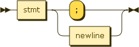

## Blocks

Blocks introduce variable and namespace scope and masking.

block:

## Statement types

N1QL logic supports several types of statements.

stmt:

#### Expressions

Several statements below use *mexpr* and *lexpr*:

* *mexpr*: all in-memory expression types (all expressions excluding
  cursors or other objects which retain network or other non-memory
  dependencies or resources)
* *lexpr*: all expression types in N1QL logic, including mexpr and
  cursor.

Mexpr and lexpr are specified later in this document, under
"Expressions".

### Begin

A BEGIN statement creates an explicit block.

begin:

### Declare

A DECLARE statement explicitly declares one or more variables in the
current scope, and optionally initialize them.  Like golang, multiple
variables are supported.

decl:

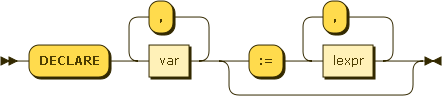

var:

### Initializer

An initializer statement implicitly declares one or more variables in
the current scope, and always initializes them.  An initializer cannot
be used to shadow or mask a name that is already visible in the
current scope.  Like golang, multiple variables are supported.

init:

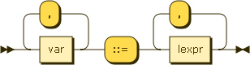

### Assignment

An assignment statement assigns values to one or more variables that
have already been declared.  Like golang, multiple variables are
supported.

assign:

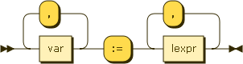

### Send

A send statement is a golang-style send to a channel.

sendop:

### Unset

Unset removes a field name and value from an object or map.

unset:

## Control flow statements

ctrl:

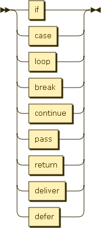

### If

This is the standard IF-THEN-ELSEIF-ELSE form.

if:

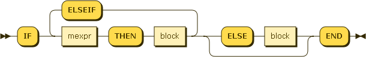

### Case

There are 2 forms of the CASE statement.

case:

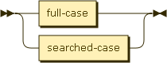

#### Full case

Full-case is equivalent to IF-THEN-ELSEIF-ELSE.

full-case:

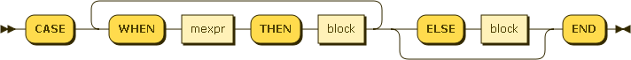

#### Searched case

Searched-case is equivalent to a SWITCH statement in C / C++ / Java /
Go.

searched-case:

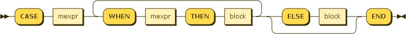

### Loops

loop:

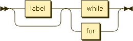

for:

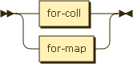

### While

This is a standard WHILE loop.

while:

### For (over iterables)

This form of FOR loop iterates over iterable expressions (e.g. arrays,
ranges) and cursors (queries and EXECUTEs).  It is a runtime error if
the argument does not evaluate to an iterable expression or cursor.

for-iter:

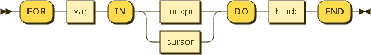

### For (over maps and objects)

This form of FOR loop iterates over maps and JSON objects.  It is a
runtime error if the mexpr does not evaluate to a map or JSON object.

for-map:

key-var:

val-var:

### Break

The BREAK statement exits a loop, which may be labeled (e.g. when
exiting an outer loop).

break:

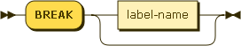

### Continue

The CONTINUE statement jumps to the next iteration of a loop, which
may be labeled (e.g. when continuing an outer loop).

continue:

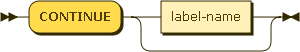

### Pass

A PASS statement does nothing; it is a noop. It is useful in places
where at least one statement is required (e.g. in blocks).  PASS is
borrowed from Python.  A NULL expression can also be used to
equivalent effect.

pass:

### Return

A RETURN statement returns from the current function or procedure,
optionally setting the values of the return variables.  It is an error
if there is no current function or procedure (e.g. in a standalone
BEGIN block).

return:

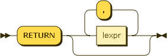

### Deliver

DELIVER is a concurrency construct borrowed from golang.  It randomly
selects a send or receive operation and performs it, or blocks until
an operation is available.  DELIVER is called SELECT in golang.

deliver:

commop:

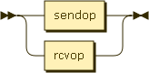

#### Send op

Send to a channel.

sendop:

#### Receive op

Receive from a channel. The optional second variable is for status.

rcvop:

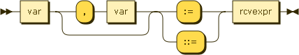

## Expressions

N1QL Logic uses a superset of the expressions used by N1QL Select and
N1QL DML.

### Memory expressions

Memory expressions include all expressions that don't retain
non-memory dependencies or resources.

mexpr:

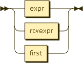

#### Receive expr

Receive a value and optional status from a channel.

rcvexpr:

#### First

FIRST returns the first result of a cursor.

FIRST is equivalent to the SQL constructs SELECT ... INTO and UPDATE /
INSERT / DELETE ... RETURNING INTO.  N1QL aims to be more streamlined
by defining an expression instead of alternate syntax for query
statements.

If the cursor returns an empty result set, the FIRST evaluates to
NULL.

first:

### Logic expressions

Logic expressions encompass all expression types in N1QL Logic.

lexpr:

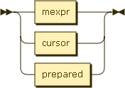

#### Prepare

PREPARE evaluates to a prepared statement.  Its argument may be a
query or a string-valued mexpr.  In either case, a special syntax is
used to identify embedded query parameters.

The arguments to USING introduce names to be used as query parameters.

prepare:

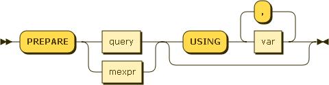

#### Cursor

A cursor expression is either a direct query or an EXECUTE, both of
which evaluate to a logical cursor.

cursor:

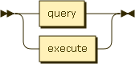

query:

#### Execute

The argument to EXECUTE must evaluate to a prepared statement
(e.g. the result of a PREPARE) or a string.

The arguments to USING are bound to the query parameters.

execute:

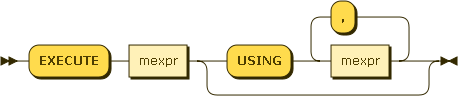

## About this Document

The
[grammar](https://github.com/couchbaselabs/query/blob/master/docs/n1ql-logic.ebnf)
forming the basis of this document is written in a [W3C dialect of
EBNF](http://www.w3.org/TR/REC-xml/#sec-notation).

This grammar has not yet been converted to an actual implementation,
ambiguities and conflicts may still be present.

Diagrams were generated by [Railroad Diagram
Generator](http://railroad.my28msec.com/) 

### Document History

* 2013-07-13 - Initial checkin
    * Logic inspired by RDBMS stored procedures, and by [The Go
      Programming Language](http://golang.org).
* 2013-07-14 - First meaningful (non-stub) checkin
    * Logic inspired by RDBMS stored procedures, and by [The Go
      Programming Language](http://golang.org).
* 2013-07-14 - Cosmetics
    * Typos, wording.

### Open Issues

This meta-section records open issues in this document, and will
eventually disappear.

1. Should we provide first-class functions and closures?  Likely yes.

1. Should EXECUTE ... USING accept values, name=value pairs, or both?

1. Do we need syntax for embedded query parameters in PREPARE
   expressions, e.g. a leading colon (:)?
