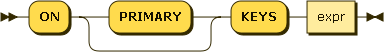
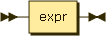

# N1QL Query Language&mdash;SELECT

* Status: DRAFT
* Latest: [n1ql-select](https://github.com/couchbaselabs/query/blob/master/docs/n1ql-select.md)
* Modified: 2014-10-17

## Introduction

N1QL (pronounced "nickel") is the query language from Couchbase. N1QL
aims to meet the query needs of distributed document-oriented
databases. This document specifies the syntax and semantics of the
SELECT statement in N1QL.

*N1QL* stands for Non-1st Query Language. The name reflects the fact
that the Couchbase document-oriented data model is based on [Non-1st
Normal Form
(N1NF)](http://en.wikipedia.org/wiki/Database_normalization#Non-first_normal_form_.28NF.C2.B2_or_N1NF.29).

## SELECT syntax

The syntax of the SELECT statement is as follows.

### SELECT statement

_select:_

_set-op:_

In N1QL, SELECT statements can begin with either SELECT or FROM. The
behavior is the same in either case.

_subselect:_

_select-from:_

_from-select:_

### SELECT clause

_select-clause:_

_result-expr:_

_path:_

_alias:_

### FROM clause

_from-clause:_

_from-term:_

_from-path:_

_namespace:_

_use-keys-clause:_

_join-clause:_

_join-type:_

_on-keys-clause:_

_nest-clause:_

_unnest-clause:_

### LET clause

_let-clause:_

### WHERE clause

_where-clause:_

_cond:_

### GROUP BY clause

_group-by-clause:_

_letting-clause:_

_having-clause:_

### UNION, INTERSECT, and EXCEPT

_set-op:_

UNION, INTERSECT, and EXCEPT are used to combine results from multiple
sub-selects.

UNION returns values from the first sub-select and from the second
sub-select.

INTERSECT returns values from the first sub-select that are
__present__ in the second sub-select.

EXCEPT returns values from the first sub-select that are __absent__
from the second sub-select.

UNION, INTERSECT, and EXCEPT return distinct results, such that there
are no duplicates.

UNION ALL, INTERSECT ALL, and EXCEPT ALL return all applicable values,
including duplicates. These forms are faster, because they do not
compute distinct results.

### ORDER BY clause

_order-by-clause:_

_ordering-term:_

### LIMIT clause

_limit-clause:_

### OFFSET clause

_offset-clause:_

## SELECT processing

The behavior of a SELECT query is best understood as a sequence of
steps. Output objects from each step become input objects to the next
step. The result of a SELECT is an array containing zero or more
result objects.

1.  Data sourcing - the data source in the FROM clause describes which
    objects become the input source for the query

1.  Filtering - result objects are filtered by the WHERE clause, if
    present

1.  Result object generation - result objects are generated from GROUP
    BY and HAVING clauses and the result expression list

1.  Duplicate removal - if DISTINCT is specified, duplicate result
    objects are removed

1.  Ordering - if ORDER BY is specified, the results are sorted
    according to the ordering terms

1.  Offsetting - if OFFSET is specified, the specified number of
    results are skipped

1.  Limiting - if LIMIT is specified, the results are limited to the
    given number

## FROM clause

The FROM clause defines the data sources and input objects for the
query.

Every FROM clause specifies one or more keyspaces (buckets). The first
keyspace is called the primary keyspace.

_from-clause:_

_from-term:_

_from-path:_

_pool-name:_

_use-keys-clause:_

_join-clause:_

_join-type:_

_on-keys-clause:_

_nest-clause:_

_unnest-clause:_

The following sections discuss various elements of the FROM
clause. These elements can be combined.

### Omitted

If the FROM clause is omitted, the data source is equivalent to an
array containing a single empty object. This allows you to evaluate
expressions that do not depend on stored data.

Evaluating an expression:

        SELECT 10 + 20

=>

        [ { "$1" : 30 } ]

Counting the number of inputs:

        SELECT COUNT(*) AS input_count

=>

        [ { "input_count" : 1 } ]

Getting the input contents:

        SELECT *

=>

        [ { } ]

### Keyspaces (buckets)

The simplest type of FROM clause specifies a keyspace (bucket):

        SELECT * FROM customer

This returns every value in the _customer_ keyspace.

The keyspace can be prefixed with an optional namespace (pool):

        SELECT * FROM main:customer

This queries the _customer_ keyspace in the _main_ namespace.

If the namespace is omitted, the default namespace in the current
session is used.

### Keys

Specific primary keys within a keyspace (bucket) can be
specified. Only values having those primary keys will be included as
inputs to the query.

To specify a single key:

        SELECT * FROM customer USE KEYS "acme-uuid-1234-5678"

To specify multiple keys:

        SELECT * FROM customer USE KEYS [ "acme-uuid-1234-5678", "roadster-uuid-4321-8765" ]

In the FROM clause of a subquery, USE KEYS is mandatory for the
primary keyspace.

### Nested paths

Nested paths can be specified. For each document in the keyspace, the
path is evaluated and its value becomes an input the query. For a
given document, if any element of the path is NULL or MISSING, that
document is skipped and does not contribute any inputs to the query.

If some customer documents contain a _primary\_contact_ object, the
following query can retrieve them:

        SELECT * FROM customer.primary_contact

=>

        [
            { "name" : "John Smith", "phone" : "+1-650-555-1234", "address" : { ... } },
            { "name" : "Jane Brown", "phone" : "+1-650-555-5678", "address" : { ... } }
        ]

Nested paths can have arbitrary depth and can include array
subscripts.

        SELECT * FROM customer.primary_contact.address

=>

        [
            { "street" : "101 Main St.", "zip" : "94040" },
            { "street" : "3500 Wilshire Blvd.", "zip" : "90210" }
        ]

### Joins

Joins allow you to create new input objects by combining two or more
source objects. For example, if our _customer_ objects were:

        {
            "name": ...,
            "primary_contact": ...,
            "address": [ ... ]
        }

And our _invoice_ objects were:

        {
            "customer_key": ...,
            "invoice_date": ...,
            "invoice_item_keys": [ ... ],
            "total": ...
        }

And the FROM clause was:

        FROM invoice inv JOIN customer cust ON KEYS inv.customer_key

Then each joined object would be:

        {
            "inv" : {
                "customer_key": ...,
                "invoice_date": ...,
                "invoice_item_keys": [ ... ],
                "total": ...
            },
            "cust" : {
                "name": ...,
                "primary_contact": ...,
                "address": [ ... ]
            }
        }

If our _invoice_item_ objects were:

        {
            "invoice_key": ...,
            "product_key": ...,
            "unit_price": ...,
            "quantity": ...,
            "item_subtotal": ...
        }

And the FROM clause was:

        FROM invoice JOIN invoice_item item ON KEYS invoice.invoice_item_keys

Then our joined objects would be:

        {
            "invoice" : {
                "customer_key": ...,
                "invoice_date": ...,
                "invoice_item_keys": [ ... ],
                "total": ...
            },
            "item" : {
                "invoice_key": ...,
                "product_key": ...,
                "unit_price": ...,
                "quantity": ...,
                "item_subtotal": ...
            }
        },
        {
            "invoice" : {
                "customer_key": ...,
                "invoice_date": ...,
                "invoice_item_keys": [ ... ],
                "total": ...
            },
            "item" : {
                "invoice_key": ...,
                "product_key": ...,
                "unit_price": ...,
                "quantity": ...,
                "item_subtotal": ...
            }
        },
        ...

ON KEYS is required after each JOIN. It specifies the primary keys for
the second keyspace (bucket) in the join.

Joins can be chained.

By default, an INNER join is performed. This means that for each
joined object produced, both the left and right hand source objects
must be non-missing and non-null.

If LEFT or LEFT OUTER is specified, then a left outer join is
performed. At least one joined object is produced for each left hand
source object. If the right hand source object is NULL or MISSING,
then the joined object's right-hand side value is also NULL or MISSING
(omitted), respectively.

### Unnests

If a document or object contains a nested array, UNNEST conceptually
performs a join of the nested array with its parent object. Each
resulting joined object becomes an input to the query.

If some customer documents contain an array of addresses under the
_address_ field, the following query retrieves each nested address
along with the parent customer's name.

        SELECT c.name, a.* FROM customer c UNNEST c.address a

=>

        [
            { "name" : "Acme Inc.", "street" : "101 Main St.", "zip" : "94040" },
            { "name" : "Acme Inc.", "street" : "300 Broadway", "zip" : "10011" },
            { "name" : "Roadster Corp.", "street" : "3500 Wilshire Blvd.", "zip" : "90210" },
            { "name" : "Roadster Corp.", "street" : "4120 Alamo Dr.", "zip" : "75019" }
        ]

The first path element after each UNNEST must reference some preceding
path.

Unnests can be chained.

By default, an INNER unnest is performed. This means that for each
result object produced, both the left and right hand source objects
must be non-missing and non-null.

If LEFT or LEFT OUTER is specified, then a left outer unnest is
performed. At least one result object is produced for each left hand
source object. If the right hand source object is NULL, MISSING,
empty, or a non-array value, then the result object's right-hand side
value is MISSING (omitted).

### Nests

Nesting is conceptually the inverse of unnesting. Nesting performs a
join across two keyspaces (or a keyspace with itself). But instead of
producing a cross-product of the left and right hand inputs, a single
result is produced for each left hand input, while the corresponding
right hand inputs are collected into an array and nested as a single
array-valued field in the result object.

Recall our _invoice_ objects:

        {
            "customer_key": ...,
            "invoice_date": ...,
            "invoice_item_keys": [ ... ],
            "total": ...
        }

And our _invoice_item_ objects:

        {
            "invoice_key": ...,
            "product_key": ...,
            "unit_price": ...,
            "quantity": ...,
            "item_subtotal": ...
        }

If the FROM clause was:

        FROM invoice inv NEST invoice_item items ON KEYS inv.invoice_item_keys

The results would be:

        {
            "invoice" : {
                "customer_key": ...,
                "invoice_date": ...,
                "invoice_item_keys": [ ... ],
                "total": ...
            },
            "items" : [
                {
                    "invoice_key": ...,
                    "product_key": ...,
                    "unit_price": ...,
                    "quantity": ...,
                    "item_subtotal": ...
                },
                {
                    "invoice_key": ...,
                    "product_key": ...,
                    "unit_price": ...,
                    "quantity": ...,
                    "item_subtotal": ...
                }
            ]
        },
        {
            "invoice" : {
                "customer_key": ...,
                "invoice_date": ...,
                "invoice_item_keys": [ ... ],
                "total": ...
            },
            "items" : [
                {
                    "invoice_key": ...,
                    "product_key": ...,
                    "unit_price": ...,
                    "quantity": ...,
                    "item_subtotal": ...
                },
                {
                    "invoice_key": ...,
                    "product_key": ...,
                    "unit_price": ...,
                    "quantity": ...,
                    "item_subtotal": ...
                }
            ]
        },
        ...

Nests can be chained with other nests, joins, and unnests.

By default, an INNER nest is performed. This means that for each
result object produced, both the left and right hand source objects
must be non-missing and non-null.

If there is no matching right hand source object, then the right hand
source object is as follows:

* If the ON KEYS expression evaluates to MISSING, the right hand value
  is also MISSING
* If the ON KEYS expression evaluates to NULL, the right hand value is
  MISSING
* If the ON KEYS expression evaluates to an array, the right hand
  value is an empty array
* If the ON KEYS expression evaluates to a non-array value, the right
  hand value is an empty array

If LEFT or LEFT OUTER is specified, then a left outer nest is
performed. One result object is produced for each left hand source
object.

The right hand result of NEST is always an array or MISSING.

### Arrays

If an array occurs along a path, the array may be subscripted to
select one element.

Array values - for each customer, the entire _address_ array is
selected:

        SELECT a FROM customer.address a

=>

        [
            {
                "a": [
                          { "street" : "101 Main St.", "zip" : "94040" },
                          { "street" : "300 Broadway", "zip" : "10011" }
                      ]
            },
            {
                "a": [
                          { "street" : "3500 Wilshire Blvd.", "zip" : "90210" },
                          { "street" : "4120 Alamo Dr.", "zip" : "75019" }
                      ]
            }
        ]

Subscripting - for each customer, the first element of the _address_
array is selected:

        SELECT * FROM customer.address[0]

=>

        [
            { "street" : "101 Main St.", "zip" : "94040" },
            { "street" : "3500 Wilshire Blvd.", "zip" : "90210" }
        ]

## WHERE clause

_where-clause:_

_cond:_

If a WHERE clause is specified, the input objects are filtered
accordingly. The WHERE condition is evaluated for each input object,
and only objects evaluating to TRUE are retained.

## GROUP BY clause

_group-by-clause:_

_letting-clause:_

_having-clause:_

### HAVING

## SELECT clause

_select-clause:_

_result-expr:_

_path:_

_alias:_

### DISTINCT

## ORDER BY clause

_order-by-clause:_

_ordering-term:_

If no ORDER BY clause is specified, the order in which the result
objects are returned is undefined.

If an ORDER BY clause is specified, the order of items in the result
array is determined by the ordering expressions.  Objects are first
sorted by the left-most expression in the list.  Any items with the
same sort value are then sorted by the next expression in the list.
This is repeated to break tie sort values until the end of the
expression list is reached.  The order of objects with the same sort
value for each sort expression is undefined.

As ORDER BY expressions can evaluate to any JSON value, we define an
ordering when comparing values of different types.  The following list
describes the order by type (from lowest to highest):

* missing value
* null
* false
* true
* number
* string (string comparison is done using a raw byte collation of UTF8
  encoded strings)
* array (element by element comparison is performed until the end of
  the shorter array; if all the elements so far are equal, then the
  longer array sorts after)
* object (larger objects sort after; for objects of equal length,
  name/value by name/value comparison is performed; names are examined
  in sorted order using the normal ordering for strings)

## OFFSET clause

_offset-clause:_

An OFFSET clause specifies a number of objects to be skipped. If a
LIMIT clause is also present, the OFFSET is applied prior to the
LIMIT.  The OFFSET value must be a non-negative integer.

## LIMIT clause

_limit-clause:_

A LIMIT clause imposes an upper bound on the number of objects
returned by the SELECT statement.  The LIMIT value must be a
non-negative integer.

## Expressions

_expr:_

### Literals

The specification for literals can be found in an Appendix.

### Identifier

_identifier:_

An identifier can either be escaped or unescaped.  Unescaped
identifiers cannot support the full range of idenfiers allowed in a
JSON document, but do support the most common ones with a simpler
syntax.  Escaped identifiers are surrounded with backticks and support
all identifiers allowed in JSON.  Using the backtick character within
an escaped identifier can be accomplised by using two consecutive
backtick characters.

Keywords cannot be escaped; therefore, escaped identifiers can overlap
with keywords.

_unescaped-identifier:_

_escaped-identifier:_

An identifier is a symbolic reference to a particular value in the
current context.

If the current context is the document:

    {
        "name": "n1ql"
    }

Then the identifier _name_ would evaluate to the value n1ql.

#### Case-sensitivity of identifiers

Identifiers in N1QL are __case-sensitive.__

### Nested

nested-expr:

Nested expressions support using the dot (`.`) operator to access
fields nested inside of other objects as well as using the bracket
notation (`[position]` or `[start:end?]`) to access elements inside an
array.

Consider the following object:

    {
      "address": {
        "city": "Mountain View"
      },
      "revisions": [2013, 2012, 2011, 2010]
    }

 The expression `address.city` evalutes to the value `"Mountain View"`.

 The expression `revisions[0]` evaluates to the value `2013`.

#### Array slicing

The form `source-array [ start : end ]` is called array slicing. It
returns a new array containing a subset of the source array,
containing the elements from position `start` to `end-1`. The element
at `start` is included, while the element at `end` is not. If `end` is
omitted, all elements from `start` to the end of the source array are
included.

The expression `revisions[1:3]` evaluates to the array value `[2012,
2011]`.

The expression `revisions[1:]` evaluates to the array value `[2012,
2011, 2010]`.

### Case

_case-expr:_

_simple-case-expr:_

Simple case expressions allow for conditional matching within an
expression.  The first WHEN expression is evaluated.  If it is equal
to the search expression, the result of this expression is the THEN
expression.  If not, subsequent WHEN clauses are evaluated in the same
manner.  If none of the WHEN expressions is equal to the search
expression, then the result of the CASE expression is the ELSE
expression.  If no ELSE expression was provided, the result is NULL.

_searched-case-expr:_

Searched case expressions allow for conditional logic within an
expression.  The first WHEN expression is evaluated.  If TRUE, the
result of this expression is the THEN expression.  If not, subsequent
WHEN clauses are evaluated in the same manner.  If none of the WHEN
clauses evaluate to TRUE, then the result of the expression is the
ELSE expression.  If no ELSE expression was provided, the result is
NULL.

### Logical

_logical-term:_

Logical terms allow for combining other expressions using boolean
logic.  Standard AND, OR and NOT operators are supported.

### Comparison

_comparison-term:_

Comparison terms allow for comparing two expressions.  Standard
"equal", "not equal", "greater than", "greater than or equal", "less
than", and "less than or equal" are supported.

For equal (= and ==) and not equal (!= and <>) two forms are supported
to aid in compatibility with other query languages.

If either operand in a comparison is MISSING, the result is MISSING.
Next, if either operand in a comparison is NULL, the result is NULL.
Otherwise the remaining rules for comparing values are followed.

N1QL specifies a total ordering for all values, across all types. This
ordering is used by the comparison operators, and is described under
__ORDER BY__.

String comparison is done using a raw byte collation of UTF8 encoded
strings (sometimes referred to as binary, C, or memcmp).  This
collation is __case sensitive__.  Case insensitive comparisons can be
performed using UPPER() or LOWER() functions.

Array and object comparisons are done as described under __ORDER BY__.

#### LIKE

The LIKE operator allows for wildcard matching of string values.  The
right-hand side of the operator is a pattern, optionally containg '%'
and '\_' wildcard characters.  Percent (%) matches any string of zero
or more characters; underscore (\_) matches any single character.

The wildcards can be escaped by preceding them with a backslash
(\\). Backslash itself can also be escaped by preceding it with
another backslash.

### Arithmetic

_arithmetic-term:_

Arithemetic terms allow for performing basic arithmetic within an
expression.  The standard addition, subtraction, multiplication,
division, and modulo operators are supported.  Additionally, a
negation operator will change the sign of the expression.

These arithmetic operators only operate on numbers. If either operand
is not a number, it will evaluate to NULL.

### Concatenation

_concatenation-term:_

If both operands are strings, the `||` operator concatenates these
strings.  Otherwise the expression evaluates to NULL.

### Function

_function-call:_

_function-name:_

Function names are case-insensitive.  See Appendices for the supported
functions.

### Subquery

_subquery-expr:_

Subquery expressions return an array that is the result of evaluating
the subquery.

In the FROM clause of a subquery, USE KEYS is mandatory for the
primary keyspace (bucket).

### Collection

_collection-expr:_

#### EXISTS

_exists-expr:_

EXISTS evaluates to TRUE if the value is an array and contains at
least one element.

#### IN

_in-expr:_

IN evaluates to TRUE if the right-hand-side value is an array and
directly contains the left-hand-side value.

#### WITHIN

_within-expr:_

WITHIN evaluates to TRUE if the right-hand-side value contains the
left-hand-side value as a child or descendant (i.e. directly or
indirectly).

#### ANY, SOME, and EVERY

Range predicates (ANY, SOME, EVERY) allow you to test a boolean
condition over the elements or attributes of a collection or
object(s). ANY, SOME, and EVERY evaluate to a boolean value.

_range-cond:_

_var:_

#### ARRAY, FIRST, and OBJECT

Range transforms (ARRAY, FIRST, OBJECT) allow you to map and filter
the elements or attributes of a collection or object(s). ARRAY
evaluates to an array of the operand expression, while FIRST evaluates
to a single element based on the operand expression. OBJECT evaluates
to an object whose name : value attributes are _name-expr_ : _expr_.

_range-xform:_

_Name-expr_ must evaluate to a string. If not, that value is omitted
from the result object.

_name-expr:_

### Construction

Objects and arrays can be constructed with arbitrary structure,
nesting, and embedded expressions.

_construction-expr:_

#### Objects

_object:_

_members:_

_pair:_

#### Arrays

_array:_

_elements:_

## Boolean interpretation

Some contexts require values to be interpreted as booleans. For
example:

* WHERE clause
* HAVING clause
* WHEN clause

The following rules apply:

* MISSING, NULL, and false are false
* numbers +0, -0, and NaN are false
* empty strings, arrays, and objects are false
* all other values are true

## Appendix - Identifier scoping / ambiguity

Identifiers include keyspace (bucket) names, fields within documents,
and aliases. The following rules apply.

* FROM - Aliases in the FROM clause create new names that may
  be referred to anywhere in the query
* LET - Aliases in the LET clause create new names that may
  be referred to anywhere in the query
* LETTING - Aliases in the LETTING clause create new names that may be
  referred to in the HAVING, SELECT, and ORDER BY clauses
* SELECT - Aliases in the projection create new names that
  may be referred to in the SELECT and ORDER BY clauses
* FOR - Aliases in a collection expression create names that
  are local to that collection expression

When an alias collides with a keyspace or field name in the same
scope, the identifier always refers to the alias. This allows for
consistent behavior in scenarios where an identifier only collides in
some documents.

The left-most portion of a dotted identifier may refer to the name of
the datasource.  For example:

    SELECT beer.name FROM beer

In this query `beer.name` is simply a more formal way of expressing
`name`.

## Appendix - Operator precedence

The following operators are supported by N1QL.  The list is ordered
from highest to lowest precedence.

* CASE
* . 
* [] 
* \- (unary)
* \* / %
* \+ \- (binary)
* IS
* IN
* BETWEEN
* LIKE
* < <= > >=
* =, ==, <>, !=
* NOT
* AND
* OR
* UNION

Parentheses allow for grouping expressions to override the order of
operations. They have the highest precedence.

## Appendix - Four-valued logic

In N1QL boolean propositions can evaluate to NULL or MISSING.  The
following table describes how these values relate to the logical
operators:

<table>
  <tr>
        <th>A</th>
        <th>B</th>
        <th>A and B</th>
        <th>A or B</th>
  </tr>
  <tr>
        <td>FALSE</td>
        <td>FALSE</td>
        <td>FALSE</td>
        <td>FALSE</td>
  </tr>
   <tr>
        <td>TRUE</td>
        <td>TRUE</td>
        <td>TRUE</td>
        <td>TRUE</td>
  </tr>
   <tr>
        <td>FALSE</td>
        <td>TRUE</td>
        <td>FALSE</td>
        <td>TRUE</td>
  </tr>
  <tr>
        <td>FALSE</td>
        <td>NULL</td>
        <td>FALSE</td>
        <td>NULL</td>
  </tr>
  <tr>
        <td>TRUE</td>
        <td>NULL</td>
        <td>NULL</td>
        <td>TRUE</td>
  </tr>
  <tr>
        <td>NULL</td>
        <td>NULL</td>
        <td>NULL</td>
        <td>NULL</td>
  </tr>
  <tr>
        <td>FALSE</td>
        <td>MISSING</td>
        <td>FALSE</td>
        <td>MISSING</td>
  </tr>
  <tr>
        <td>TRUE</td>
        <td>MISSING</td>
        <td>MISSING</td>
        <td>TRUE</td>
  </tr>
  <tr>
        <td>NULL</td>
        <td>MISSING</td>
        <td>MISSING</td>
        <td>NULL</td>
  </tr>
  <tr>
        <td>MISSING</td>
        <td>MISSING</td>
        <td>MISSING</td>
        <td>MISSING</td>
  </tr>
</table>

<table>
        <tr>
                <th>A</th>
                <th>not A</th>
        </tr>
        <tr>
                <td>FALSE</td>
                <td>TRUE</td>
        </tr>
        <tr>
                <td>TRUE</td>
                <td>FALSE</td>
        </tr>
        <tr>
                <td>NULL</td>
                <td>NULL</td>
        </tr>
        <tr>
                <td>MISSING</td>
                <td>MISSING</td>
        </tr>
</table>

#### Comparing NULL and MISSING values

<table>
        <tr>
                <th>Operator</th>
                <th>Non-NULL Value</th>
                <th>NULL</th>
                <th>MISSING</th>
        </tr>
    <tr>
        <td>IS NULL</td>
        <td>FALSE</td>
        <td>TRUE</td>
        <td>MISSING</td>
    </tr>
    <tr>
        <td>IS NOT NULL</td>
        <td>TRUE</td>
        <td>FALSE</td>
        <td>MISSING</td>
    </tr>
    <tr>
        <td>IS MISSING</td>
        <td>FALSE</td>
        <td>FALSE</td>
        <td>TRUE</td>
    </tr>
    <tr>
        <td>IS NOT MISSING</td>
        <td>TRUE</td>
        <td>TRUE</td>
        <td>FALSE</td>
    </tr>
    <tr>
        <td>IS VALUED</td>
        <td>TRUE</td>
        <td>FALSE</td>
        <td>FALSE</td>
    </tr>
    <tr>
        <td>IS NOT VALUED</td>
        <td>FALSE</td>
        <td>TRUE</td>
        <td>TRUE</td>
    </tr>
</table>

## Appendix - Literals

The following rules are the same as defined by
[json.org](http://json.org/) with one change:

1. In standard JSON "true", "false" and "null" are case-sensitive.  In
   N1QL, to be consistent with other keywords, they are defined to be
   case-insensitive.

_literal:_

_string:_

_chars:_

_char:_

_number:_

_int:_

_uint:_

_frac:_

_exp:_

_digits:_

_non-zero-digit:_

_digit:_

_e:_

_hex-digit:_

## Appendix - Comments

N1QL supports both block comments and line comments.

block-comment:

line-comment:

## Appendix - Scalar functions

Function names are case-insensitive. Scalar functions return MISSING
if any argument is MISSING, and then NULL if any argument is NULL or
not of the required type.

### Date functions

__CLOCK\_MILLIS()__ - system clock at function evaluation time, as
UNIX milliseconds; varies during a query.

__CLOCK\_STR([ fmt ])__ - system clock at function evaluation time, as
a string in a supported format; varies during a query. Supported
formats:

* __"2006-01-02T15:04:05.999Z07:00"__ - Default format. (ISO8601 / RFC3339)
* __"2006-01-02T15:04:05Z07:00"__ (ISO8601 / RFC3339)
* __"2006-01-02T15:04:05.999"__
* __"2006-01-02T15:04:05"__
* __"2006-01-02 15:04:05.999Z07:00"__
* __"2006-01-02 15:04:05Z07:00"__
* __"2006-01-02 15:04:05.999"__
* __"2006-01-02 15:04:05"__
* __"2006-01-02"__
* __"15:04:05.999Z07:00"__
* __"15:04:05Z07:00"__
* __"15:04:05.999"__
* __"15:04:05"__

__DATE\_ADD\_MILLIS(expr, n, part)__ - date arithmetic. _n_ and _part_
are used to define an interval or duration, which is then added (or
subtracted) to the UNIX timestamp, returning the result. Parts:

* __"millenium"__
* __"century"__
* __"decade"__
* __"year"__
* __"quarter"__
* __"month"__
* __"week"__
* __"day"__
* __"hour"__
* __"minute"__
* __"second"__
* __"millisecond"__

__DATE\_ADD\_STR(expr, n, part)__ - date arithmetic. _n_ and _part_
are used to define an interval or duration, which is then added (or
subtracted) to the date string in a supported format, returning the
result.

__DATE\_DIFF\_MILLIS(expr1, expr2, part)__ - date arithmetic. returns
the elapsed time between two UNIX timestamps, as an integer whose unit
is _part_.

* __"millenium"__
* __"century"__
* __"decade"__
* __"year"__
* __"week"__
* __"day"__
* __"hour"__
* __"minute"__
* __"second"__
* __"millisecond"__

__DATE\_DIFF\_STR(expr1, expr2, part)__ - date arithmetic. returns the
elapsed time between two date strings in a supported format, as an
integer whose unit is _part_.

__DATE\_PART\_MILLIS(expr, part)__ - date part as an integer. The date
expr is a number representing UNIX milliseconds, and part is one of
the following date part strings.

* __"millenium"__
* __"century"__
* __"decade"__ - floor(year / 10)
* __"year"__
* __"quarter"__ - 1 to 4
* __"month"__ - 1 to 12
* __"day"__ - 1 to 31
* __"hour"__ - 0 to 23
* __"minute"__ - 0 to 59
* __"second"__ - 0 to 59
* __"millisecond"__ - 0 to 999
* __"week"__ - 1 to 53; ceil(day\_of\_year / 7.0)
* __"day\_of\_year", "doy"__ - 1 to 366
* __"day\_of\_week", "dow"__ - 0 to 6
* __"iso\_week"__ - 1 to 53; use with "iso_year"
* __"iso\_year"__ - use with "iso_week"
* __"iso\_dow"__ - 1 to 7
* __"timezone"__ - offset from UTC in seconds
* __"timezone\_hour"__ - hour component of timezone offset
* __"timezone\_minute"__ - 0 to 59; minute component of timezone offset

__DATE\_PART\_STR(expr, part)__ - date part as an integer. The date
expr is a string in a supported format, and part is one of the
supported date part strings.

__DATE\_TRUNC\_MILLIS(expr, part)__ - truncates UNIX timestamp so that
the given date part string is the least significant.

__DATE\_TRUNC\_STR(expr, part)__ - truncates ISO 8601 timestamp so
that the given date part string is the least significant.

__MILLIS(expr), STR\_TO\_MILLIS(expr)__ - converts date in a supported
format to UNIX milliseconds.

__MILLIS\_TO\_STR(expr [, fmt ])__ - converts UNIX milliseconds to
string in a supported format.

__MILLIS\_TO\_UTC(expr [, fmt ])__ - converts the UNIX timestamp to a
UTC string in a supported format.

__MILLIS\_TO\_ZONE\_NAME(expr, tz_name [, fmt ])__ - converts the
UNIX timestamp to a string in the named time zone.

__NOW\_MILLIS()__ - statement timestamp as UNIX milliseconds; does not
vary during a query.

__NOW\_STR([ fmt ])__ - statement timestamp as a string in a supported
format; does not vary during a query.

__STR\_TO\_MILLIS(expr), MILLIS(expr)__ - converts date in a supported
format to UNIX milliseconds.

__STR\_TO\_UTC(expr)__ - converts the ISO 8601 timestamp to UTC.

__STR\_TO\_ZONE\_NAME(expr, tz_name)__ - converts the supported
timestamp string to the named time zone.

### String functions

__CONTAINS(expr, substr)__ - true if the string contains the
substring.

__INITCAP(expr), TITLE(expr)__ - converts the string so that the first
letter of each word is uppercase and every other letter is lowercase.

__LENGTH(expr)__ - length of the string value.

__LOWER(expr)__ - lowercase of the string value.

__LTRIM(expr [, chars ])__ - string with all leading chars removed
(whitespace by default).

__POSITION(expr, substr)__ - the first position of the substring
within the string, or -1. The position is 0-based.

__REGEXP\_CONTAINS(expr, pattern)__ - true if the string value
contains the regular expression pattern.

__REGEXP\_LIKE(expr, pattern)__ - true if the string value matches the
regular expression pattern.

__REGEXP\_POSITION(expr, pattern)__ - first position of the regular
expression pattern within the string, or -1.

__REGEXP\_REPLACE(expr, pattern, repl [, n ])__ - new string with
occurences of _pattern_ replaced with _repl_. If _n_ is given, at most
_n_ replacements are performed.

__REPEAT(expr, n)__ - string formed by repeating _expr_ _n_ times.

__REPLACE(expr, substr, repl [, n ])__ - string with all occurences of
_substr_ replaced with _repl_. If _n_ is given, at most _n_
replacements are performed.

__RTRIM(expr, [, chars ])__ - string with all trailing chars removed
(whitespace by default).

__SPLIT(expr [, sep ])__ - splits the string into an array of
substrings separated by _sep_. If _sep_ is not given, any combination
of whitespace characters is used.

__SUBSTR(expr, position [, length ])__ - substring from the integer
_position_ of the given _length_, or to the end of the string. The
position is 0-based, i.e. the first position is 0. If _position_ is
negative, it is counted from the end of the string; -1 is the last
position in the string.

__TITLE(expr), INITCAP(expr)__ - converts the string so that the first
letter of each word is uppercase and every other letter is lowercase.

__TRIM(expr [, chars ])__ - string with all leading and trailing chars
removed (whitespace by default).

__UPPER(expr)__ - uppercase of the string value.

### Number functions

__ABS(expr)__ - absolute value of the number.

__ACOS(expr)__ - arccosine in radians.

__ASIN(expr)__ - arcsine in radians.

__ATAN(expr)__ - arctangent in radians.

__ATAN2(expr1, expr2)__ - arctangent of expr2/expr1.

__CEIL(expr)__ - smallest integer not less than the number.

__COS(expr)__ - cosine.

__DEGREES(expr)__ - radians to degrees.

__EXP(expr)__ - _e_\*\*expr.

__LN(expr)__ - log base _e_.

__LOG(expr)__ - log base 10.

__FLOOR(expr)__ - largest integer not greater than the number.

__PI()__ - PI.

__POWER(expr1, expr2)__ - expr1\*\*expr2.

__RADIANS(expr)__ - degrees to radians.

__RANDOM([ expr ])__ - pseudorandom number with optional seed.

__ROUND(expr [, digits ])__ - rounds the value to the given number of
integer digits to the right of the decimal point (left if _digits_ is
negative). _digits_ is 0 if not given.

__SIGN(expr)__ - -1, 0, or 1 for negative, zero, or positive numbers
respectively.

__SIN(expr)__ - sine.

__SQRT(expr)__ - square root.

__TAN(expr)__ - tangent.

__TRUNC(expr [, digits ])__ - truncates the number to the given number
of integer digits to the right of the decimal point (left if _digits_
is negative). _digits_ is 0 if not given.

### Array functions

__ARRAY\_APPEND(expr, value)__ - new array with _value_ appended.

__ARRAY\_AVG(expr)__ - arithmetic mean (average) of all the non-NULL
number values in the array, or NULL if there are no such values.

__ARRAY\_CONCAT(expr1, expr2)__ - new array with the concatenation of
the input arrays.

__ARRAY\_CONTAINS(expr, value)__ - true if the array contains _value._

__ARRAY\_COUNT(expr)__ - count of all the non-NULL values in the
array, or zero if there are no such values.

__ARRAY\_DISTINCT(expr)__ - new array with distinct elements of input
array.

__ARRAY\_IFNULL(expr)__ - return the first non-NULL value in the
array, or NULL.

__ARRAY\_LENGTH(expr)__ - number of elements in the array.

__ARRAY\_MAX(expr)__ - largest non-NULL, non-MISSING array element, in
N1QL collation order.

__ARRAY\_MIN(expr)__ - smallest non-NULL, non-MISSING array element,
in N1QL collation order.

__ARRAY\_POSITION(expr, value)__ - the first position of _value_ within
the array, or -1. The position is 0-based.

__ARRAY\_PREPEND(value, expr)__ - new array with _value_ prepended.

__ARRAY\_PUT(expr, value)__ - new array with _value_ appended, if
_value_ is not already present; else unmodified input array.

__ARRAY\_RANGE(start, end [, step ])__ - new array of numbers, from
_start_ until the largest number less than _end_. Successive numbers
are incremented by _step_. If _step_ is omitted, it defaults to 1. If
_step_ is negative, decrements until the smallest number greater than
_end_.

__ARRAY\_REMOVE(expr, value)__ - new array with all occurences of
_value_ removed.

__ARRAY\_REPEAT(value, n)__ - new array with _value_ repeated _n_
times.

__ARRAY\_REPLACE(expr, value1, value2 [, n ])__ - new array with all
occurences of _value1_ replaced with _value2_. If _n_ is given, at
most _n_ replacements are performed.

__ARRAY\_REVERSE(expr)__ - new array with all elements
in reverse order.

__ARRAY\_SORT(expr)__ - new array with elements sorted in N1QL
collation order.

__ARRAY\_SUM(expr)__ - sum of all the non-NULL number values in the
array, or zero if there are no such values.

### Object functions

__OBJECT\_LENGTH(expr)__ - number of name-value pairs in the object.

__OBJECT\_NAMES(expr)__ - array containing the attribute names of the
object, in N1QL collation order.

__OBJECT\_VALUES(expr)__ - array containing the attribute values of
the object, in N1QL collation order of the corresponding names.

### JSON functions

__DECODE\_JSON(expr)__ - unmarshals the JSON-encoded string into a
N1QL value; the empty string is MISSING.

__ENCODE\_JSON(expr)__ - marshals the N1QL value into a JSON-encoded
string; MISSING becomes the empty string.

__ENCODED\_SIZE(expr)__ - number of bytes in an uncompressed JSON
encoding of the value. The exact size is
implementation-dependent. Always returns an integer, and never MISSING
or NULL; returns 0 for MISSING.

__POLY\_LENGTH(expr)__ - length of the value after evaluating the
expression.  The exact meaning of length depends on the type of the
value:

* MISSING - MISSING
* NULL - NULL
* string - the length of the string
* array - the number of elements in the array
* object - the number of name/value pairs in the object
* any other value - NULL

### Comparison functions

__GREATEST(expr1, expr2, ...)__ - largest non-NULL, non-MISSING value
if the values are of the same type; otherwise NULL.

__LEAST(expr1, expr2, ...)__ - smallest non-NULL, non-MISSING value if
the values are of the same type; otherwise NULL.

### Conditional functions for unknowns

__IFMISSING(expr1, expr2, ...)__ - first non-MISSING value.

__IFMISSINGORNULL(expr1, expr2, ...)__ - first non-NULL, non-MISSING
value.

__IFNULL(expr1, expr2, ...)__ - first non-NULL value. Note that this
function may return MISSING.

__MISSINGIF(expr1, expr2)__ - MISSING if expr1 = expr2, else expr1.

__NULLIF(expr1, expr2)__ - NULL if expr1 = expr2; else expr1.

### Conditional functions for numbers

__IFINF(expr1, expr2, ...)__ - first non-MISSING, non-Inf number or
NULL.

__IFNAN(expr1, expr2, ...)__ - first non-MISSING, non-NaN number or
NULL.

__IFNANORINF(expr1, expr2, ...)__ - first non-MISSING, non-Inf,
non-NaN number or NULL.

__IFNEGINF(expr1, expr2, ...)__ - first non-MISSING, non-NegInf number
or NULL.

__IFPOSINF(expr1, expr2, ...)__ - first non-MISSING, non-PosInf number
or NULL.

__FIRSTNUM(expr1, expr2, ...)__ - first finite number.

__NANIF(expr1, expr2)__ - NaN if expr1 = expr2; else expr1.

__NEGINFIF(expr1, expr2)__ - NegInf if expr1 = expr2; else expr1.

__POSINFIF(expr1, expr2)__ - PosInf if expr1 = expr2; else expr1.

### Meta and value functions

__BASE64(expr)__ - base64-encoding of expr.

__META(expr)__ - meta data for the document _expr_.

### Type checking functions

__ISARRAY(expr)__ - true if expr is an array; else false.

__ISATOM(expr)__ - true if expr is a boolean, number, or
string; else false.

__ISBOOL(expr)__ - true if expr is a boolean; else false.

__ISNUM(expr)__ - true if expr is a number; else false.

__ISOBJ(expr)__ - true if expr is an object; else false.

__ISSTR(expr)__ - true if expr is a string; else false.

__TYPENAME(expr)__ - one of the following strings, based on the value
of expr:

* __"missing"__
* __"null"__
* __"not_json"__
* __"boolean"__
* __"number"__
* __"string"__
* __"array"__
* __"object"__

### Type conversion functions

__TOARRAY(expr)__ - array as follows:

* MISSING is MISSING
* NULL is NULL
* arrays are themselves
* all other values are wrapped in an array

__TOATOM(expr)__ - atomic value as follows:

* MISSING is MISSING
* NULL is NULL
* arrays of length 1 are the result of TOATOM() on their single element
* objects of length 1 are the result of TOATOM() on their single value
* booleans, numbers, and strings are themselves
* all other values are NULL

__TOBOOL(expr)__ - boolean as follows:

* MISSING is MISSING
* NULL is NULL
* false is false
* numbers +0, -0, and NaN are false
* empty strings, arrays, and objects are false
* all other values are true

__TONUM(expr)__ - number as follows:

* MISSING is MISSING
* NULL is NULL
* false is 0
* true is 1
* numbers are themselves
* strings that parse as numbers are those numbers
* all other values are NULL

__TOSTR(expr)__ - string as follows:

* MISSING is MISSING
* NULL is NULL
* false is "false"
* true is "true"
* numbers are their string representation
* strings are themselves
* all other values are NULL

## Appendix - Aggregate functions

Aggregate functions can only be used in LETTING, HAVING, SELECT, and
ORDER BY clauses.  When aggregate functions are used in expressions in
these clauses, the query will operate as an aggregate query.

If there is no input row for the group, COUNT functions return 0. All
other aggregate functions return NULL.

__ARRAY\_AGG(expr)__ - array of the non-MISSING values in the group,
including NULLs.

__ARRAY\_AGG(DISTINCT expr)__ - array of the distinct non-MISSING
values in the group, including NULLs.

__AVG(expr)__ - arithmetic mean (average) of all the number values in
the group.

__AVG(DISTINCT expr)__ - arithmetic mean (average) of all the distinct
number values in the group.

__COUNT(*)__ - count of all the input rows for the group, regardless
of value.

__COUNT(expr)__ - count of all the non-NULL, non-MISSING values in
the group.

__COUNT(DISTINCT expr)__ - count of all the distinct non-NULL,
non-MISSING values in the group.

__MAX(expr)__ - maximum non-NULL, non-MISSING value in the group,
in N1QL collation order.

__MIN(expr)__ - minimum non-NULL, non-MISSING value in the group,
in N1QL collation order.

__SUM(expr)__ - sum of all the number values in the group.

__SUM(DISTINCT expr)__ - arithmetic sum of all the distinct number
values in the group.

## Appendix - Keywords

The following keywords are reserved and cannot be used as unescaped
identifiers.  All keywords are case-insensitive.

Escaped identifiers can overlap with keywords.

Some of these keywords are not currently implemented but are reserved
for future use.

* __ALL__
* __ALTER__
* __ANALYZE__
* __AND__
* __ANY__
* __ARRAY__
* __AS__
* __ASC__
* __BEGIN__
* __BETWEEN__
* __BREAK__
* __BUCKET__
* __BY__
* __CALL__
* __CASE__
* __CAST__
* __CLUSTER__
* __COLLATE__
* __COLLECTION__
* __COMMIT__
* __CONNECT__
* __CONTINUE__
* __CREATE__
* __DATABASE__
* __DATASET__
* __DATASTORE__
* __DECLARE__
* __DELETE__
* __DERIVED__
* __DESC__
* __DESCRIBE__
* __DISTINCT__
* __DO__
* __DROP__
* __EACH__
* __ELEMENT__
* __ELSE__
* __END__
* __EVERY__
* __EXCEPT__
* __EXCLUDE__
* __EXECUTE__
* __EXISTS__
* __EXPLAIN__
* __FALSE__
* __FIRST__
* __FLATTEN__
* __FOR__
* __FROM__
* __FUNCTION__
* __GRANT__
* __GROUP__
* __HAVING__
* __IF__
* __IN__
* __INCLUDE__
* __INDEX__
* __INLINE__
* __INNER__
* __INSERT__
* __INTERSECT__
* __INTO__
* __IS__
* __JOIN__
* __KEY__
* __KEYS__
* __KEYSPACE__
* __LAST__
* __LEFT__
* __LET__
* __LETTING__
* __LIKE__
* __LIMIT__
* __MAP__
* __MAPPING__
* __MATCHED__
* __MATERIALIZED__
* __MERGE__
* __MINUS__
* __MISSING__
* __NAMESPACE__
* __NEST__
* __NOT__
* __NULL__
* __OBJECT__
* __OFFSET__
* __ON__
* __OPTION__
* __OR__
* __ORDER__
* __OUTER__
* __OVER__
* __PARTITION__
* __PASSWORD__
* __PATH__
* __POOL__
* __PREPARE__
* __PRIMARY__
* __PRIVATE__
* __PRIVILEGE__
* __PROCEDURE__
* __PUBLIC__
* __RAW__
* __REALM__
* __REDUCE__
* __RENAME__
* __RETURN__
* __RETURNING__
* __REVOKE__
* __RIGHT__
* __ROLE__
* __ROLLBACK__
* __SATISFIES__
* __SCHEMA__
* __SELECT__
* __SET__
* __SHOW__
* __SOME__
* __START__
* __STATISTICS__
* __SYSTEM__
* __THEN__
* __TO__
* __TRANSACTION__
* __TRIGGER__
* __TRUE__
* __TRUNCATE__
* __TYPE__
* __UNDER__
* __UNION__
* __UNIQUE__
* __UNNEST__
* __UNSET__
* __UPDATE__
* __UPSERT__
* __USE__
* __USER__
* __USING__
* __VALUE__
* __VALUED__
* __VALUES__
* __VIEW__
* __WHEN__
* __WHERE__
* __WHILE__
* __WITH__
* __WITHIN__
* __WORK__
* __XOR__

## Appendix - Sample projections

For the following examples consider a keyspace (bucket) containing the
following document with ID "n1ql-2013"

    {
      "name": "N1QL",
      "address": {
        "city": "Mountain View"
      },
      "revisions": [2013]
    }

### Selecting the whole document

`SELECT *`

    {
      "name": "N1QL",
      "address": {
        "city": "Mountain View"
      },
      "revisions": [2013]
    }

### Selecting individual field

`SELECT name`

    {
        "name": "N1QL"
    }

### Selecting a more complex expression

`SELECT revsions[0] - 13`

    {
        "revisions[0]-13": 2000
    }

### Selecting a more complex expression with custom identifier

`SELECT revsions[0] - 13 AS modified_revision`

    {
        "modified_revision": 2000
    }

### Selecting the whole document and adding meta-data

`SELECT *, META()`

    {
      "name": "N1QL",
      "address": {
        "city": "Mountain View"
      },
      "revisions": [2013],
      "meta": {
        "id": "n1ql-2013",
        "cas": "8BADF00DDEADBEEF",
        "flags": 0,
        "expiration": 0
      }
    }

### Selecting the whole document and adding meta-data with custom identifer (to avoid any collisions)

`SELECT *, META() AS custom_meta_field`

    {
      "name": "N1QL",
      "address": {
        "city": "Mountain View"
      },
      "revisions": [2013],
      "custom_meta_field": {
        "id": "n1ql-2013",
        "cas": "8BADF00DDEADBEEF",
        "flags": 0,
        "expiration": 0
      }
    }

### Building a complex object using literal JSON

SELECT {"thename": name} AS custom_obj

    {
      "custom_obj": {
        "thename": "N1QL"
      }
    }

## Appendix - Changes from DP2 to DP3

#### FROM ... OVER => FROM ... UNNEST

* Replaced FROM ... OVER with FROM ... UNNEST

#### ANY / ALL ... OVER => ANY / EVERY ... SATISFIES

* Replaced ANY ... OVER with ANY ... SATISFIES
* Replaced ALL ... OVER with EVERY ... SATISFIES

#### KEYS Clause

* Added KEYS clause to FROM clause

#### JOINs

* Added JOINs based on primary keys

#### NESTs

* Added NESTs based on primary keys

#### CASE

* Added a second form of CASE expression

#### BETWEEN

* Added [ NOT ] BETWEEN

#### Array functions and slicing

* Added array slicing

* Added ARRAY_CONCAT(), ARRAY_LENGTH(), ARRAY_APPEND(),
  ARRAY_PREPEND(), and ARRAY_REMOVE()

#### Date functions

* Added functions for UNIX timestamps, with MILLIS in the function
  name

#### Type functions

* Added IS_<type> type-checking functions

* Added TYPE_NAME() function

* Added TO_<type> type conversion functions

## Appendix - Features not in DP3

The following features are not supported in DP3.

#### RAW

#### LET

#### LETTING

#### UNION [ ALL ]

#### FOR

* Only a single variable is supported in the FOR clause

#### Unknowns

* In DP3, IS VALUED is the opposite of IS NOT NULL. The behavior of IS
  [ NOT ] NULL and IS [ NOT ] VALUED are described in the DP1 / DP2
  spec.

#### Functions

* In DP3, not all functions are provided. Only the DP2 functions, the
  type functions mentioned above, and the functions listed below, are
  provided.
    * ARRAY\_CONCAT
    * ARRAY\_APPEND
    * ARRAY\_PREPEND
    * ARRAY\_REMOVE
    * ARRAY\_LENGTH
    * DATE\_PART\_STR
    * NOW\_STR
    * DATE\_PART\_MILLIS
    * NOW\_MILLIS
    * STR\_TO\_MILLIS
    * MILLIS\_TO\_STR, MILLIS

#### Pools

* In DP3, the syntax for qualifying buckets with pool names is

    : pool-name . bucket-name

  and not

    pool-name : bucket-name

  as specified in this document.

## About this document

The
[grammar](https://github.com/couchbaselabs/query/blob/master/docs/n1ql-select.ebnf)
forming the basis of this document is written in a [W3C dialect of
EBNF](http://www.w3.org/TR/REC-xml/#sec-notation).

This grammar has not yet been converted to an actual implementation,
ambiguities and conflicts may still be present.

Diagrams were generated by [Railroad Diagram
Generator](http://bottlecaps.de/rr/ui/) 

### Document history

* 2013-07-06 - Initial branching off from UNQL spec
    * Added joins, subqueries, and pools
    * Allowed scalar values along path joins
    * Generalized collection expressions
    * Added comprehensions
    * Added EXISTS, IN, NOT IN
    * Hid UNIQUE, which is supported as a synonym for DISTINCT (to reduce the spec slightly)
    * Added BETWEEN, NOT BETWEEN
    * Made AS optional everywhere
    * Generalized concatenation to include arrays
    * Added DIV for integer division
    * Detached OFFSET from LIMIT
* 2013-07-06 - Cosmetics
    * Fixed some spelling
    * Clarified some prose
    * Added (non-)description of joins
* 2013-07-08 - Grammar
    * Clarified that escaped identifiers can overlap with keywords
    * Streamlined grammar for functions and result-exprs
    * Added to open issues
* 2013-07-13 - Comments
    * Added Appendix on comments
* 2013-07-15 - Added Open Issue
    * Added open issue on default aliases in results / projections
* 2013-07-16 - Case-sensitivity and rounding
    * Specified syntax for case-sensitivity of field names
    * Specified behavior of ROUND() and TRUNC() functions
* 2013-07-17 - Case-sensitivity
    * Renamed default case-sensitivity to nearest-case matching
    * On duplicate matches, no match is made and warnings are generated
* 2013-07-19 - cond
    * Added cond to EBNF diagrams
* 2013-07-23 - JOIN result objects
    * Added Appendix on JOIN result objects
* 2013-12-03 - Target syntax
    * Updated syntax targeting beta / production release
    * KEY joins and subqueries
    * Updated syntax for FROM UNNEST
    * Updated syntax for collection expressions
    * BETWEEN operator
    * [*] operator for array traversal
    * Handle NaN and +/- infinity
    * Date/Time features
* 2013-12-10 - Syntax
    * Array expansion
* 2013-12-15 - Beta / GA deltas
    * Added appendix on syntax changes for Beta / GA
* 2014-01-01 - NEST
    * Added NEST
    * Added join-type to UNNEST
* 2014-01-02 - NEST result format
    * Changed NEST result format to be consistent with UNNEST and JOIN
* 2014-01-07 - NEST result format
    * Changed result format for inner nests
* 2014-01-21 - Collection expressions
    * Per customer requirement, extend collection expressions to
      multiple collections
    * Customer requirement: If you have a property that is an array of
      subdocuments like the children property in your examples, it
      looks easy to find the documents where there is a child with the
      gender equal to female and the age greater than 12 say for
      example.  Now suppose the data is stored differently.  There are
      now two properties in the document, each being an array, one for
      the list of children genders and one for the list of children
      ages.  In this case the gender on line one corresponds to the
      age on line one.  How would you search the document such that
      the lines matched up?  How do you make sure the line that is
      female is also the line where the age is greater than 12?  Now
      take that one step further and put the two properties into two
      separate documents.  You still want to find the documents where
      the search criteria are true on the same line in each document.
      How do you do that?  We need to be able to relate multiple
      properties together on a line by line basis and they may be
      stored separately.
* 2014-02-06 - Misc
    * Restored IS [ NOT ] VALUED
    * Removed MAP() and REDUCE() for now
    * Syntax fixes for traversing multiple collections
* 2014-02-10 - Function call syntax
    * Removed COUNT(path.*), kept COUNT(*)
    * Removed COUNT(DISTINCT *), kept COUNT(DISTINCT expr, ...)
* 2014-02-13 - SELECT clause
    * Omit result expressions to return raw value
* 2014-02-14 - Collation, LET, LETTING
    * Clarified collation spec strings, arrays, and objects
    * Added LET and LETTING clauses
* 2014-02-16 - SELECT RAW
    * Added SELECT RAW
* 2014-02-17 - KEY / KEYS
    * Cleaned up usage of KEY and kEYS.
* 2014-02-18 - SELECT list
    * Require SELECT list
* 2014-02-18 - Array expansion
    * Removed array expansion for now.
* 2014-02-22 - Functions
    * Expanded set of functions.
* 2014-02-23 - Keywords
    * Updated list of keywords and reserved words.
* 2014-02-23 - Functions
    * Added regexp and date arithmetic functions.
* 2014-02-23 - Trig functions
    * Added trig functions.
* 2014-03-05 - Functions
    * Updated function lists and desccriptions.
* 2014-03-11 - DP3 pool syntax
    * Added diff about DP3 pool syntax
* 2014-04-12 - Date formats
    * Listed the supported date formats.
* 2014-06-23 - Nested
    * Allow expressions to select object fields.
* 2014-06-23 - UNNEST
    * Allow UNNEST of non-path expressions.
* 2014-07-31 - Keywords
    * Updated list of keywords and reserved words.
* 2014-08-02 - Keywords
    * Updated list of keywords and reserved words.
* 2014-08-02 - Identifiers
    * Removed $ as a starting character for unescaped identifiers.
* 2014-08-03 - Meta functions
    * Removed VALUE() function, which is superfluous
    * Renamed BASE64_VALUE() to BASE64()
    * Required argument to META() and BASE64()
* 2014-08-07 - ARRAY_RANGE()
    * Added ARRAY_RANGE() function
* 2014-08-10 - WITHIN
    * Added WITHIN
* 2014-08-10 - Keywords
    * Added keywords
* 2014-08-10 - Functions
    * Removed _ in type checking and conversion function names
* 2014-09-01 - Reserved words
    * Added INCLUDE and EXCLUDE as reserved words
* 2014-09-06 - Reserved words
    * Added VALUE as a reserved word
* 2014-10-11 - Syntax and SQL++
    * Incorporate SQL++ discussions with Prof. Yannis
    * USE [ PRIMARY ] KEYS
    * ON [ PRIMARY ] KEYS
    * SELECT ELEMENT
    * FLATTEN
    * Replace pool-name with namespace
* 2014-10-11 - Construction
    * Move object and array construction from literals to expressions
* 2014-10-11 - Set operators
    * Document INTERSECT and EXCEPT
* 2014-10-17 - OBJECT_NAMES
    * Rename OBJECT_KEYS to OBJECT_NAMES
* 2014-10-17 - SELECT clause
    * Fix syntax of SELECT clause
* 2014-10-17 - Ranging and objects
    * Range over both collections and objects.
    * Create both ARRAYs and OBJECTs.
    * Construct objects with dynamic attribute names (aka _maps_ in SQL++).
* 2014-10-17 - Keyspace and namespace
    * Use the terms "keyspace" and "namespace".

### Open issues

This meta-section records open issues in this document, and will
eventually disappear.
