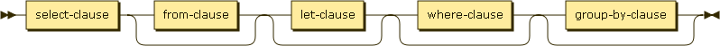
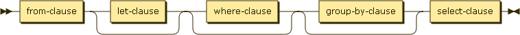
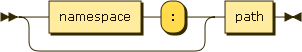
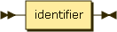
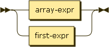
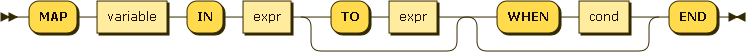
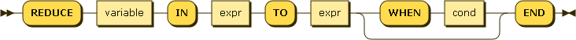
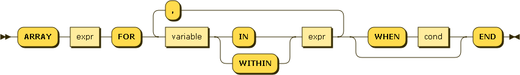
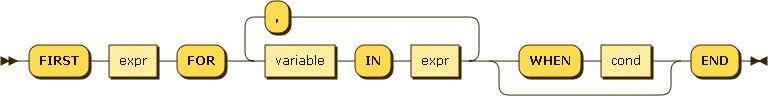

# N1QL Query Language&mdash;SELECT

* Status: DRAFT
* Latest: [n1ql-select](https://github.com/couchbaselabs/query/blob/master/docs/n1ql-select.md)
* Modified: 2013-12-15

## Introduction

N1QL ("nickel") is the query language from Couchbase. N1QL aims to
meet the query needs of distributed document-oriented databases. This
document specifies the syntax and semantics of the SELECT statement in
N1QL.

*N1QL* stands for Non-1st Query Language. The name reflects the fact
that the Couchbase document-oriented data model is based on [Non-1st
Normal Form
(N1NF)](http://en.wikipedia.org/wiki/Database_normalization#Non-first_normal_form_.28NF.C2.B2_or_N1NF.29).

## SELECT syntax

The syntax of the SELECT statement is as follows.

### SELECT statement

*select:*

In N1QL, SELECT statements can begin with either SELECT or FROM. The
behavior is the same in either case.

*select-core:*

*select-from-core:*

*from-select-core:*

### SELECT clause

*select-clause:*

*result-expr:*

*path:*

*alias:*

### FROM clause

*from-clause:*

*from-term:*

*from-path:*

*pool-name:*

*key-clause:*

*join-clause:*

*join-type:*

*unnest-clause:*

### WHERE clause

*where-clause:*

*cond:*

### GROUP BY clause

*group-by-clause:*

*having-clause:*

### ORDER BY clause

*order-by-clause:*

*ordering-term:*

### LIMIT clause

*limit-clause:*

### OFFSET clause

*offset-clause:*

## SELECT processing

The behavior of a SELECT query is best understood as a sequence of
steps. Output objects from each step become input objects to the next
step. The result of a SELECT is an array containing zero or more
result objects.

1.  Data sourcing - the data source in the FROM clause describes which
    objects become the input source for the query

1.  Filtering - result objects are filtered by the WHERE clause, if
    present

1.  Result object generation - result objects are generated from GROUP
    BY and HAVING clauses and the result expression list

1.  Duplicate removal - if DISTINCT is specified, duplicate result
    objects are removed

1.  Ordering - if ORDER BY is specified, the results are sorted
    according to the ordering terms

1.  Offsetting - if OFFSET is specified, the specified number of
    results are skipped

1.  Limiting - if LIMIT is specified, the results are limited to the
    given number

<!--

### Data sourcing

If a statement begins with SELECT, The FROM clause is optional.  When
it is omitted, the input for the execution of the query is a single
empty object.  This allows for the evaluation of N1QL expressions that
do not depend on any data.

The most common form of the FROM clause is specifying a single
identifier which identifies a bucket name.  In this form, an alias can
optionally be specified with the AS clause.  When specified, this
alias is the identifier used to explicitly refer to this data source
in the query.  If omitted, the data source is referred to using the
bucket name itself.

Another usage of the FROM clause specifies a path within a bucket.  In
this form, for each document in the specified bucket, the path is
evaluated and that value becomes the input to the query.  If a literal
integer array index is used it must be non-negative.  If any of the
elements of the path are NULL or MISSING for a document in the bucket,
that document will not contribute any canidate objects to the rest of
the query.  For example:

    FROM organization.address

In this example, a bucket named `organization` contains documents
describing each organization.  Each organization document has a field
namd `address` which is an object.  Using this syntax each address
object becomes the input to the query.

Finally, the most complex usage of the FROM clause allows for path
joins within a document.  This feature is sometimes referred to as
`OVER`, `FLATTEN` or `UNNEST`.  Conceptually, a document containing a
nested array can have each of the members of this array joined with
the document.  Each of these joined objects become the input to the
query.  If an element referenced along the OVER path is a scalar value
instead of an array, it will be treated like a single-element array.
If it is NULL or MISSING, then this document will not contribute any
candidate objects to the rest of the query.  For example:

    FROM organizations o OVER o.employees e

Using this sytnax, a single organization with two employees:

    {
      "name": "o1",
      "employees": [ e1, e2]
    }

Would result in two objects forming the input for the execution of the
query:

    {
      "organization": {
        "name": "o1",
        "employees": [ e1, e2]
      },
      "employee": e1
    }
    {
      "organization": {
        "name": "o1",
        "employees": [ e1, e2]
      },
      "employee": e2
    }

As the right hand side of OVER is another data source, OVERs may be
chained together.  However, the OVER right-hand argument must always
be a subpath relative to the immediate preceding expression.  The
following is a valid usage of multiple OVERs.

    FROM organization o OVER o.employees e OVER e.addresses a

It is important to understand that the following two FROM clauses have
different behaviors.

    FROM organization.employees

    FROM organization OVER employees

The first clause would make the input to the query be the array of
employees.  The second clause would iterate over the employees array
and join each element to the organization, and then make the resulting
joined objects the inputs to the query.

NOTE: Path joining and expansion over array-valued members is only
done in the FROM clause.  It is not done for nested expressions in the
SELECT list, WHERE clause, etc.

#### Joins

Joins have their normal meaning from SQL.

### Filtering

If a WHERE clause is specified, the expression is evaluated for each
object.  All objects evaluating to TRUE are included in the result
array.

### Result object generation

Result object generation depends on whether or not this is an
aggregate query.  An aggregate query is any query which either
contains a GROUP BY clause or references one or more aggregate
functions in the result expression list.

* Non-aggregate query - each result expression in the result expression list is evaluated once for each object.
* Aggregate query without GROUP BY - each result expression in the result expression list is evaluated once for a single group containing all objects.
* Aggregate query with GROUP BY - each expression the GROUP BY clause is evaluated once for each row.  Based on this evaluation each row is assigned to a group.  If a HAVING clause was also specified, it is evaluated once for each group.  If the result of evaluation is false this group is discarded.  Finally, each result expression in the result expression list is evaluated once for each group.

Final projection of evaluated result expressions is as follows:

1.  If the result expression list included '*', the result object is the original item returned from the FROM clause.  Otherwise the result object starts empty.
1.  If the result expression list includes `<path>.*`, the path is evaluated.  If the result of this evaluation is an object, all the key/value pairs within this object are added to the result object.  If the result is not an object, nothing is added to the result object.
1.  For each remaining expression in the result expression list.  If an alias was specified, that identifier is used as the key in the result object and the value is the evaluated expression.  If no alias was specified, a default name is generated for the key.

Specifying the same identifier more than once in the result expression
list, or using an identifer that conflicts with a field in the
document returned by '*' is allowed, but it is only guaranteed that
one value with that key is returned.  If duplicate key names are
detected in the projection, a warning is returned along with the query
results.

Returning complex object and arrays is possible by specifying literal
JSON constructors in the projection expression.

See Appendix for some example projections.

### Duplicate removal

If the DISTINCT keyword was specified, duplicate result objects are
removed from the result array.  If DISTINCT was not specified, the
statement returns all qualifying objects.

Two results are considered duplicate if the projected objects are the
same (using the normal procedure for comparing objects).  See the
ORDER BY section for more details about this process.

### Ordering

If no ORDER BY clause is specified, the order in which the result
objects are returned is undefined.

If an ORDER BY clause is specified, the order of items in the result
array is determined by these expressions.  Objects are first sorted by
the left-most expression in the list.  Any items with the same sort
value are then sorted by the next expresion in the list.  This is
repeated to break tie sort values until the end of the expression list
is reached.  The order of objects with the same sort value for each
sort expression is undefined.

As ORDER BY expressions can evaluate to any JSON value, it must define
an ordering when comparing values of different types.  The following
list describes the order by type (from lowest to highest):

* missing value
* null
* false
* true
* number
* string
* array (element by element comparison, longer arrays sort after)
* object (key/value by key/value comparison, keys are examined in sorted order using the normal ordering for strings, larger objects sort after)

-->

## FROM clause

The FROM clause defines the data sources and input objects for the
query.

Every FROM clause specifies one or more buckets. The first bucket is
called the primary bucket.

*from-clause:*

*from-term:*

*from-path:*

*pool-name:*

*key-clause:*

*join-clause:*

*join-type:*

*unnest-clause:*

The following sections discuss various elements of the FROM
clause. These elements can be combined.

### Omitted

If the FROM clause is omitted, the data source is equivalent to an
array containing a single empty object. This allows you to evaluate
expressions that do not depend on stored data.

Evaluating an expression:

        SELECT 10 + 20

=>

        [ { "$1" : 30 } ]

Counting the number of inputs:

        SELECT COUNT(*) AS input_count

=>

        [ { "input_count" : 1 } ]

Getting the input contents:

        SELECT *

=>

        [ { } ]

### Buckets

The simplest type of FROM clause specifies a bucket:

        SELECT * FROM customer

This returns every value in the *customer* bucket.

The bucket name can be prefixed with an optional pool name:

        SELECT * FROM :main.customer

This queries the *customer* bucket in the *main* pool.

If the pool name is omitted, the default pool in the current session
is used.

### Keys

Specific primary keys within a bucket can be specified. Only values
having those primary keys will be included as inputs to the query.

To specify a single key:

        SELECT * FROM customer KEY "acme-uuid-1234-5678"

To specify multiple keys:

        SELECT * FROM customer KEYS [ "acme-uuid-1234-5678", "roadster-uuid-4321-8765" ]

In the FROM clause of a subquery, KEY or KEYS is mandatory for the
primary bucket.

### Nested paths

Nested paths within buckets can be specified. For each document in the
bucket, the path is evaluated and its value becomes an input the
query. For a given document, if any element of the path is NULL or
MISSING, that document is skipped and does not contribute any inputs
to the query.

If some customer documents contain a *primary\_contact* object, the
following query can retrieve them:

        SELECT * FROM customer.primary_contact

=>

        [
            { "name" : "John Smith", "phone" : "+1-650-555-1234", "address" : { ... } },
            { "name" : "Jane Brown", "phone" : "+1-650-555-5678", "address" : { ... } }
        ]

Nested paths can have arbitrary depth and can include array
subscripts.

        SELECT * FROM customer.primary_contact.address

=>

        [
            { "street" : "101 Main St.", "zip" : "94040" },
            { "street" : "3500 Wilshire Blvd.", "zip" : "90210" }
        ]

### Joins

Joins allow you to create new input objects by combining two or more
source objects. For example, if our *customer* objects were:

        {
            "name": ...,
            "primary_contact": ...,
            "address": [ ... ]
        }

And our *invoice* objects were:

        {
            "customer_key": ...,
            "invoice_date": ...,
            "total": ...
        }

And the FROM clause was:

        FROM invoice inv JOIN customer cust KEY inv.customer_key

Then each joined object would be:

        {
            "inv" : {
                "customer_key": ...,
                "invoice_date": ...,
                "total": ...
            },
            "cust" : {
                "name": ...,
                "primary_contact": ...,
                "address": [ ... ]
            }
        }

KEY or KEYS is required after each JOIN. It specifies the primary keys
for the second bucket in the join.

Joins can be chained.

By default, an INNER join is performed. This means that for each
joined object produced, both the left and right hand source objects
must be non-null.

If LEFT or LEFT OUTER is specified, then a left outer join is
performed. At least one joined object is produced for each left hand
source object. If the right hand source object is null or missing, the
joined object is MISSING a value for the right hand side.

### Unnests

If a document or object contains a nested array, UNNEST conceptually
performs an inner join of the nested array with its parent
object. Each resulting joined object becomes an input to the query.

If some customer documents contain an array of addresses under the
*address* field, the following query retrieves each nested address
along with the parent customer's name.

        SELECT c.name, a.* FROM customer c UNNEST c.address a

=>

        [
            { "name" : "Acme Inc.", "street" : "101 Main St.", "zip" : "94040" },
            { "name" : "Acme Inc.", "street" : "300 Broadway", "zip" : "10011" },
            { "name" : "Roadster Corp.", "street" : "3500 Wilshire Blvd.", "zip" : "90210" },
            { "name" : "Roadster Corp.", "street" : "4120 Alamo Dr.", "zip" : "75019" }
        ]

The first path element after each UNNEST must reference some preceding
path.

Unnests can be chained.

### Expansions

If an array occurs along a path, the array may be subscripted to
select one element, or it may be expanded to select all its elements.

Array values - for each customer, the entire *address* array is
selected:

        SELECT VALUE() FROM customer.address

=>

        [
            {
                "$1": [
                          { "street" : "101 Main St.", "zip" : "94040" },
                          { "street" : "300 Broadway", "zip" : "10011" }
                      ]
            },
                "$1": [
                          { "street" : "3500 Wilshire Blvd.", "zip" : "90210" },
                          { "street" : "4120 Alamo Dr.", "zip" : "75019" }
                      ]
            }
        ]

Subscripting - for each customer, the first element of the *address*
array is selected:

        SELECT * FROM customer.address[0]

=>

        [
            { "street" : "101 Main St.", "zip" : "94040" },
            { "street" : "3500 Wilshire Blvd.", "zip" : "90210" }
        ]

Expansion - for each customer, every element of the *address* array is
selected:

        SELECT * FROM customer.address[*]

=>

        [
            { "street" : "101 Main St.", "zip" : "94040" },
            { "street" : "300 Broadway", "zip" : "10011" },
            { "street" : "3500 Wilshire Blvd.", "zip" : "90210" },
            { "street" : "4120 Alamo Dr.", "zip" : "75019" }
        ]

Expansions can be chained.

## WHERE clause

*where-clause:*

*cond:*

If a WHERE clause is specified, the input objects are filtered
accordingly. The WHERE condition is evaluated for each input object,
and only objects evaluating to TRUE are retained.

## GROUP BY clause

*group-by-clause:*

*having-clause:*

### HAVING

## SELECT clause

*select-clause:*

*result-expr:*

*path:*

*alias:*

### DISTINCT

## ORDER BY clause

*order-by-clause:*

*ordering-term:*

If no ORDER BY clause is specified, the order in which the result
objects are returned is undefined.

If an ORDER BY clause is specified, the order of items in the result
array is determined by the ordering expressions.  Objects are first
sorted by the left-most expression in the list.  Any items with the
same sort value are then sorted by the next expression in the list.
This is repeated to break tie sort values until the end of the
expression list is reached.  The order of objects with the same sort
value for each sort expression is undefined.

As ORDER BY expressions can evaluate to any JSON value, we define an
ordering when comparing values of different types.  The following list
describes the order by type (from lowest to highest):

* missing value
* null
* false
* true
* number
* string
* array (element by element comparison, longer arrays sort after)
* object (key/value by key/value comparison, keys are examined in
  sorted order using the normal ordering for strings, larger objects
  sort after)

## OFFSET clause

*offset-clause:*

An OFFSET clause specifies a number of objects to be skipped. If a
LIMIT clause is also present, the OFFSET is applied prior to the
LIMIT.  The OFFSET value must be a non-negative integer.

## LIMIT clause

*limit-clause:*

A LIMIT clause imposes an upper bound on the number of objects
returned by the SELECT statement.  The LIMIT value must be a
non-negative integer.

## Expressions

*expr:*

### Literal value

The specification for literal values can be found in Appendix.

### Identifier

*identifier:*

An identifier can either be escaped or unescaped.  Unescaped
identifiers cannot support the full range of idenfiers allowed in a
JSON document, but do support the most common ones with a simpler
syntax.  Escaped identifiers are surrounded with backticks and support
all identifiers allowed in JSON.  Using the backtick character within
an escaped identifier can be accomplised by using two consecutive
backtick characters.

Keywords cannot be escaped; therefore, escaped identifiers can overlap
with keywords.

*unescaped-identifier:*

*escaped-identifier:*

An identifier is a symbolic reference to a particular value in the
current context.

If the current context is the document:

    {
        "name": "n1ql"
    }

Then the identifier *name* would evaluate to the value n1ql.

#### Case-sensitivity of identifiers

Aliases are always case-insensitive.

Field names within documents use the following case-sensitivity rules.

* *fieldname* and *\`fieldname\`* and *\`fieldname\`n* use
   nearest-case matching (see below)
* *\`fieldname\`i* uses case-insensitive matching only
* *\`fieldname\`s* uses case-sensitive matching only

#### Nearest-case matching

1. do a case-sensitive match; if found, the matching is completed
2. if no case-sensitive match is found, do a case-insensitive match

If a case-insensitive or nearest-case match finds more than one
matching field, a match is not made and warnings are generated.

### Nested

nested-expr:

Nested expressions support using the dot (`.`) operator to access
fields nested inside of other objects as well as using the bracket
notation (`[index]`) to access elements inside an array or object.

Consider the following object:

    {
      "address": {
        "city": "Mountain View"
      },
      "revisions": [2013]
    }

 The expression `address.city` evalutes to the value `"Mountain View"`.

 The expression `revisions[0]` evaluates to the value `2013`.

### Case

*case-expr:*

*simple-case-expr:*

Simple case expressions allow for conditional matching within an
expression.  The first WHEN expression is evaluated.  If it is equal
to the search expression, the result of this expression is the THEN
expression.  If not, subsequent WHEN clauses are evaluated in the same
manner.  If none of the WHEN expressions is equal to the search
expression, then the result of the CASE expression is the ELSE
expression.  If no ELSE expression was provided, the result is NULL.

*searched-case-expr:*

Searched case expressions allow for conditional logic within an
expression.  The first WHEN expression is evaluated.  If TRUE, the
result of this expression is the THEN expression.  If not, subsequent
WHEN clauses are evaluated in the same manner.  If none of the WHEN
clauses evaluate to TRUE, then the result of the expression is the
ELSE expression.  If no ELSE expression was provided, the result is
NULL.

### Logical

*logical-term:*

Logical terms allow for combining other expressions using boolean
logic.  Standard AND, OR and NOT operators are supported.

### Comparison

*comparison-term:*

Comparison terms allow for comparing two expressions.  Standard
"equal", "not equal", "greater than", "greater than or equal", "less
than", and "less than or equal" are supported.

For equal (= and ==) and not equal (!= and <>) two forms are supported
to aid in compatibility with other query languages.

If either operand in a comparison is MISSING, the result is MISSING.
Next, if either operand in a comparison is NULL, the result is NULL.
Otherwise the remaining rules for comparing values are followed.

In N1QL a comparison operator implicitly requires that both operands
be of the same type.  If the operands are of different types it always
evaluates to FALSE.

By default, string comparison is done using a raw collation (sometimes
referred to as binary, C, or memcmp).  This collation is **case
sensitive**.  Case insensitive comparisons can be performed using
UPPER() or LOWER() functions.

The LIKE operator allows for wildcard matching of string values.  The
right-hand side of the operator is a pattern, optionally containg '%'
and '_' wildcard characters.  Percent (%) matches any string of zero
or more characters, underscore (\_) matches any single character.

### Arithmetic

*arithmetic-term:*

Arithemetic terms allow for performing basic arithmetic within an
expression.  The standard addition, subtraction, multiplication,
division, and modulo operators are supported.  DIV performs integer
(instead of floating-point) division.  Additionally, a negation
operator will change the sign of the expression.

These arithmetic operators only operate on numeric values.  If either
operand is not numeric it will evaluate to NULL.

### Concatenation

*concatenation-term:*

If both operands are strings, the `||` operator concatenates these
strings.  Otherwise the expression evaluates to NULL.

### Function

*function-call:*

*function-name:*

Function names are case-insensitive.  See Appendix for the list and
definition of the supported functions.

### Subquery

*subquery-expr:*

Subquery expressions return an array that is the result of evaluating
the subquery.

In the FROM clause of a subquery, KEY or KEYS is mandatory for the
primary bucket.

### Collection

*collection-expr:*

*exists-expr:*

The existential expression, also known as the existential quantifier
or predicate, evaluates to TRUE if and only if the subquery returns at
least one row.  Otherwise the existential expression evaluates to
FALSE.

*collection-cond:*

Collection predicates allow you to test a boolean condition over the
elements of a collection.

*variable:*

*collection-xform:*

Collection transforms allow you to map and filter the elements of a
collection.

*map-expr:*

*reduce-expr:*

*array-expr:*

*first-expr:*

## Boolean interpretation

As expressions are evaluated they could become any valid JSON value (or MISSING).

During some phases of executing a query the evaluated value must be
considered in a **boolean** context.  These are:

* WHERE clause
* HAVING clause
* any application of BOOLEAN logic (AND, OR, NOT)

When interpreting a non-boolean value in a boolean context, the same
rules used by JavaScript are followed.

See [ECMAScript Language Specification Chapter 11 Section
9](http://ecma-international.org/ecma-262/5.1/#sec-11.9)

## Appendix - Identifier Scoping/Ambiguity

Identifiers appear in many places in an N1QL query.  Frequently
identifiers are used to described paths within a document, but they
are also used in `AS` clauses to introduce new identifiers.

* SELECT - `AS` identifiers in the projection create new names that
  may be referred to in the SELECT and ORDER BY clauses
* FROM - `AS` identifiers in the FROM clause create new names that may
  be referred to anywhere in the query
* Collection expressions - `AS` identifiers in collection expressions
  create names that can **ONLY** be used within this collection
  expression

Introducing the same identifier using `AS` multiple times in a query
results in an error.

When an `AS` identifier collides with a document property in the same
scope, the identifier always refers to the `AS` alias and **NOT** the
document property.  This allows for consistent behavior in scenarios
where an identifier only collides with some of the documents.

The left-most portion of a dotted identifier may refer to the name of
the datasource.  For example:

    SELECT beer.name FROM beer

In this query `beer.name` is simply a more formal way of expressing
`name`.

If the identifier is the name of a datasource, it refers to the whole
object in the current context.  For example

    SELECT * FROM beer WHERE beer = {"name": "bud"}

This query would perform an exact match of candidate documents from
the beer datasource against the specified object literal.

## Appendix - Functions

Function names are case in-sensitive.  The following functions are
defined:

ARRAY_APPEND(array, value) - returns a new array with the value
appended.

ARRAY_CONCAT(array, array) - returns a new array with the
concatenation of the input arrays.

ARRAY_LENGTH(array) - returns the number of elements in the array.

ARRAY_PREPEND(value, array) - returns a new array with the value
prepended.

CEIL(value) - if value is numeric, returns the smallest integer not
less than the value.  otherwise, NULL.

FLOOR(value) - if value is numeric, returns the largest integer not
greater than the value.  otherwise, NULL.

GREATEST(expr, expr, ...) - returns the largest value of all the
expressions.  if all values are NULL or MISSING returns NULL.

IFMISSING(expr1, expr2, ...) - returns the first non-MISSING value

IFMISSINGORNULL(expr1, expr2, ...) - returns the first non-NULL,
non-MISSING value

IFNULL(epxr1, expr2, ...) - returns the first non-NULL value

META() - returns the meta data for the document in the current context

MISSINGIF(value1, value2) - if value1 = value 2, return MISSING,
otherwise value1

LEAST(expr, expr, ...) - returns the smallest non-NULL, non-MISSING of
all the expressions.  if all valus are NULL or MISSING returns NULL.

LENGTH(expr) - Returns the length of the string value after evaluting
the expression, or NULL if the value is not a string.

LOWER(expr) - if expr is a string, the string is returned in all lower
case.  otherwise NULL.

LTRIM(expr, character set) - remove the longest string containing only
the characters in the specified character set starting at the
beginning

NULLIF(value1, value2) - if value1 = value 2, return NULL, otherwise
value1

POLY_LENGTH(expr) - Returns the length of the value after evaluting
the expression.  The exact meaning of length depends on the type of
the value:

* string - the length of the string
* array - the number of items in the array
* object - the number of key/value pairs in the object
* anything else - null

ROUND(value) - if value is numeric, rounds to the nearest integer.
otherwise NULL.  same as ROUND(value, 0)

ROUND(value, digits) - if digits is an integer and value is numeric,
rounds the value the specified number of digits to the right of the
decimal point (left if digits is negative). Otherwise, NULL.

RTRIM(expr, character set) - remove the longest string containing only
the characters in the specified character set starting at the end

SUBSTR(value, position) - if value is a string and position is numeric
returns a substring from the position to the end of the string.
string positions always start with 1.  if position is 0, it behaves as
if you specified 1.  if position is a positive integer, characters are
counted from the begining of the string.  if position is negative,
characters are counted from the end of the string.  if value is not a
string or position is not an integer, returns NULL.

SUBSTR(value, position, length) - if length is a positive integer
behaves identical to SUBSTR(value, position) but only returns at most
length characters.  otherwise NULL.

TRIM(expr, character set) - synonym for LTRIM(RTRIM(expr, character
set), character set)

TRUNC(value) - if the value is numeric, truncates towards zero.
Otherwise NULL.  same as TRUNC(value, 0)

TRUNC(value, digits) - if digits is an integer and value is numeric,
truncates to the specific number of digits to the right of the decimal
point (left if digits is negative).  Otherwise, NULL.

UPPER(expr) - if expr is a string, the string is return in all upper
case.  Otherwise NULL.

VALUE() - returns the full value for the item in the current context

### Aggregate Functions

There are 5 aggregate functions, SUM, AVG, COUNT, MIN, and MAX.
Aggregate functions can only be used in SELECT, HAVING, and ORDER BY
clauses.  When aggregate functions are used in expressions in these
clauses, the query will operate as an aggregate query.  Aggregate
functions take one argument, the value over which to compute the
aggregate function.  The COUNT function can also take '*' as its
argument.

#### Null/Missing/Non-numeric Elimination

If the argument the aggregate function is '*' all rows are considered.
If the argument to the aggregate function is anything else, then if
the result of evaluating the expression is Null or Missing, that row
is eliminated.

ARRAY_AGG(expr) - returns an array of the values in the group.

COUNT(expr) - always returns 0 or a positive integer

MIN(expr) - min returns the minimum value of all values in the group.
The minimum value is the first non-NULL, non-MISSING value that would
result from an ORDER BY on the same expression.  min returns NULL if
there are no non-NULL, non-MISSING values.

MAX(expr) - max returns the maximum values of all values in the group.
The maximum value is the last value that would be returned from an
ORDER BY on the same expression.  max returns NULL if there are no
non-NULL, non-MISSING values

For AVG, and SUM, any row where the result of the expression is
non-numeric is also eliminated.

## Appendix - Operator Precedence

The following operators are supported by N1QL.  The list is ordered
from highest to lowest precedence.

* CASE/WHEN/THEN/ELSE/END
* . 
* [] 
* \-
* \* / %
* \+ \-
* IS NULL, IS MISSING
* IS NOT NULL, IS NOT MISSING
* LIKE
* < <= > >=
* =
* NOT
* AND
* OR

Parentheses, while not strictly speaking an operator, allow for
grouping expressions to override the order of operations.  (they have
the highest precedence)

## Appendix - Four-valued logic

In N1QL boolean propositions could evaluate to NULL or MISSING.  The
following table describes how these values relate to the logical
operators:

<table>
  <tr>
        <th>A</th>
        <th>B</th>
        <th>A and B</th>
        <th>A or B</th>
  </tr>
  <tr>
        <td>FALSE</td>
        <td>FALSE</td>
        <td>FALSE</td>
        <td>FALSE</td>
  </tr>
   <tr>
        <td>TRUE</td>
        <td>TRUE</td>
        <td>TRUE</td>
        <td>TRUE</td>
  </tr>
   <tr>
        <td>FALSE</td>
        <td>TRUE</td>
        <td>FALSE</td>
        <td>TRUE</td>
  </tr>
  <tr>
        <td>FALSE</td>
        <td>NULL</td>
        <td>FALSE</td>
        <td>NULL</td>
  </tr>
  <tr>
        <td>TRUE</td>
        <td>NULL</td>
        <td>NULL</td>
        <td>TRUE</td>
  </tr>
  <tr>
        <td>NULL</td>
        <td>NULL</td>
        <td>NULL</td>
        <td>NULL</td>
  </tr>
  <tr>
        <td>FALSE</td>
        <td>MISSING</td>
        <td>FALSE</td>
        <td>MISSING</td>
  </tr>
  <tr>
        <td>TRUE</td>
        <td>MISSING</td>
        <td>MISSING</td>
        <td>TRUE</td>
  </tr>
  <tr>
        <td>NULL</td>
        <td>MISSING</td>
        <td>MISSING</td>
        <td>MISSING</td>
  </tr>
  <tr>
        <td>MISSING</td>
        <td>MISSING</td>
        <td>MISSING</td>
        <td>MISSING</td>
  </tr>
</table>

<table>
        <tr>
                <th>A</th>
                <th>not A</th>
        </tr>
        <tr>
                <td>FALSE</td>
                <td>TRUE</td>
        </tr>
        <tr>
                <td>TRUE</td>
                <td>FALSE</td>
        </tr>
        <tr>
                <td>NULL</td>
                <td>NULL</td>
        </tr>
        <tr>
                <td>MISSING</td>
                <td>MISSING</td>
        </tr>
</table>

#### Comparing NULL and MISSING values

* IS NULL - returns rows where the value of a property is explicitly set to NULL (not missing).
* IS NOT NULL - returns rows which contain a value (not NULL or missing).
* IS MISSING - returns rows where the value of a property is missing (not explicitly set to NULL).
* IS NOT MISSING - returns rows which contain a value or explicit NULL.

**NOTE**: IS NULL/IS NOT NULL and IS MISSING/IS NOT MISSING are **not**
  inverse operators:

<table>
        <tr>
                <th>Operator</th>
                <th>NULL</th>
                <th>MISSING</th>
        </tr>
    <tr>
        <td>IS NULL</td>
        <td>TRUE</td>
        <td>FALSE</td>
    </tr>
    <tr>
        <td>IS NOT NULL</td>
        <td>FALSE</td>
        <td>FALSE</td>
    </tr>
     <tr>
        <td>IS MISSING</td>
        <td>FALSE</td>
        <td>TRUE</td>
    </tr>
    <tr>
        <td>IS NOT MISSING</td>
        <td>TRUE</td>
        <td>FALSE</td>
    </tr>
</table>

## Appendix - Three-valued logic

We are considering unifying NULL and MISSING. In that case, the only
way to distinguish NULL and MISSING would be via the IS [ NOT ]
MISSING operators.

Here would be the logic tables in that case:

<table>
  <tr>
        <th>A</th>
        <th>B</th>
        <th>A and B</th>
        <th>A or B</th>
  </tr>
  <tr>
        <td>FALSE</td>
        <td>FALSE</td>
        <td>FALSE</td>
        <td>FALSE</td>
  </tr>
   <tr>
        <td>TRUE</td>
        <td>TRUE</td>
        <td>TRUE</td>
        <td>TRUE</td>
  </tr>
   <tr>
        <td>FALSE</td>
        <td>TRUE</td>
        <td>FALSE</td>
        <td>TRUE</td>
  </tr>
  <tr>
        <td>FALSE</td>
        <td>NULL</td>
        <td>FALSE</td>
        <td>NULL</td>
  </tr>
   <tr>
        <td>TRUE</td>
        <td>NULL</td>
        <td>NULL</td>
        <td>TRUE</td>
  </tr>
  <tr>
        <td>NULL</td>
        <td>NULL</td>
        <td>NULL</td>
        <td>NULL</td>
  </tr>
</table>

<table>
        <tr>
                <th>A</th>
                <th>not A</th>
        </tr>
        <tr>
                <td>FALSE</td>
                <td>TRUE</td>
        </tr>
        <tr>
                <td>TRUE</td>
                <td>FALSE</td>
        </tr>
        <tr>
                <td>NULL</td>
                <td>NULL</td>
        </tr>
</table>

#### Comparing NULL and MISSING values

* IS NULL - returns rows where the value of a property is NULL or missing.
* IS NOT NULL - returns rows which contain a value (not NULL or missing).
* IS MISSING - returns rows where the value of a property is missing (not explicitly set to NULL).
* IS NOT MISSING - returns rows which contain a value or explicit NULL.

<table>
        <tr>
                <th>Operator</th>
                <th>NULL</th>
                <th>MISSING</th>
        </tr>
    <tr>
        <td>IS NULL</td>
        <td>TRUE</td>
        <td>TRUE</td>
    </tr>
    <tr>
        <td>IS NOT NULL</td>
        <td>FALSE</td>
        <td>FALSE</td>
    </tr>
     <tr>
        <td>IS MISSING</td>
        <td>FALSE</td>
        <td>TRUE</td>
    </tr>
    <tr>
        <td>IS NOT MISSING</td>
        <td>TRUE</td>
        <td>FALSE</td>
    </tr>
</table>

## Appendix - Literal JSON Values

The following rules are the same as defined by
[json.org](http://json.org/) with two changes:

1. In standard JSON arrays and objects only contain nested values.  In
   N1QL, literal arrays and objects can contain nested expressions.
1. In standard JSON "true", "false" and "null" are case-sensitive.  In
   N1QL, to be consistent with other keywords, they are defined to be
   case-insensitive.

literal-value:

object:

members:

pair:

array:

elements:

string:

chars:

char:

number:

int:

frac:

exp:

digits:

non-zero-digit:

digit:

e:

hex-digit:

## Appendix - Comments

N1QL supports both block comments and line comments.

block-comment:

line-comment:

## Appendix - Key/Reserved Words

The following keywords are reserved and cannot be used in document
property paths without escaping.  All keywords are case-insensitive.

Keywords cannot be escaped; therefore, escaped identifiers can overlap
with keywords.

* ALL
* ALTER
* AND
* ANY
* AS
* ASC
* BETWEEN
* BUCKET
* BY
* CASE
* CAST
* COLLATE
* CREATE
* DATABASE
* DELETE
* DESC
* DISTINCT
* DROP
* EACH
* ELSE
* END
* EXCEPT
* EXISTS
* EXPLAIN
* FALSE
* FROM
* GROUP
* HAVING
* IF
* IN
* INLINE
* INSERT
* INTERSECT
* INTO
* IS
* JOIN
* LIKE
* LIMIT
* MISSING
* NOT
* NULL
* OFFSET
* ON
* OR
* ORDER
* OVER
* PATH
* SELECT
* THEN
* TRUE
* UNION
* UNIQUE
* UPDATE
* VALUED
* WHEN
* WHERE

## Appendix - Sample Projections

For the following examples consider a bucket containing the following
document with ID "n1ql-2013"

    {
      "name": "N1QL",
      "address": {
        "city": "Mountain View"
      },
      "revisions": [2013]
    }

### Selecting the whole document

`SELECT *`

    {
      "name": "N1QL",
      "address": {
        "city": "Mountain View"
      },
      "revisions": [2013]
    }

### Selecting individual field

`SELECT name`

    {
        "name": "N1QL"
    }

### Selecting a more complex expression

`SELECT revsions[0] - 13`

    {
        "revisions[0]-13": 2000
    }

### Selecting a more complex expression with custom identifier

`SELECT revsions[0] - 13 AS modified_revision`

    {
        "modified_revision": 2000
    }

### Selecting the whole document and adding meta-data

`SELECT *, META()`

    {
      "name": "N1QL",
      "address": {
        "city": "Mountain View"
      },
      "revisions": [2013],
      "meta": {
        "id": "n1ql-2013",
        "cas": "8BADF00DDEADBEEF",
        "flags": 0,
        "expiration": 0
      }
    }

### Selecting the whole document and adding meta-data with custom identifer (to avoid any collisions)

`SELECT *, META() AS custom_meta_field`

    {
      "name": "N1QL",
      "address": {
        "city": "Mountain View"
      },
      "revisions": [2013],
      "custom_meta_field": {
        "id": "n1ql-2013",
        "cas": "8BADF00DDEADBEEF",
        "flags": 0,
        "expiration": 0
      }
    }

### Building a complex object using literal JSON

SELECT {"thename": name} AS custom_obj

    {
      "custom_obj": {
        "thename": "N1QL"
      }
    }

## Appendix - Syntax Changes for Beta / GA

#### FROM ... OVER => FROM ... UNNEST

* Replaced FROM ... OVER with FROM ... UNNEST

#### ANY / ALL ... OVER => ANY / EVERY ... SATISFIES

* Replaced ANY / ALL ... OVER with ANY / EVERY ... SATISFIES

#### KEY / KEYS Clause

* Added KEY / KEYS clause to FROM clause

#### JOINs

* Added JOINs based on primary keys

#### Subqueries

* Added subqueries based on primary keys

#### CASE expressions

* Added a second form of CASE expression

#### Array Functions and Slicing

* Added array slicing

* Added ARRAY_CONCAT(), ARRAY_LENGTH(), ARRAY_APPEND(),
  ARRAY_PREPEND(), and other array functions

#### Array Expansions

* Added array expansions

## About this Document

The
[grammar](https://github.com/couchbaselabs/query/blob/master/docs/n1ql-select.ebnf)
forming the basis of this document is written in a [W3C dialect of
EBNF](http://www.w3.org/TR/REC-xml/#sec-notation).

This grammar has not yet been converted to an actual implementation,
ambiguities and conflicts may still be present.

Diagrams were generated by [Railroad Diagram
Generator](http://bottlecaps.de/rr/ui/) 

### Document History

* 2013-07-06 - Initial branching off from UNQL spec
    * Added joins, subqueries, and pools
    * Allowed scalar values along path joins
    * Generalized collection expressions
    * Added comprehensions
    * Added EXISTS, IN, NOT IN
    * Hid UNIQUE, which is supported as a synonym for DISTINCT (to reduce the spec slightly)
    * Added BETWEEN, NOT BETWEEN
    * Made AS optional everywhere
    * Generalized concatenation to include arrays
    * Added DIV for integer division
    * Detached OFFSET from LIMIT
* 2013-07-06 - Cosmetics
    * Fixed some spelling
    * Clarified some prose
    * Added (non-)description of joins
* 2013-07-08 - Grammar
    * Clarified that escaped identifiers can overlap with keywords
    * Streamlined grammar for functions and result-exprs
    * Added to open issues
* 2013-07-13 - Comments
    * Added Appendix on comments
* 2013-07-15 - Added Open Issue
    * Added open issue on default aliases in results / projections
* 2013-07-16 - Case-sensitivity and rounding
    * Specified syntax for case-sensitivity of field names
    * Specified behavior of ROUND() and TRUNC() functions
* 2013-07-17 - Case-sensitivity
    * Renamed default case-sensitivity to nearest-case matching
    * On duplicate matches, no match is made and warnings are generated
* 2013-07-19 - cond
    * Added cond to EBNF diagrams
* 2013-07-23 - JOIN result objects
    * Added Appendix on JOIN result objects
* 2013-12-03 - Target syntax
    * Updated syntax targeting beta / production release
    * KEY joins and subqueries
    * Updated syntax for FROM UNNEST
    * Updated syntax for collection expressions
    * BETWEEN operator
    * [*] operator for array traversal
    * Handle NaN and +/- infinity
    * Date/Time features
* 2013-12-10 - Syntax
    * Array expansion
* 2013-12-15 - Beta / GA deltas
    * Added appendix on syntax changes for Beta / GA

### Open Issues

This meta-section records open issues in this document, and will
eventually disappear.
