# N1QL Query Language&mdash;SELECT

* Status: DRAFT
* Latest: [n1ql-select](https://github.com/couchbase/query/blob/master/docs/n1ql-select.md)
* Modified: 2017-02-10

## Introduction

N1QL (pronounced "nickel") is the query language from Couchbase. N1QL
aims to meet the query needs of distributed document-oriented
databases. This document specifies the syntax and semantics of the
SELECT statement in N1QL.

*N1QL* stands for Non-1st Query Language. The name reflects the fact
that the Couchbase document-oriented data model is based on [Non-1st
Normal Form
(N1NF)](http://en.wikipedia.org/wiki/Database_normalization#Non-first_normal_form_.28NF.C2.B2_or_N1NF.29).

## SELECT syntax

The syntax of the SELECT statement is as follows.

### SELECT statement

_select:_

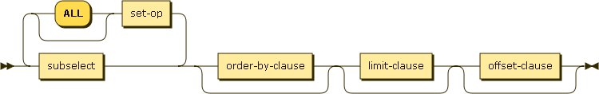

_select-term:_

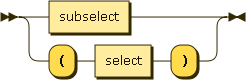

In N1QL, SELECT statements can begin with either SELECT or FROM. The
behavior is the same in either case.

_subselect:_

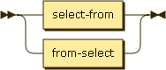

_select-from:_

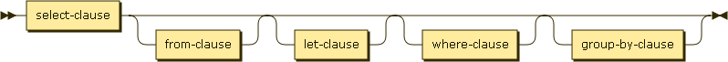

_from-select:_

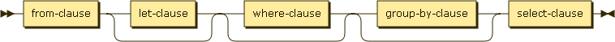

_set-op:_

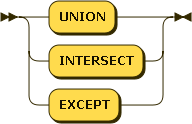

### SELECT clause

_select-clause:_

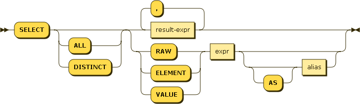

_result-expr:_

_path:_

_alias:_

### FROM clause

_from-clause:_

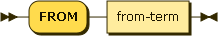

_from-term:_

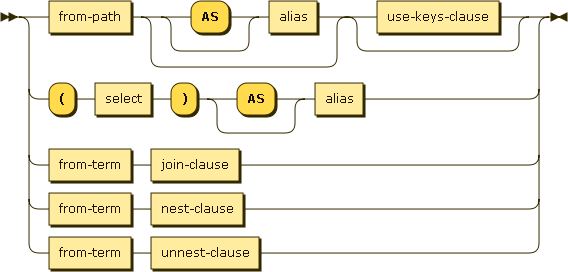

_from-keyspace:_

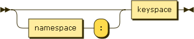

_namespace:_

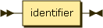

_keyspace:_

_use-clause:_

_use-keys-clause:_

_use-index-clause:_

_index-ref:_

_index-name:_

_index-using:_

_join-clause:_

_join-type:_

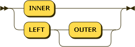

_join-predicate:_

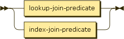

_lookup-join-predicate:_

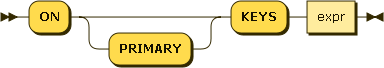

_index-join-predicate:_

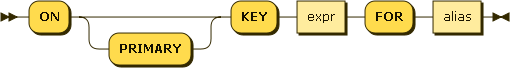

_nest-clause:_

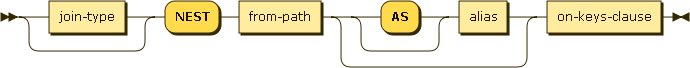

_unnest-clause:_

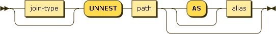

### LET clause

_let-clause:_

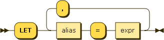

### WHERE clause

_where-clause:_

_cond:_

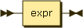

### GROUP BY clause

_group-by-clause:_

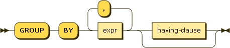

_letting-clause:_

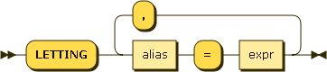

_having-clause:_

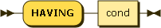

### UNION, INTERSECT, and EXCEPT

_set-op:_

UNION, INTERSECT, and EXCEPT are used to combine results from multiple
sub-selects.

UNION returns values from the first sub-select and from the second
sub-select.

INTERSECT returns values from the first sub-select that are
__present__ in the second sub-select.

EXCEPT returns values from the first sub-select that are __absent__
from the second sub-select.

UNION, INTERSECT, and EXCEPT return distinct results, such that there
are no duplicates.

UNION ALL, INTERSECT ALL, and EXCEPT ALL return all applicable values,
including duplicates. These forms are faster, because they do not
compute distinct results.

### ORDER BY clause

_order-by-clause:_

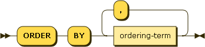

_ordering-term:_

### LIMIT clause

_limit-clause:_

### OFFSET clause

_offset-clause:_

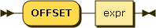

## SELECT processing

The behavior of a SELECT query is best understood as a sequence of
steps. Output objects from each step become input objects to the next
step. The result of a SELECT is an array containing zero or more
result objects.

1.  Data sourcing - the data source in the FROM clause describes which
    objects become the input source for the query

1.  Filtering - result objects are filtered by the WHERE clause, if
    present

1.  Result object generation - result objects are generated from GROUP
    BY and HAVING clauses and the result expression list

1.  Duplicate removal - if DISTINCT is specified, duplicate result
    objects are removed

1.  Ordering - if ORDER BY is specified, the results are sorted
    according to the ordering terms

1.  Offsetting - if OFFSET is specified, the specified number of
    results are skipped

1.  Limiting - if LIMIT is specified, the results are limited to the
    given number

## FROM clause

The FROM clause defines the data sources and input objects for the
query.

Every FROM clause specifies one or more keyspaces (buckets). The first
keyspace is called the primary keyspace.

_from-clause:_

_from-term:_

The following sections discuss various elements of the FROM
clause. These elements can be combined.

### Omitted

If the FROM clause is omitted, the data source is equivalent to an
array containing a single empty object. This allows you to evaluate
expressions that do not depend on stored data.

Evaluating an expression:

        SELECT 10 + 20

=>

        [ { "$1" : 30 } ]

Counting the number of inputs:

        SELECT COUNT(*) AS input_count

=>

        [ { "input_count" : 1 } ]

Getting the input contents:

        SELECT *

=>

        [ { } ]

### Keyspaces (buckets)

The simplest type of FROM clause specifies a keyspace (bucket):

        SELECT * FROM customer

This returns every value in the _customer_ keyspace.

The keyspace can be prefixed with an optional namespace (pool):

        SELECT * FROM main:customer

This queries the _customer_ keyspace in the _main_ namespace.

If the namespace is omitted, the default namespace in the current
session is used.

### Keys

Specific primary keys within a keyspace (bucket) can be
specified. Only values having those primary keys will be included as
inputs to the query.

To specify a single key:

        SELECT * FROM customer USE KEYS "acme-uuid-1234-5678"

To specify multiple keys:

        SELECT * FROM customer USE KEYS [ "acme-uuid-1234-5678", "roadster-uuid-4321-8765" ]

In the FROM clause of a subquery, USE KEYS is mandatory for the
primary keyspace.

### Lookup joins

Joins allow you to create new input objects by combining two or more
source objects.

N1QL provides two types of joins: lookup joins and index joins. Index
joins are discussed later in this document.

Let us start with lookup joins.

For example, if our _customer_ objects were:

        {
            "name": ...,
            "primary_contact": ...,
            "address": [ ... ]
        }

And our _invoice_ objects were:

        {
            "customer_key": ...,
            "invoice_date": ...,
            "invoice_item_keys": [ ... ],
            "total": ...
        }

And the FROM clause was:

        FROM invoice inv JOIN customer cust ON KEYS inv.customer_key

Then each joined object would be:

        {
            "inv" : {
                "customer_key": ...,
                "invoice_date": ...,
                "invoice_item_keys": [ ... ],
                "total": ...
            },
            "cust" : {
                "name": ...,
                "primary_contact": ...,
                "address": [ ... ]
            }
        }

If our _invoice_item_ objects were:

        {
            "invoice_key": ...,
            "product_key": ...,
            "unit_price": ...,
            "quantity": ...,
            "item_subtotal": ...
        }

And the FROM clause was:

        FROM invoice JOIN invoice_item item ON KEYS invoice.invoice_item_keys

Then our joined objects would be:

        {
            "invoice" : {
                "customer_key": ...,
                "invoice_date": ...,
                "invoice_item_keys": [ ... ],
                "total": ...
            },
            "item" : {
                "invoice_key": ...,
                "product_key": ...,
                "unit_price": ...,
                "quantity": ...,
                "item_subtotal": ...
            }
        },
        {
            "invoice" : {
                "customer_key": ...,
                "invoice_date": ...,
                "invoice_item_keys": [ ... ],
                "total": ...
            },
            "item" : {
                "invoice_key": ...,
                "product_key": ...,
                "unit_price": ...,
                "quantity": ...,
                "item_subtotal": ...
            }
        },
        ...

_join-clause:_

_join-type:_

_join-predicate:_

_lookup-join-predicate:_

For lookup joins, ON KEYS is required after each JOIN. It specifies
the primary keys for the second keyspace (bucket) in the join.

Joins can be chained.

By default, an INNER join is performed. This means that for each
joined object produced, both the left and right hand source objects
must be non-missing and non-null.

If LEFT or LEFT OUTER is specified, then a left outer join is
performed. At least one joined object is produced for each left hand
source object. If the right hand source object is NULL or MISSING,
then the joined object's right-hand side value is also NULL or MISSING
(omitted), respectively.

### Unnests

If a document or object contains a nested array, UNNEST conceptually
performs a join of the nested array with its parent object. Each
resulting joined object becomes an input to the query.

If some customer documents contain an array of addresses under the
_address_ field, the following query retrieves each nested address
along with the parent customer's name.

        SELECT c.name, a.* FROM customer c UNNEST c.address a

=>

        [
            { "name" : "Acme Inc.", "street" : "101 Main St.", "zip" : "94040" },
            { "name" : "Acme Inc.", "street" : "300 Broadway", "zip" : "10011" },
            { "name" : "Roadster Corp.", "street" : "3500 Wilshire Blvd.", "zip" : "90210" },
            { "name" : "Roadster Corp.", "street" : "4120 Alamo Dr.", "zip" : "75019" }
        ]

_unnest-clause:_

The first path element after each UNNEST must reference some preceding
path.

Unnests can be chained.

By default, an INNER unnest is performed. This means that for each
result object produced, both the left and right hand source objects
must be non-missing and non-null.

If LEFT or LEFT OUTER is specified, then a left outer unnest is
performed. At least one result object is produced for each left hand
source object. If the right hand source object is NULL, MISSING,
empty, or a non-array value, then the result object's right-hand side
value is MISSING (omitted).

### Lookup nests

Nesting is conceptually the inverse of unnesting. Nesting performs a
join across two keyspaces (or a keyspace with itself). But instead of
producing a cross-product of the left and right hand inputs, a single
result is produced for each left hand input, while the corresponding
right hand inputs are collected into an array and nested as a single
array-valued field in the result object.

As with joins, N1QL provides two types of nests: lookup nests and
index nests. We start here with lookup nests, followed by a later
section on index nests.

Recall our _invoice_ objects:

        {
            "customer_key": ...,
            "invoice_date": ...,
            "invoice_item_keys": [ ... ],
            "total": ...
        }

And our _invoice\_item_ objects:

        {
            "invoice_key": ...,
            "product_key": ...,
            "unit_price": ...,
            "quantity": ...,
            "item_subtotal": ...
        }

If the FROM clause was:

        FROM invoice inv NEST invoice_item items ON KEYS inv.invoice_item_keys

The results would be:

        {
            "invoice" : {
                "customer_key": ...,
                "invoice_date": ...,
                "invoice_item_keys": [ ... ],
                "total": ...
            },
            "items" : [
                {
                    "invoice_key": ...,
                    "product_key": ...,
                    "unit_price": ...,
                    "quantity": ...,
                    "item_subtotal": ...
                },
                {
                    "invoice_key": ...,
                    "product_key": ...,
                    "unit_price": ...,
                    "quantity": ...,
                    "item_subtotal": ...
                }
            ]
        },
        {
            "invoice" : {
                "customer_key": ...,
                "invoice_date": ...,
                "invoice_item_keys": [ ... ],
                "total": ...
            },
            "items" : [
                {
                    "invoice_key": ...,
                    "product_key": ...,
                    "unit_price": ...,
                    "quantity": ...,
                    "item_subtotal": ...
                },
                {
                    "invoice_key": ...,
                    "product_key": ...,
                    "unit_price": ...,
                    "quantity": ...,
                    "item_subtotal": ...
                }
            ]
        },
        ...

_nest-clause:_

_join-type:_

_join-predicate:_

_lookup-join-predicate:_

Nests can be chained with other nests, joins, and unnests.

By default, an INNER nest is performed. This means that for each
result object produced, both the left and right hand source objects
must be non-missing and non-null.

If there is no matching right hand source object, then the right hand
source object is as follows:

* If the ON KEYS expression evaluates to MISSING, the right hand value
  is also MISSING
* If the ON KEYS expression evaluates to NULL, the right hand value is
  MISSING
* If the ON KEYS expression evaluates to an array, the right hand
  value is an empty array
* If the ON KEYS expression evaluates to a non-array value, the right
  hand value is an empty array

If LEFT or LEFT OUTER is specified, then a left outer nest is
performed. One result object is produced for each left hand source
object.

The right hand result of NEST is always an array or MISSING.

### Index joins

Beginning with Couchbase 4.5 ("Watson" release), N1QL provides a new
type of JOIN called index join. The original N1QL joins are now called
lookup joins.

In order to understand the behavior and benefit of index joins, it is
useful to review lookup joins and their limitations. With lookup
joins, the left terms must be able to produce the primary key of the
next right term. We call this a left-to-right join.

Left-to-right joins are most efficient when it is possible to filter
on the left terms before applying the join. In our invoice and
customer example, we could filter on invoices before applying the
join. For example, to find all invoices and customers where the
invoice total exceeds $10,000, we could write:

        FROM invoice inv JOIN customer cust ON KEYS inv.customer_key
        WHERE inv.total > 10000

In this case, there is a many-to-one relationship from invoice to
customer. There is also an implicit child-to-parent relationship.

Suppose instead that we wanted to perform the same join, but filter on
customer name. _invoice_ does not contain customer name, so we cannot
filter on invoice. And _customer_ does not contain invoice keys, so we
cannot reverse the join order as N1QL joins are left-to-right only. In
order to maintain the left-to-right nature of N1QL joins, we would
need to scan all the invoices, join the corresponding customers, and
then apply the filter on customer name. This is highly inefficient.

Enter index joins. Index joins address the problem of performing
left-to-right joins where the most selective filter condition is on
the parent, not the child. In other words, we want the parent to be in
the left term(s), and the child to be the right term.

Index joins introduce a slight syntax variation which allows you to
specify both the child and the parent.

In our example, that would be:

        FROM customer cust JOIN invoice inv ON KEY inv.customer_key FOR cust
        WHERE cust.name = "Acme Inc."

The term immediately after JOIN is the child; in this case _inv_. The
term immediately after FOR is the parent, in this case _cust_. The
parent must be specified because JOINs can be chained, producing
several terms to the left of the current JOIN. One of these left terms
must be identified as the parent.

Note that for index joins, the syntax uses ON KEY (singular) instead
of ON KEYS (plural). This is because for index joins, the ON KEY
expression must produce a scalar value (for lookup joins, the ON KEYS
expression can produce either a scalar or an array value).

Finally, index joins require an index on the ON KEY expression. That
is why they are called "index joins".

_join-clause:_

_join-type:_

_join-predicate:_

_index-join-predicate:_

In other respects, the semantics of index joins are the same as lookup
joins: INNER, LEFT OUTER, chaining, handling of NULL and MISSING, etc.

### Index nests

Index nests are like index joins, except that they perform a nest
rather than a join.

Recall our example from lookup nests:

        FROM invoice inv NEST invoice_item items ON KEYS inv.invoice_item_keys

The example required that each invoice object contain an array of
invoice\_item\_keys. In other words, the parent object (_invoice_)
contained an array of keys to child objects (_invoice\_item_).

But suppose the data was not modeled this way. For example, if some
parents could have many children (thousands or more), then modeling
the data this way could be problematic, because those parent objects
would become very large, and maintaining the parent-child
relationships within the parent objects would lead to contention.

Instead, the child object (_invoice\_item_) would contain a key to the
parent object (_invoice_). To write the same nesting query, using
N1QL's left-to-right semantics, you would use an index nest:

        FROM invoice inv NEST invoice_item items ON KEY items.invoice_key FOR inv

Like index joins, index nests allow you to efficiently filter on the
parent objects before performing the nest.

_nest-clause:_

_join-type:_

_join-predicate:_

_index-join-predicate:_

In other respects, the semantics of index nests are the same as lookup
nests: INNER, LEFT OUTER, chaining, handling of NULL and MISSING, etc.

## WHERE clause

_where-clause:_

_cond:_

If a WHERE clause is specified, the input objects are filtered
accordingly. The WHERE condition is evaluated for each input object,
and only objects evaluating to TRUE are retained.

## GROUP BY clause

_group-by-clause:_

_letting-clause:_

_having-clause:_

## SELECT clause

_select-clause:_

_result-expr:_

_path:_

_alias:_

### DISTINCT

## ORDER BY clause

_order-by-clause:_

_ordering-term:_

If no ORDER BY clause is specified, the order in which the result
objects are returned is undefined.

If an ORDER BY clause is specified, the order of objects in the result
array is determined by the ordering expressions.  Objects are first
sorted by the left-most expression in the list.  Any items with the
same sort value are then sorted by the next expression in the list.
This is repeated to break tie sort values until the end of the
expression list is reached.  The order of objects with the same sort
value for each sort expression is undefined.

As ORDER BY expressions can evaluate to any JSON value, we define an
ordering when comparing values of different types.  The following list
describes the order by type (from lowest to highest):

* missing
* null
* false
* true
* number
* string (string comparison is done using a raw byte collation of UTF8
  encoded strings)
* array (element by element comparison is performed until the end of
  the shorter array; if all the elements so far are equal, then the
  longer array sorts after)
* object (larger objects sort after; for objects of equal length,
  name/value by name/value comparison is performed; names are examined
  in sorted order using the normal ordering for strings)
* binary (raw byte-wise comparison)

Each ORDER BY expression can have separate collation. ASC (lowest to highest),
DESC (highest to lowest). If collation is omitted default to ASC.

Each ORDER BY expression can have separate nulls ordering (NULLS FIRST or
NULLS LAST). NULL and MISSING considered together and placed according to
specification, between NULL and MISSING it follows collation specification.
If nulls ordering is omitted default is natural order described below.
* In case of ASC it will be ASC NULLS FIRST
* In case of DESC it will be DESC NULLS LAST.

<table>
  <tr>
        <th>ASC NULLS FIRST</th>
        <th>ASC NULLS LAST</th>
        <th>DESC NULLS FIRST</th>
        <th>DESC NULLS LAST</th>
  </tr>
  <tr>
        <td>MISSING</td>
        <td>FALSE</td>
        <td>NULL</td>
        <td>BINARY</td>
  </tr>
  <tr>
        <td>NULL</td>
        <td>TRUE</td>
        <td>MISSING</td>
        <td>OBJECT</td>
  </tr>
  <tr>
        <td>FALSE</td>
        <td>NUMBER</td>
        <td>BINARY</td>
        <td>ARRAY</td>
  </tr>
  <tr>
        <td>TRUE</td>
        <td>STRING</td>
        <td>OBJECT</td>
        <td>STRING</td>
  </tr>
  <tr>
        <td>NUMBER</td>
        <td>ARRAY</td>
        <td>ARRAY</td>
        <td>NUMBER</td>
  </tr>
  <tr>
        <td>STRING</td>
        <td>OBJECT</td>
        <td>STRING</td>
        <td>TRUE</td>
  </tr>
  <tr>
        <td>ARRAY</td>
        <td>BINARY</td>
        <td>NUMBER</td>
        <td>FALSE</td>
  </tr>
  <tr>
        <td>OBJECT</td>
        <td>MISSING</td>
        <td>TRUE</td>
        <td>NULL</td>
  </tr>
  <tr>
        <td>BINARY</td>
        <td>NULL</td>
        <td>FALSE</td>
        <td>MISSING</td>
  </tr>
</table>

## OFFSET clause

_offset-clause:_

An OFFSET clause specifies a number of objects to be skipped. If a
LIMIT clause is also present, the OFFSET is applied prior to the
LIMIT.  The OFFSET value must be a non-negative integer.

## LIMIT clause

_limit-clause:_

A LIMIT clause imposes an upper bound on the number of objects
returned by the SELECT statement.  The LIMIT value must be a
non-negative integer.

## Expressions

_expr:_

### Literals

The specification for literals can be found in an Appendix.

### Identifier

_identifier:_

An identifier can either be escaped or unescaped.  Unescaped
identifiers cannot support the full range of idenfiers allowed in a
JSON document, but do support the most common ones with a simpler
syntax.  Escaped identifiers are surrounded with backticks and support
all identifiers allowed in JSON.  Using the backtick character within
an escaped identifier can be accomplised by using two consecutive
backtick characters.

Keywords cannot be escaped; therefore, escaped identifiers can overlap
with keywords.

_unescaped-identifier:_

_escaped-identifier:_

An identifier is a symbolic reference to a particular value in the
current context.

If the current context is the document:

    {
        "name": "n1ql"
    }

Then the identifier _name_ would evaluate to the value n1ql.

#### Case-sensitivity of identifiers

Identifiers in N1QL are __case-sensitive__ by default.

### Nested

Nested expressions are used to access fields inside of objects and
elements and slices inside of arrays.

nested-expr:

Consider the following example:

    {
      "address": {
        "city": "Mountain View"
      },
      "revisions": [2013, 2012, 2011, 2010]
    }

#### Fields

Nested expressions support using the dot (`.`) operator to access
fields nested inside of other objects. The form `.[expr]` is used to
access an object field named by evaluating the `expr` contained in the
brackets.

_field-expr:_

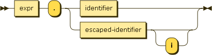

By default, field names are __case sensitive__. To access a field
case-insensitively, include the trailing __i__.

In our example, the expressions `address.city`, ``address.`CITY`i``,
`address.["ci" || "ty"]`, and `address.["CI" || "TY"]i` all evaluate
to `"Mountain View"`.

#### Elements

Nested expressions also support using the bracket notation
(`[position]`) to access elements inside an array. Negative positions
are counted backwards from the end of the array.

_element-expr:_

In our example, the expression `revisions[0]` evaluates to `2013`. The
expression `revision[-1]` evaluates to `2010`.

#### Array slicing

The form `source-expr [ start : end ]` is called array slicing. It
returns a new array containing a subset of the source, containing the
elements from position `start` to `end-1`. The element at `start` is
included, while the element at `end` is not. If `end` is omitted, all
elements from `start` to the end of the source array are included.
Negative positions are counted backwards from the end of the array.

_slice-expr:_

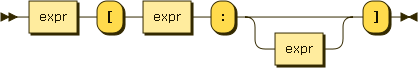

In our example, `revisions[1:3]` evaluates to `[2012,2011]`.
`revisions[1:]` evaluates to `[2012, 2011, 2010]`.  `revisions[-2:]`
evaluates to `[2011, 2010]`.

### Case

_case-expr:_

_simple-case-expr:_

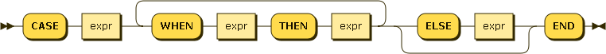

Simple case expressions allow for conditional matching within an
expression.  The first WHEN expression is evaluated.  If it is equal
to the search expression, the result of this expression is the THEN
expression.  If not, subsequent WHEN clauses are evaluated in the same
manner.  If none of the WHEN expressions is equal to the search
expression, then the result of the CASE expression is the ELSE
expression.  If no ELSE expression was provided, the result is NULL.

_searched-case-expr:_

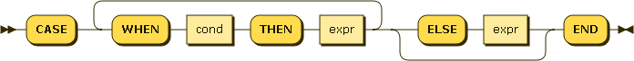

Searched case expressions allow for conditional logic within an
expression.  The first WHEN expression is evaluated.  If TRUE, the
result of this expression is the THEN expression.  If not, subsequent
WHEN clauses are evaluated in the same manner.  If none of the WHEN
clauses evaluate to TRUE, then the result of the expression is the
ELSE expression.  If no ELSE expression was provided, the result is
NULL.

### Logical

_logical-term:_

Logical terms allow for combining other expressions using boolean
logic.  Standard AND, OR and NOT operators are supported.

### Comparison

_comparison-term:_

Comparison terms allow for comparing two expressions.  Standard
"equal", "not equal", "greater than", "greater than or equal", "less
than", and "less than or equal" are supported.

For equal (= and ==) and not equal (!= and <>) two forms are supported
to aid in compatibility with other query languages.

If either operand in a comparison is MISSING, the result is MISSING.
Next, if either operand in a comparison is NULL, the result is NULL.
Otherwise the remaining rules for comparing values are followed.

N1QL specifies a total ordering for all values, across all types. This
ordering is used by the comparison operators, and is described under
__ORDER BY__.

String comparison is done using a raw byte collation of UTF8 encoded
strings (sometimes referred to as binary, C, or memcmp).  This
collation is __case sensitive__.  Case insensitive comparisons can be
performed using UPPER() or LOWER() functions.

Array and object comparisons are done as described under __ORDER BY__.

#### LIKE

The LIKE operator allows for wildcard matching of string values.  The
right-hand side of the operator is a pattern, optionally containg '%'
and '\_' wildcard characters.  Percent (%) matches any string of zero
or more characters; underscore (\_) matches any single character.

The wildcards can be escaped by preceding them with a backslash
(\\). Backslash itself can also be escaped by preceding it with
another backslash.

### Arithmetic

_arithmetic-term:_

Arithemetic terms allow for performing basic arithmetic within an
expression.  The standard addition, subtraction, multiplication,
division, and modulo operators are supported.  Additionally, a
negation operator will change the sign of the expression.

These arithmetic operators only operate on numbers. If either operand
is not a number, it will evaluate to NULL.

### Concatenation

_concatenation-term:_

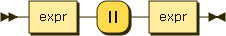

If both operands are strings, the `||` operator concatenates these
strings.  Otherwise the expression evaluates to NULL.

### Function

_function-call:_

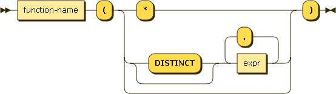

_function-name:_

Function names are case-insensitive.  See Appendices for the supported
functions.

### Subquery

_subquery-expr:_

Subquery expressions return an array that is the result of evaluating
the subquery.

In the FROM clause of a subquery, USE KEYS is mandatory for the
primary keyspace (bucket).

### Collection

_collection-expr:_

#### EXISTS

_exists-expr:_

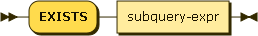

EXISTS evaluates to TRUE if the value is an array and contains at
least one element.

#### IN

_in-expr:_

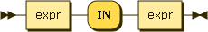

IN evaluates to TRUE if the right-hand-side value is an array and
directly contains the left-hand-side value.

#### WITHIN

_within-expr:_

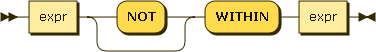

WITHIN evaluates to TRUE if the right-hand-side value contains the
left-hand-side value (or name and value) as a child or descendant
(i.e. directly or indirectly).

#### ANY or SOME, EVERY, and ANY AND EVERY or SOME AND EVERY

Range predicates (ANY or SOME, EVERY, and ANY AND EVERY or SOME AND
EVERY) allow you to test a boolean condition over the elements or
attributes of a collection or object(s). They each evaluate to a
boolean value.

ANY or SOME is TRUE if the collection is non-empty and at least one
element matches.

EVERY is TRUE if the collection is empty, or if the collection is
non-empty and every element matches.

ANY AND EVERY or SOME AND EVERY is TRUE if the collection is non-empty
and every element matches.

_range-cond:_

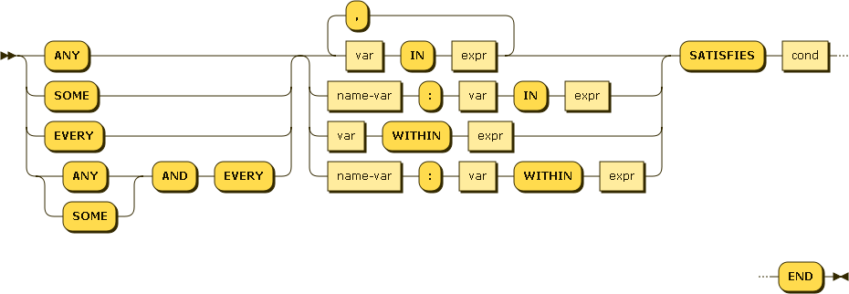

_var:_

_name-var:_

#### ARRAY, FIRST, and OBJECT

Range transforms (ARRAY, FIRST, OBJECT) allow you to map and filter
the elements or attributes of a collection or object(s). ARRAY
evaluates to an array of the operand expression, while FIRST evaluates
to a single element based on the operand expression. OBJECT evaluates
to an object whose name : value attributes are _name-expr_ : _expr_.

_Name-expr_ must evaluate to a string. If not, that attribute is
omitted from the result object.

_range-xform:_

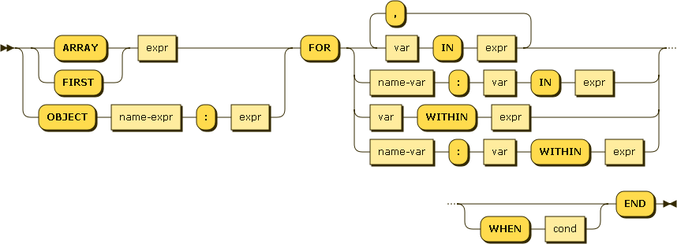

### Construction

Objects and arrays can be constructed with arbitrary structure,
nesting, and embedded expressions.

_construction-expr:_

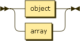

#### Objects

_object:_

_members:_

_pair:_

#### Arrays

_array:_

_elements:_

### Window Functions

Window functions computes an aggregate value based on a group of objects.
The group of rows are defined by window-clause. For each object sliding
window of objects defined. The window determines objects used to compute
aggregate. The window size can be physical or logical or group of objects.

Window functions are processed after Joins, LET, Filter, GROUP BY, LETTING,
and HAVING clause. Window functions can only appear in projection clause or
query ORDER BY clause. So, window function operates on query result set.
In case of window function every input object there is output object vs
aggregates each group returns one object. If query block has GROUP BY
or aggregate functions the all the expressions in window functions must
only dependent on GROUP BY expressions or aggregate functions.

The query block can have any number of window functions, there is no limit.

Window functions are used for compute cumulative, moving, and reporting aggregations.

_window-function:_

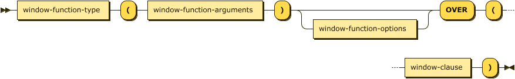

_window-function-arguments:_

_aggregate-quantifier:_

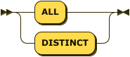

_window-function-options:_

_nthval-from:_

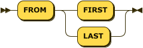

_nulls-treatment:_

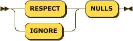

_window-clause:_

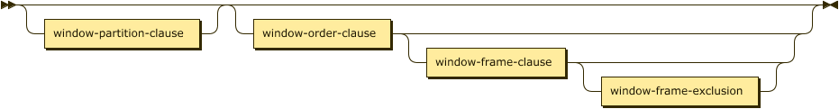

_window-partition-clause:_

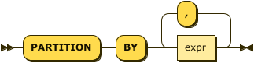

_window-order-clause:_

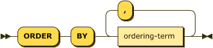

_ordering-term:_

_window-frame-clause:_

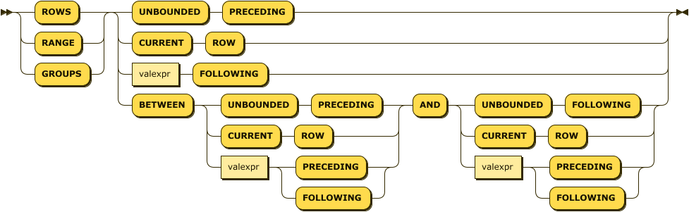

_window-frame-exclusion:_

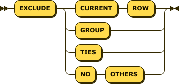

_window-function-type:_

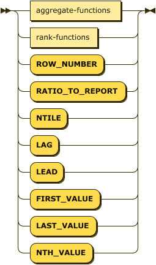

_aggregate-functions:_

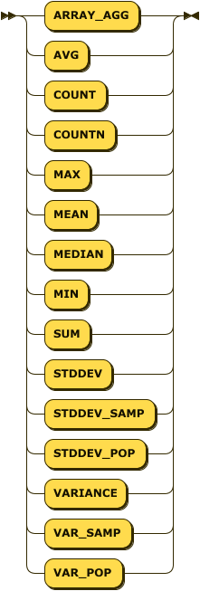

_rank-functions:_

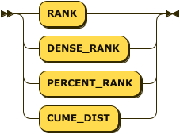

## window function type

The window function type can be
* aggregate functions (ARRAY_AGG, AVG, COUNT, COUNTN, MAX, MEAN, MEDIAN, MIN, SUM,
                       STDDEV, STDDEV_SAMP, STDDEV_POP, VARIANCE, VAR_SAMP, VAR_POP).
* rank functions (RANK, DENSE_RANK, PERCENT_RANK, CUME_DIST).
* ROW_NUMBER.
* value functions (FIRST_VALUE, LAST_VALUE, NTH_VALUE).
* LAG, LEAD.
* NTILE, RATIO_TO_REPORT.

## window function arguments

_window-function-arguments:_

_aggregate-quantifier:_

The window functions takes 0 to 3 arguments. The type of expression is depends on
each object field type, due to that no error is return unless constant number is
expected. If the function is expecting certain type (ex: aggregate functions
(except ARRAY_AGG, COUNT, MIN, MAX), NTILE, RATIO_TO_REPORT expects argument value
must be number), but argument evaluates to different type, that object will
omitted from computation (instead of raising error).

The arguments can be constants, object fields, non-window functions, functions,
aggregates, query named/positional parameters, and expression involving any of these.

There is no restriction on arguments be subquery. However one should avoid this due
to nature of repeated evaluation during computation. If required, one should use
LET or intervene subquery to avoid repeated evaluation.

The arguments cannot nest another window functions. You can specify window function
in subquery and compute another window function in parent query.  Additional restrictions
apply for 2nd and 3rd arguments whenever is allowed.

Only COUNT window function allows argument as STAR (i.e COUNT(*)).

Only aggregate functions allows ALL, DISTINCT quantifier. Default is ALL.

The return type of window function can be number or one of JSON type. If window function
returns number high end values may be rounded (number is represented as float64).

The following table shows window functions and corresponding syntax clauses allowed.

<table>
  <tr>
        <th>Window Function</th>
        <th>No of Arguments</th>
        <th>Quantifier Clause</th>
        <th>Options Clause</th>
        <th>Partition Clause</th>
        <th>Order Clause</th>
        <th>Frame Clause</th>
  </tr>
  <tr>
        <td>ARRAY_AGG</td>
        <td>1</td>
        <td>Optional</td>
        <td>No</td>
        <td>Optional</td>
        <td>Optional</td>
        <td>Optional</td>
  </tr>
  <tr>
        <td>AVG</td>
        <td>1</td>
        <td>Optional</td>
        <td>No</td>
        <td>Optional</td>
        <td>Optional</td>
        <td>Optional</td>
  </tr>
  <tr>
        <td>COUNT</td>
        <td>1</td>
        <td>Optional</td>
        <td>No</td>
        <td>Optional</td>
        <td>Optional</td>
        <td>Optional</td>
  </tr>
  <tr>
        <td>COUNTN</td>
        <td>1</td>
        <td>Optional</td>
        <td>No</td>
        <td>Optional</td>
        <td>Optional</td>
        <td>Optional</td>
  </tr>
  <tr>
        <td>MAX</td>
        <td>1</td>
        <td>Optional</td>
        <td>No</td>
        <td>Optional</td>
        <td>Optional</td>
        <td>Optional</td>
  </tr>
  <tr>
        <td>MEAN</td>
        <td>1</td>
        <td>Optional</td>
        <td>No</td>
        <td>Optional</td>
        <td>Optional</td>
        <td>Optional</td>
  </tr>
  <tr>
        <td>MEDIAN</td>
        <td>1</td>
        <td>Optional</td>
        <td>No</td>
        <td>Optional</td>
        <td>Optional</td>
        <td>Optional</td>
  </tr>
  <tr>
        <td>MIN</td>
        <td>1</td>
        <td>Optional</td>
        <td>No</td>
        <td>Optional</td>
        <td>Optional</td>
        <td>Optional</td>
  </tr>
  <tr>
        <td>SUM</td>
        <td>1</td>
        <td>Optional</td>
        <td>No</td>
        <td>Optional</td>
        <td>Optional</td>
        <td>Optional</td>
  </tr>
  <tr>
        <td>STDDEV</td>
        <td>1</td>
        <td>Optional</td>
        <td>No</td>
        <td>Optional</td>
        <td>Optional</td>
        <td>Optional</td>
  </tr>
  <tr>
        <td>STDDEV_SAMP</td>
        <td>1</td>
        <td>Optional</td>
        <td>No</td>
        <td>Optional</td>
        <td>Optional</td>
        <td>Optional</td>
  </tr>
  <tr>
        <td>STDDEV_POP</td>
        <td>1</td>
        <td>Optional</td>
        <td>No</td>
        <td>Optional</td>
        <td>Optional</td>
        <td>Optional</td>
  </tr>
  <tr>
        <td>VARIANCE</td>
        <td>1</td>
        <td>Optional</td>
        <td>No</td>
        <td>Optional</td>
        <td>Optional</td>
        <td>Optional</td>
  </tr>
  <tr>
        <td>VAR_SAMP</td>
        <td>1</td>
        <td>Optional</td>
        <td>No</td>
        <td>Optional</td>
        <td>Optional</td>
        <td>Optional</td>
  </tr>
  <tr>
        <td>VAR_POP</td>
        <td>1</td>
        <td>Optional</td>
        <td>No</td>
        <td>Optional</td>
        <td>Optional</td>
        <td>Optional</td>
  </tr>
  <tr>
        <td>ROW_NUMBER</td>
        <td>0</td>
        <td>No</td>
        <td>No</td>
        <td>Optional</td>
        <td>Optional</td>
        <td>NO</td>
  </tr>
  <tr>
        <td>RANK</td>
        <td>0</td>
        <td>No</td>
        <td>No</td>
        <td>Optional</td>
        <td>MUST</td>
        <td>NO</td>
  </tr>
  <tr>
        <td>DENSE_RANK</td>
        <td>0</td>
        <td>No</td>
        <td>No</td>
        <td>Optional</td>
        <td>MUST</td>
        <td>NO</td>
  </tr>
  <tr>
        <td>PERCENT_RANK</td>
        <td>0</td>
        <td>No</td>
        <td>No</td>
        <td>Optional</td>
        <td>MUST</td>
        <td>NO</td>
  </tr>
  <tr>
        <td>CUME_DIST</td>
        <td>0</td>
        <td>No</td>
        <td>No</td>
        <td>Optional</td>
        <td>MUST</td>
        <td>NO</td>
  </tr>
  <tr>
        <td>NTILE</td>
        <td>1</td>
        <td>No</td>
        <td>No</td>
        <td>Optional</td>
        <td>MUST</td>
        <td>NO</td>
  </tr>
  <tr>
        <td>FIRST_VALUE</td>
        <td>1</td>
        <td>No</td>
        <td>nulls-treatment</td>
        <td>Optional</td>
        <td>Optional</td>
        <td>Optional</td>
  </tr>
  <tr>
        <td>LAST_VALUE</td>
        <td>1</td>
        <td>No</td>
        <td>nulls-treatment</td>
        <td>Optional</td>
        <td>Optional</td>
        <td>Optional</td>
  </tr>
  <tr>
        <td>NTH_VALUE</td>
        <td>2</td>
        <td>No</td>
        <td>nthval-from, nulls-treatment</td>
        <td>Optional</td>
        <td>Optional</td>
        <td>Optional</td>
  </tr>
  <tr>
        <td>RATIO_TO_REPORT</td>
        <td>1</td>
        <td>No</td>
        <td></td>
        <td>Optional</td>
        <td>Optional</td>
        <td>Optional</td>
  </tr>
  <tr>
        <td>LAG</td>
        <td>1 or 2 or 3</td>
        <td>No</td>
        <td>nulls-treatment</td>
        <td>Optional</td>
        <td>MUST</td>
        <td>NO</td>
  </tr>
  <tr>
        <td>LEAD</td>
        <td>1 or 2 or 3</td>
        <td>No</td>
        <td>nulls-treatment</td>
        <td>Optional</td>
        <td>MUST</td>
        <td>NO</td>
  </tr>
</table>

## window function options

_window-function-options:_

_nthval-from:_

_nulls-treatment:_

Only NTH_VALUE function allows nthval-from clause. FROM {FIRST | LAST} determines whether
the computation begins first or last object of the window. The default is FROM FIRST.

Only FIRST_VALUE, LAST_VALUE, NTH_VALUE, LAG, and LEAD functions allows nulls-treatment clause.
{RESPECT | IGNORE} NULLS determines whether NULL values are included or eliminated from
the computation. The default is RESPECT NULLS. MISSING value are also treated as NULLS during
computation.

## window clause

_window-clause:_

The presence of OVER (window-clause) indicates the function is window function.
The expressions in any part of window-clause can be constants, object fields,
non-window functions, functions,  aggregates, query named/positional
parameters, and expression involving any of these.

There is no restriction on any part of window-clause be subquery. However one
should avoid this due to nature of repeated evaluation during computation.
If required one should use LET or intervene subquery to avoid repeated evaluation.

Any part of the window-clause cannot nest another window functions. You can
specify window function in subquery and compute another window function in
parent query by joining, filtering, grouping.

## window partition clause

_window-partition-clause:_

The PARTITION BY clause will partition the query results into groups by
using all the PARTITION BY expressions. If window-partition-clause is
omitted all the query results are considered as single partition.

The PARTITION BY clause can have one or more expressions. Multiple
window functions can have same or different PARTITION BY expressions.

## window order clause

_window-order-clause:_

_ordering-term:_

The window-order-clause decides how the objects are ordered within the partition.
Window function works on objects order specified in the window-order-clause of the
function. The window-order-clause of the function will not guarantee order of
query results. One should use query ORDER BY to guarantee final result ordering.

The window-order-clause can have multiple ordering expressions. Each ordering
expression have separate collation and nulls ordering. See query ORDER BY for details.

If there is no window-order-clause, all objects are considered peers (i.e. ties).
When window-order-clause result in ties each window functions behaves differently.
To remove ties add additional ordering expressions. This will be more useful for
rank-functions and ROW_NUMBER.

* ROW_NUMBER return distinct number for each object. If there is ties the return
  value depends on how objects are processed and result can be non-deterministic.
* rank-functions (RANK, DENSE_RANK, PERCENT_RANK, CUME_DIST) return same result
  for each object.
* Other window functions it depends on window frame. Physical window frame with ROWS
  results can be non-deterministic (depends on frame specification) for each object.
  Logical window frame with RANGE/GROUP results are same for each object.

Window frame that uses RANGE with either \<valexpr\> PRECEDING or \<valexpr\> FOLLOWING
must have only single ordering expression. The ordering expression type must be NUMBER.
The ordering expression is not a NUMBER type will cause empty window frame, which
result into DEFAULT window function value (most cases it will be NULL, except
COUNT/COUNTN which is 0). There is no restriction when window frame is with
ROWS or GROUPS.

RANGE logical window frame is commonly used in interval time. There is no specific
time related data type in JSON. The datetime in JSON is represented as string in
ISO-8601 standard. To avoid NUMBER type restriction one can use N1QL datetime
functions to convert datetime into MILLISECONDS, use in ordering expression and
\<valexpr\> in window frame.

## window frame clause

_window-frame-clause:_

The window functions allows window-frame-clause. See Table in window function arguments .
The window-frame-clause is allowed only when window-order-clause is present. The window
frame specification is top to bottom.

When there is no window-frame-clause
* If there is no window-order-clause, window frame is entire partition.
* If there is window-order-clause, window frame becomes all objects in the
  partition precede current object and its peers (i.e. window frame of
  RANGE BETWEEN UNBOUNDED PRECEDING AND CURRENT ROW).

Otherwise window frame becomes window-frame-clause

The window frame supports the following units.
* ROWS -- window frame in physical offset. Counts the exact number of objects within the frame.
The window function may produce non-deterministic results, when window ordering doesn't result in unique
ordering. You can add unique expression or more window ordering expressions.
* RANGE -- window frame in logical offset. Looks for a value offset within the frame.
The window function produce deterministic results.
* GROUPS -- window frame in logical groups. Counts all groups of tied rows within the frame.
The window function produce deterministic results.

Window frame that uses RANGE with either \<valexpr\> PRECEDING or \<valexpr\> FOLLOWING
must have only single ordering expression. The ordering expression type must be NUMBER.
The ordering expression is not a NUMBER type will cause empty window frame, which
result into DEFAULT window function value (most cases it will be NULL, except
COUNT/COUNTN which is 0).

BETWEEN ... AND ... clause specifies start point and endpoint of the window frame.
The expression before AND is start point and expression after AND is endpoint.
If BETWEEN is omitted and specifies only one endpoint, it becomes start point and
endpoint becomes CURRENT ROW.

Window frame endpoint can't be before start point. The specification explicitly violates
this restriction will result in semantic error. However if it violates this
restriction implicitly will result in empty window frame, which result into DEFAULT
window function value (most cases it will be NULL, except COUNT/COUNTN which is 0).

window frame that result in explicit violation are:
* {ROWS|RANGE|GROUPS} BETWEEN CURRENT ROW AND \<valexpr\> PRECEDING
* {ROWS|RANGE|GROUPS} BETWEEN \<valexpr\> FOLLOWING AND \<valexpr\> PRECEDING
* {ROWS|RANGE|GROUPS} BETWEEN \<valexpr\> FOLLOWING AND CURRENT ROW

window frame that result in implicit violation are:
* {ROWS|RANGE|GROUPS} BETWEEN UNBOUNDED PRECEDING AND \<evalexpr\> PRECEDING,
  If \<evalexpr\> is too high some objects can result in empty window frame
* {ROWS|RANGE|GROUPS} BETWEEN \<svalexpr\> PRECEDING AND \<evalexpr\> PRECEDING,
  If \<evalexpr\> >= \<svalexpr\> will result in empty window frame for all result set
* {ROWS|RANGE|GROUPS} BETWEEN \<svalexpr\> FOLLOWING AND \<evalexpr\> FOLLOWING,
  If \<svalexpr\> >= \<evalexpr\> will result in empty window frame for all result set
* {ROWS|RANGE|GROUPS} BETWEEN \<svalexpr\> FOLLOWING AND UNBOUNDED FOLLOWING,
  If \<svalexpr\> is too high some objects can result in empty window frame
* If window-frame-exclusion is present any other window frame specification
  can result in empty window frame.

If window frame contains \<valexpr\> PRECEDING or \<valexpr\> FOLLOWING,
It must be positive constant or expression that evaluates positive number.
For ROWS or GROUPS it must be integer.

Window frame that uses RANGE with either \<valexpr\> PRECEDING or \<valexpr\> FOLLOWING
must have only single ordering expression. The ordering expression type must be NUMBER.
The ordering expression is not a NUMBER type will cause empty window frame, which
result into DEFAULT window function value (most cases it will be NULL, except
COUNT/COUNTN which is 0). There is no restriction when window frame uses
ROWS or GROUPS.

RANGE logical window frame is commonly used in interval time. There is no specific
time related data type in JSON. The datetime in JSON is represented as string in
ISO-8601 standard. To avoid NUMBER type restriction one can use N1QL datetime
functions to convert datetime into MILLISECONDS, use in ordering expression and
\<valexpr\> in window frame.

## window frame exclusion clause

_window-frame-exclusion:_

This can be used only when window frame clause is present. This is optional clause.
If this clause omitted, default is no exclusion (same as EXCLUDE NO OTHERS).

* EXCLUDE CURRENT ROW  -- current object is still part of window frame, then current
  object is removed from the window frame.
* EXCLUDE GROUP -- remove the current object and any peers of the current object from
  the window frame.
* EXCLUDE TIES -- remove any objects other than the current object that are peers of
  the current object from the window frame.
* EXCLUDE NO OTHERS -- no additional objects are removed from the window frame

If the current object is already removed from the window frame, then it remains
removed from the window frame.

## Boolean interpretation

Some contexts require values to be interpreted as booleans. For
example:

* WHERE clause
* HAVING clause
* WHEN clause

The following rules apply:

* MISSING, NULL, and false are false
* numbers +0, -0, and NaN are false
* empty strings, arrays, and objects are false
* all other values are true

## Appendix - Identifier scoping / ambiguity

Identifiers include keyspace (bucket) names, fields within documents,
and aliases. The following rules apply.

* FROM - Aliases in the FROM clause create new names that may
  be referred to anywhere in the query
* LET - Aliases in the LET clause create new names that may
  be referred to anywhere in the query
* LETTING - Aliases in the LETTING clause create new names that may be
  referred to in the HAVING, SELECT, and ORDER BY clauses
* SELECT - Aliases in the projection create new names that
  may be referred to in the SELECT and ORDER BY clauses
* FOR - Aliases in a collection expression create names that
  are local to that collection expression

When an alias collides with a keyspace or field name in the same
scope, the identifier always refers to the alias. This allows for
consistent behavior in scenarios where an identifier only collides in
some documents.

The left-most portion of a dotted identifier may refer to the name of
the datasource.  For example:

    SELECT beer.name FROM beer

In this query `beer.name` is simply a more formal way of expressing
`name`.

## Appendix - Operator precedence

The following operators are supported by N1QL.  The list is ordered
from highest to lowest precedence.

* CASE
* .
* []
* \- (unary)
* \* / %
* \+ \- (binary)
* IS
* IN
* BETWEEN
* LIKE
* < <= > >=
* =, ==, <>, !=
* NOT
* AND
* OR
* UNION, INTERSECT, EXCEPT
* ORDER BY

Parentheses allow for grouping expressions to override the order of
operations. They have the highest precedence.

## Appendix - Four-valued logic

In N1QL boolean propositions can evaluate to NULL or MISSING.  The
following table describes how these values relate to the logical
operators:

<table>
  <tr>
        <th>A</th>
        <th>B</th>
        <th>A and B</th>
        <th>A or B</th>
  </tr>
  <tr>
        <td>FALSE</td>
        <td>FALSE</td>
        <td>FALSE</td>
        <td>FALSE</td>
  </tr>
   <tr>
        <td>TRUE</td>
        <td>TRUE</td>
        <td>TRUE</td>
        <td>TRUE</td>
  </tr>
   <tr>
        <td>FALSE</td>
        <td>TRUE</td>
        <td>FALSE</td>
        <td>TRUE</td>
  </tr>
  <tr>
        <td>FALSE</td>
        <td>NULL</td>
        <td>FALSE</td>
        <td>NULL</td>
  </tr>
  <tr>
        <td>TRUE</td>
        <td>NULL</td>
        <td>NULL</td>
        <td>TRUE</td>
  </tr>
  <tr>
        <td>NULL</td>
        <td>NULL</td>
        <td>NULL</td>
        <td>NULL</td>
  </tr>
  <tr>
        <td>FALSE</td>
        <td>MISSING</td>
        <td>FALSE</td>
        <td>MISSING</td>
  </tr>
  <tr>
        <td>TRUE</td>
        <td>MISSING</td>
        <td>MISSING</td>
        <td>TRUE</td>
  </tr>
  <tr>
        <td>NULL</td>
        <td>MISSING</td>
        <td>MISSING</td>
        <td>NULL</td>
  </tr>
  <tr>
        <td>MISSING</td>
        <td>MISSING</td>
        <td>MISSING</td>
        <td>MISSING</td>
  </tr>
</table>

<table>
        <tr>
                <th>A</th>
                <th>not A</th>
        </tr>
        <tr>
                <td>FALSE</td>
                <td>TRUE</td>
        </tr>
        <tr>
                <td>TRUE</td>
                <td>FALSE</td>
        </tr>
        <tr>
                <td>NULL</td>
                <td>NULL</td>
        </tr>
        <tr>
                <td>MISSING</td>
                <td>MISSING</td>
        </tr>
</table>

#### Comparing NULL and MISSING values

<table>
        <tr>
                <th>Operator</th>
                <th>Non-NULL Value</th>
                <th>NULL</th>
                <th>MISSING</th>
        </tr>
    <tr>
        <td>IS NULL</td>
        <td>FALSE</td>
        <td>TRUE</td>
        <td>MISSING</td>
    </tr>
    <tr>
        <td>IS NOT NULL</td>
        <td>TRUE</td>
        <td>FALSE</td>
        <td>MISSING</td>
    </tr>
    <tr>
        <td>IS MISSING</td>
        <td>FALSE</td>
        <td>FALSE</td>
        <td>TRUE</td>
    </tr>
    <tr>
        <td>IS NOT MISSING</td>
        <td>TRUE</td>
        <td>TRUE</td>
        <td>FALSE</td>
    </tr>
    <tr>
        <td>IS VALUED</td>
        <td>TRUE</td>
        <td>FALSE</td>
        <td>FALSE</td>
    </tr>
    <tr>
        <td>IS NOT VALUED</td>
        <td>FALSE</td>
        <td>TRUE</td>
        <td>TRUE</td>
    </tr>
</table>

## Appendix - Literals

The following rules are the same as defined by
[json.org](http://json.org/), with the following changes:

1. In standard JSON "true", "false" and "null" are case-sensitive.  In
   N1QL, to be consistent with other keywords, they are defined to be
   case-insensitive.

1. "missing" is added as a literal expression, although it is not
   returned in final results. Missing is omitted from objects, and is
   converted to null in result arrays.

_literal:_

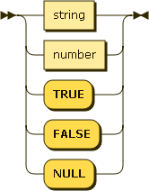

_string:_

_chars:_

_char:_

_number:_

_int:_

_uint:_

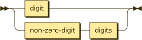

_frac:_

_exp:_

_digits:_

_non-zero-digit:_

_digit:_

_e:_

_hex-digit:_

## Appendix - Comments

N1QL supports both block comments and line comments.

block-comment:

line-comment:

## Appendix - Scalar functions

Function names are case-insensitive. Scalar functions return MISSING
if any argument is MISSING, and then NULL if any argument is NULL or
not of the required type.

### Date functions

__CLOCK\_LOCAL[ fmt ])__ - synonym for __CLOCK\_STR__. Since Couchbase 4.6.

__CLOCK\_MILLIS()__ - system clock at function evaluation time, as
UNIX milliseconds; varies during a query.

__CLOCK\_STR([ fmt ])__ - system clock at function evaluation time, as
a string in a supported format; varies during a query. Supported
formats:

* __"2006-01-02T15:04:05.999Z07:00"__ - Default format. (ISO8601 / RFC3339)
* __"2006-01-02T15:04:05Z07:00"__ (ISO8601 / RFC3339)
* __"2006-01-02T15:04:05.999"__
* __"2006-01-02T15:04:05"__
* __"2006-01-02 15:04:05.999Z07:00"__
* __"2006-01-02 15:04:05Z07:00"__
* __"2006-01-02 15:04:05.999"__
* __"2006-01-02 15:04:05"__
* __"2006-01-02"__
* __"15:04:05.999Z07:00"__
* __"15:04:05Z07:00"__
* __"15:04:05.999"__
* __"15:04:05"__

__CLOCK\_TZ(tz [, fmt ])__ - same as __CLOCK\_STR__, but in specified
time zone. Since Couchbase 4.6.

__CLOCK\_UTC([ fmt ])__ - same as __CLOCK\_STR__, but in UTC time
zone. Since Couchbase 4.6.

__DATE\_ADD\_MILLIS(expr, n, part)__ - date arithmetic. _n_ and _part_
are used to define an interval or duration, which is then added (or
subtracted) to the UNIX timestamp, returning the result. Parts:

* __"millenium"__
* __"century"__
* __"decade"__
* __"year"__
* __"quarter"__
* __"month"__
* __"week"__
* __"day"__
* __"hour"__
* __"minute"__
* __"second"__
* __"millisecond"__

__DATE\_ADD\_STR(expr, n, part)__ - date arithmetic. _n_ and _part_
are used to define an interval or duration, which is then added (or
subtracted) to the date string in a supported format, returning the
result.

__DATE\_DIFF\_MILLIS(expr1, expr2, part)__ - date arithmetic. returns
the elapsed time between two UNIX timestamps, as an integer whose unit
is _part_.

* __"millenium"__
* __"century"__
* __"decade"__
* __"year"__
* __"week"__
* __"day"__
* __"hour"__
* __"minute"__
* __"second"__
* __"millisecond"__

__DATE\_DIFF\_STR(expr1, expr2, part)__ - date arithmetic. returns the
elapsed time between two date strings in a supported format, as an
integer whose unit is _part_.

__DATE\_FORMAT\_STR(expr, fmt)__ - date formatting. See
__CLOCK\_STR()__ for supported formats. Since Couchbase 4.6.

__DATE\_PART\_MILLIS(expr, part [, tz ])__ - date part as an
integer. The date expr is a number representing UNIX milliseconds, and
part is one of the following date part strings. _tz_ is an optional
time zone name.

* __"millenium"__
* __"century"__
* __"decade"__ - floor(year / 10)
* __"year"__
* __"quarter"__ - 1 to 4
* __"month"__ - 1 to 12
* __"day"__ - 1 to 31
* __"hour"__ - 0 to 23
* __"minute"__ - 0 to 59
* __"second"__ - 0 to 59
* __"millisecond"__ - 0 to 999
* __"week"__ - 1 to 53; ceil(day\_of\_year / 7.0)
* __"day\_of\_year", "doy"__ - 1 to 366
* __"day\_of\_week", "dow"__ - 0 to 6
* __"iso\_week"__ - 1 to 53; use with "iso_year"
* __"iso\_year"__ - use with "iso_week"
* __"iso\_dow"__ - 1 to 7
* __"timezone"__ - offset from UTC in seconds
* __"timezone\_hour"__ - hour component of timezone offset
* __"timezone\_minute"__ - 0 to 59; minute component of timezone offset

__DATE\_PART\_STR(expr, part)__ - date part as an integer. The date
expr is a string in a supported format, and part is one of the
supported date part strings.

__DATE\_RANGE\_MILLIS(start, end, part [, step ])__ - similar to
__ARRAY\_RANGE__, but for dates in UNIX milliseconds. Since Couchbase
4.6.

__DATE\_RANGE\_STR(start, end, part [, step ])__ - similar to
__ARRAY\_RANGE__, but for date strings. Since Couchbase 4.6.

__DATE\_TRUNC\_MILLIS(expr, part)__ - truncates UNIX timestamp so that
the given date part string is the least significant.

__DATE\_TRUNC\_STR(expr, part)__ - truncates ISO 8601 timestamp so
that the given date part string is the least significant.

__MILLIS(expr), STR\_TO\_MILLIS(expr)__ - converts date in a supported
format to UNIX milliseconds.

__MILLIS\_TO\_LOCAL(expr [, fmt ])__ - synonym for
__MILLIS\_TO\_STR__. Since Couchbase 4.6.

__MILLIS\_TO\_STR(expr [, fmt ])__ - converts UNIX milliseconds to
string in a supported format.

__MILLIS\_TO\_TZ(expr, tz [, fmt ])__ - converts the UNIX timestamp to
a timezone-specific string in a supported format. Since Couchbase 4.6.

__MILLIS\_TO\_UTC(expr [, fmt ])__ - converts the UNIX timestamp to a
UTC string in a supported format.

__MILLIS\_TO\_ZONE\_NAME(expr, tz_name [, fmt ])__ - synonym for
__MILLIS\_TO\_TZ__.

__NOW\_LOCAL([ fmt ])__ - synonym for __NOW\_STR__. Since Couchbase 4.6.

__NOW\_MILLIS()__ - statement timestamp as UNIX milliseconds; does not
vary during a query.

__NOW\_STR([ fmt ])__ - statement timestamp as a string in a supported
format; does not vary during a query.

__NOW\_TZ(tz [, fmt ])__ - statement timestamp as a timezone-specific
string in a supported format; does not vary during a query. Since
Couchbase 4.6.

__NOW\_UTC([ fmt ])__ - statement timestamp as a UTC-timezone string
in a supported format; does not vary during a query. Since Couchbase
4.6.

__STR\_TO\_MILLIS(expr), MILLIS(expr)__ - converts date in a supported
format to UNIX milliseconds.

__STR\_TO\_TZ(expr, tz)__ - converts the supported timestamp string to
the named time zone. Since Couchbase 4.6.

__STR\_TO\_UTC(expr)__ - converts the ISO 8601 timestamp to UTC.

__STR\_TO\_ZONE\_NAME(expr, tz_name)__ - synonym for __STR\_TO\_TZ__.

__WEEKDAY\_MILLIS(expr [, tz ])__ - English name of the weekday as a
string. The date expr is a number representing UNIX milliseconds. _tz_
is an optional time zone name. Since Couchbase 4.6.1.

__WEEKDAY\_STR(expr)__ - English name of the weekday as a string. The
date expr is a string in a supported format. Since Couchbase 4.6.1.

### String functions

__CONCAT2(separator, arg1, arg2, ....)__ - concat strings into single
string with separator. ARRAY of strings are flattened in same order
and concat them with separator in the middle. If no separator needed
user can provide as "".
Example: CONCAT2('-','a','b',['c','d'],['xyz'])   --  "a-b-c-d-xyz"

__CONTAINS(expr, substr)__ - true if the string contains the
substring.

__CONTAINS\_REGEXP(expr, pattern)__ - synonym for
__REGEXP\_CONTAINS__. Since Couchbase 5.0.

__INITCAP(expr), TITLE(expr)__ - converts the string so that the first
letter of each word is uppercase and every other letter is lowercase.

__LENGTH(expr)__ - length of the string value.

__LOWER(expr)__ - lowercase of the string value.

__LTRIM(expr [, chars ])__ - string with all leading chars removed
(whitespace by default).

__POSITION(expr, substr)__ - the first position of the substring
within the string, or -1. The position is 0-based.

__REGEXP\_CONTAINS(expr, pattern)__ - true if the string value
contains the regular expression pattern.

__REGEXP\_LIKE(expr, pattern)__ - true if the string value matches the
regular expression pattern.

__REGEXP\_POSITION(expr, pattern)__ - first position of the regular
expression pattern within the string, or -1.

__REGEXP\_REPLACE(expr, pattern, repl [, n ])__ - new string with
occurences of _pattern_ replaced with _repl_. If _n_ is given, at most
_n_ replacements are performed.

__REPEAT(expr, n)__ - string formed by repeating _expr_ _n_ times.

__REPLACE(expr, substr, repl [, n ])__ - string with all occurences of
_substr_ replaced with _repl_. If _n_ is given, at most _n_
replacements are performed.

__REVERSE(expr)__ - new string with Unicode characters in reverse
order. Since Couchbase 4.6.

__RTRIM(expr [, chars ])__ - string with all trailing chars removed
(whitespace by default).

__SPLIT(expr [, sep ])__ - splits the string into an array of
substrings separated by _sep_. If _sep_ is not given, any combination
of whitespace characters is used.

__SUBSTR(expr, position [, length ])__ - substring from the integer
_position_ of the given _length_, or to the end of the string. The
position is 0-based, i.e. the first position is 0. If _position_ is
negative, it is counted from the end of the string; -1 is the last
position in the string.

__SUFFIXES(expr)__ - array of suffixes, useful for partial word
matching. SUFFIXES("abc") = [ "abc", "bc", "c" ]. Together with array
indexing, this provides an efficient alternative to LIKE("%b%"). Since
Couchbase 4.5.1.

__TITLE(expr), INITCAP(expr)__ - converts the string so that the first
letter of each word is uppercase and every other letter is lowercase.

__TRIM(expr [, chars ])__ - string with all leading and trailing chars
removed (whitespace by default).

__UPPER(expr)__ - uppercase of the string value.

### Number functions

__ABS(expr)__ - absolute value of the number.

__ACOS(expr)__ - arccosine in radians.

__ASIN(expr)__ - arcsine in radians.

__ATAN(expr)__ - arctangent in radians.

__ATAN2(expr1, expr2)__ - arctangent of expr2/expr1.

__CEIL(expr)__ - smallest integer not less than the number.

__COS(expr)__ - cosine.

__DEGREES(expr)__ - radians to degrees.

__E()__ - base of natural logarithms.

__EXP(expr)__ - _e_\*\*expr.

__IDIV(expr1, expr2)__ - integer division.

__IMOD(expr1, expr2)__ - integer remainder.

__LN(expr)__ - log base _e_.

__LOG(expr)__ - log base 10.

__FLOOR(expr)__ - largest integer not greater than the number.

__NaN()__ - not-a-number; undefined or unrepresentable numeric value.

__NEGINF()__ - Negative infinity.

__PI()__ - PI.

__POSINF()__ - Positive infinity.

__POWER(expr1, expr2)__ - expr1\*\*expr2.

__RADIANS(expr)__ - degrees to radians.

__RANDOM([ expr ])__ - pseudorandom number with optional seed.

__ROUND(expr [, digits ])__ - rounds the value to the given number of
integer digits to the right of the decimal point (left if _digits_ is
negative). _digits_ is 0 if not given.

__SIGN(expr)__ - -1, 0, or 1 for negative, zero, or positive numbers
respectively.

__SIN(expr)__ - sine.

__SQRT(expr)__ - square root.

__TAN(expr)__ - tangent.

__TRUNC(expr [, digits ])__ - truncates the number to the given number
of integer digits to the right of the decimal point (left if _digits_
is negative). _digits_ is 0 if not given.

### Array functions

__ARRAY\_ADD(expr, value, ...)__ - synonym for __ARRAY\_PUT__.

__ARRAY\_APPEND(expr, value, ...)__ - new array with _values_
appended.

__ARRAY\_AVG(expr)__ - arithmetic mean (average) of all the non-NULL
number values in the array, or NULL if there are no such values.

__ARRAY\_CONCAT(expr1, expr2, ...)__ - new array with the
concatenation of the input arrays.

__ARRAY\_CONTAINS(expr, value)__ - true if the array contains _value._

__ARRAY\_COUNT(expr)__ - count of all the non-NULL values in the
array, or zero.

__ARRAY\_DISTINCT(expr)__ - new array with distinct elements of input
array.

__ARRAY\_FLATTEN(expr, depth)__ - new array with all embedded arrays
flattened, down to the supplied depth. If depth is negative, flatten
all descendants. Since Couchbase 4.5.

__ARRAY\_IFNULL(expr)__ - return the first non-NULL value in the
array, or NULL.

__ARRAY\_INSERT(expr, pos, value)__ - new array with _value_ inserted
at position _pos_.

__ARRAY\_INTERSECT(expr1, expr2, ...)__ - set intersection. Since
Couchbase 4.5.1.

__ARRAY\_LENGTH(expr)__ - number of elements in the array.

__ARRAY\_MAX(expr)__ - largest non-NULL, non-MISSING array element, in
N1QL collation order.

__ARRAY\_MIN(expr)__ - smallest non-NULL, non-MISSING array element,
in N1QL collation order.

__ARRAY\_POSITION(expr, value)__ - the first position of _value_ within
the array, or -1. The position is 0-based.

__ARRAY\_PREPEND(value1 [, ... valueN ], expr)__ - new array with
_values_ prepended.

__ARRAY\_PUT(expr, value, ...)__ - new array with _values_ appended,
for each _value_ that is not already present.

__ARRAY\_RANGE(start, end [, step ])__ - new array of numbers, from
_start_ until the largest number less than _end_. Successive numbers
are incremented by _step_. If _step_ is omitted, it defaults to 1. If
_step_ is negative, decrements until the smallest number greater than
_end_.

__ARRAY\_REMOVE(expr, value, ...)__ - new array with all occurences of
_values_ removed.

__ARRAY\_REPEAT(value, n)__ - new array with _value_ repeated _n_
times.

__ARRAY\_REPLACE(expr, value1, value2 [, n ])__ - new array with all
occurences of _value1_ replaced with _value2_. If _n_ is given, at
most _n_ replacements are performed.

__ARRAY\_REVERSE(expr)__ - new array with elements in reverse order.

__ARRAY\_SORT(expr)__ - new array with elements sorted in N1QL
collation order.

__ARRAY\_SUM(expr)__ - sum of all the non-NULL number values in the
array, or zero.

__ARRAY\_SYMDIFF1(expr1, expr2, ...)__ - set symmetric
difference. Returns array of elements that appear in exactly one input
array. Since Couchbase 4.6.

__ARRAY\_SYMDIFFN(expr1, expr2, ...)__ - set symmetric
difference. Returns array of elements that appear in an odd number of
input arrays. Since Couchbase 4.6.

__ARRAY\_UNION(expr1, expr2, ...)__ - set union. Since Couchbase 4.6.

### Object functions

__OBJECT\_ADD(expr, name, value)__ - if the name is not present in the
object, add the name-value pair and return the resulting object, or
else return NULL.

__OBJECT\_CONCAT(expr1, expr2, ...)__ - new object with all the
name-value pairs of the input objects.

__OBJECT\_LENGTH(expr)__ - number of name-value pairs in the object.

__OBJECT\_NAMES(expr)__ - array containing the attribute names of the
object, in N1QL collation order.

__OBJECT\_PAIRS(expr)__ - array containing the attribute name and
value pairs of the object, in N1QL collation order of the names.

__OBJECT\_PUT(expr, name, value)__ - object with name-value pair added
or updated.

__OBJECT\_REMOVE(expr, name, value)__ - object with name-value pair
removed.

__OBJECT\_RENAME(expr, old_name, new_name)__ - object with _old\_name_
renamed to _new\_name_. Since Couchbase 4.6.1.

__OBJECT\_REPLACE(expr, old_value, new_value)__ - object with all
occurrences of _old\_value_ replaced by _new\_value_. Since Couchbase
4.6.1.

__OBJECT\_UNWRAP(expr)__ - if the object contains exactly one
name-value pair, return the pair's value, else NULL.

__OBJECT\_VALUES(expr)__ - array containing the attribute values of
the object, in N1QL collation order of the corresponding names.

### JSON functions

__JSON\_DECODE(expr)__ - unmarshals the JSON-encoded string into a
N1QL value; the empty string is MISSING.

__JSON\_ENCODE(expr)__ - marshals the N1QL value into a JSON-encoded
string; MISSING becomes the empty string.

__ENCODED\_SIZE(expr)__ - number of bytes in an uncompressed JSON
encoding of the value. The exact size is
implementation-dependent. Always returns an integer, and never MISSING
or NULL; returns 0 for MISSING.

__PAIRS(expr)__ - array of all name-value pairs within _expr_. Each
result pair is itself an array [ _name_, _value_ ]. If _value_ is an
array, _name_ is additionally paired with each element of the _value_
array.

__POLY\_LENGTH(expr)__ - length of the value after evaluating the
expression.  The exact meaning of length depends on the type of the
value:

* MISSING - MISSING
* NULL - NULL
* string - the length of the string
* array - the number of elements in the array
* object - the number of name/value pairs in the object
* any other value - NULL

### Token functions

__CONTAINS\_TOKEN(expr, token [, options ])__ - true if _expr_
contains _token_. See __TOKENS__ for a description of N1QL
tokenization and _options_. Since Couchbase 4.6.

__CONTAINS\_TOKEN\_LIKE(expr, pattern [, options ])__ - true if _expr_
contains a token that matches _pattern_ using LIKE pattern
matching. See __TOKENS__ for a description of N1QL tokenization and
_options_. Since Couchbase 5.0.

__CONTAINS\_TOKEN\_REGEXP(expr, pattern [, options ])__ - true if
_expr_ contains a token that matches _pattern_ using REGEXP pattern
matching. See __TOKENS__ for a description of N1QL tokenization and
_options_. Since Couchbase 5.0.

__TOKENS(expr [, options ])__ - array of tokens from the input
expression. Together with array indexing, provides efficient token
search.  Numbers, booleans, and nulls tokenize as themselves. Strings
are further tokenized into words (unless _split_ is false). Arrays and
objects have their contents further tokenized. _options_ is an
optional JSON object to control tokenization. Within _options_:

* _names_ is a boolean to include object names (true)
* _case_ is either "lower" or "upper" for case folding
* _specials_ is a boolean to include strings with special characters,
such as email addresses and URLs (false)
* _split_ is a boolean to split string values into words (true)
* _trim_ is a boolean to trim unsplit string values (true)

Since Couchbase 4.6.

### Comparison functions

__GREATEST(expr1, expr2, ...)__ - largest non-NULL, non-MISSING value
if the values are of the same type; otherwise NULL.

__LEAST(expr1, expr2, ...)__ - smallest non-NULL, non-MISSING value if
the values are of the same type; otherwise NULL.

### Conditional functions for unknowns

__IFMISSING(expr1, expr2, ...)__ - first non-MISSING value.

__IFMISSINGORNULL(expr1, expr2, ...)__ - first non-NULL, non-MISSING
value.

__IFNULL(expr1, expr2, ...)__ - first non-NULL value, or MISSING.

__MISSINGIF(expr1, expr2)__ - MISSING if expr1 = expr2, else
expr1. Returns MISSING or NULL if either input is MISSING or NULL.

__NULLIF(expr1, expr2)__ - NULL if expr1 = expr2; else expr1. Returns
MISSING or NULL if either input is MISSING or NULL.

### Conditional functions for numbers

__IFINF(expr1, expr2, ...)__ - first non-Inf number. Returns MISSING
or NULL if a non-number input is encountered first.

__IFNAN(expr1, expr2, ...)__ - first non-NaN number. Returns MISSING
or NULL if a non-number input is encountered first.

__IFNANORINF(expr1, expr2, ...)__ - first non-Inf, non-NaN
number. Returns MISSING or NULL if a non-number input is encountered
first.

__NANIF(expr1, expr2)__ - NaN if expr1 = expr2; else expr1. Returns
MISSING or NULL if either input is MISSING or NULL.

__NEGINFIF(expr1, expr2)__ - NegInf if expr1 = expr2; else
expr1. Returns MISSING or NULL if either input is MISSING or NULL.

__POSINFIF(expr1, expr2)__ - PosInf if expr1 = expr2; else
expr1. Returns MISSING or NULL if either input is MISSING or NULL.

### Meta functions

__BASE64\_DECODE(expr)__ - base64 decoding of expr.

__BASE64\_ENCODE(expr), BASE64(expr)__ - base64 encoding of expr.

__META(expr)__ - meta data for the document _expr_.

__MIN\_VERSION__ - minimum N1QL version supported by this server.

__SELF()__ - current top-level element in N1QL pipeline.

__UUID()__ - a version 4 Universally Unique Identifier(UUID).

__VERSION__ - N1QL version of this server.

### Unnest functions

__UNNEST\_POSITION(expr)__ - integer position assigned to successive
UNNEST elements.

### Type checking functions

__IS\_ARRAY(expr)__ - true if expr is an array; else MISSING, NULL, or
false.

__IS\_ATOM(expr)__ - true if expr is a boolean, number, or string;
else MISSING, NULL, or false.

__IS\_BINARY(expr)__ - true if expr is a BINARY; else MISSING, NULL,
or false.

__IS\_BOOLEAN(expr)__ - true if expr is a boolean; else MISSING, NULL,
or false.

__IS\_NUMBER(expr)__ - true if expr is a number; else MISSING, NUMBER,
or false.

__IS\_OBJECT(expr)__ - true if expr is an object; else MISSING, NULL,
or false.

__IS\_STRING(expr)__ - true if expr is a string; else MISSING, NULL,
or false.

__TYPE(expr)__ - one of the following strings, based on the value
of expr:

* __"missing"__
* __"null"__
* __"boolean"__
* __"number"__
* __"string"__
* __"array"__
* __"object"__
* __"binary"__

### Type conversion functions

__TO\_ARRAY(expr)__ - array as follows:

* MISSING is MISSING
* NULL is NULL
* arrays are themselves
* all other values are wrapped in an array

__TO\_ATOM(expr)__ - atomic value as follows:

* MISSING is MISSING
* NULL is NULL
* arrays of length 1 are the result of TOATOM() on their single element
* objects of length 1 are the result of TOATOM() on their single value
* booleans, numbers, and strings are themselves
* all other values are NULL

__TO\_BOOLEAN(expr)__ - boolean as follows:

* MISSING is MISSING
* NULL is NULL
* false is false
* numbers +0, -0, and NaN are false
* empty strings, arrays, and objects are false
* all other values are true

__TO\_NUMBER(expr)__ - number as follows:

* MISSING is MISSING
* NULL is NULL
* false is 0
* true is 1
* numbers are themselves
* strings that parse as numbers are those numbers
* all other values are NULL

__TO\_OBJECT(expr)__ - object as follows:

* MISSING is MISSING
* NULL is NULL
* objects are themselves
* all other values are the empty object

__TO\_STRING(expr)__ - string as follows:

* MISSING is MISSING
* NULL is NULL
* false is "false"
* true is "true"
* numbers are their string representation
* strings are themselves
* all other values are NULL

## Appendix - Aggregate functions

Aggregate functions can only be used in LETTING, HAVING, SELECT, and
ORDER BY clauses. When aggregate functions are used in expressions in
these clauses, the query will operate as an aggregate query.

These functions can be used both an aggregate functions and window functions. If function
expects number value, but expr evaluates non number value those are treated as NULL.

The quantifier can be ALL or DISTINCT. The default is ALL.
* ALL -- All objects are included in the computation.
* DISTINCT -- DISTINCT expr objects are included in the computation.

If there is no input row and no GROUP BY clause, COUNT, COUNTN functions return 0. All
other aggregate functions return NULL.

<table>
    <tr>
        <th>Aggregate</th>
        <th>Version</th>
        <th>Description</th>
    </tr>
    <tr>
        <td>ARRAY_AGG(quantifier expr)</td>
        <td>4.0</td>
        <td>array of the non-MISSING values in the group, including NULLs.</td>
    </tr>
    <tr>
        <td>AVG(quantifier expr)</td>
        <td>4.0</td>
        <td>arithmetic mean (average) of the number values in the group.</td>
    </tr>
    <tr>
        <td>MEAN(quantifier expr)</td>
        <td>6.5</td>
        <td>synonym of AVG.</td>
    </tr>
    <tr>
        <td>COUNT(*)</td>
        <td>4.0</td>
        <td>count of all the input rows for the group, regardless of value.</td>
    </tr>
    <tr>
        <td>COUNT(quantifier expr)</td>
        <td>4.0</td>
        <td>count of the non-NULL, non-MISSING values in the group.</td>
    </tr>
    <tr>
        <td>COUNTN(quantifier expr)</td>
        <td>5.5</td>
        <td>count of the number values in the group.</td>
    </tr>
    <tr>
        <td>MAX(quantifier expr)</td>
        <td>4.0</td>
        <td>maximum non-NULL, non-MISSING value in the group, in N1QL collation order.</td>
    </tr>
    <tr>
        <td>MEDIAN(quantifier expr)</td>
        <td>6.5</td>
        <td>middle value of the sorted number values in the group.
            In case of even numbers in the group it returns AVG of middle two values.
        </td>
    </tr>
    <tr>
        <td>MIN(quantifier expr)</td>
        <td>4.0</td>
        <td>minimum non-NULL, non-MISSING value in the group, in N1QL collation order.</td>
    </tr>
    <tr>
        <td>SUM(quantifier expr)</td>
        <td>4.0</td>
        <td>arithmetic sum of the number values in the group.</td>
    </tr>
    <tr>
        <td>STDDEV(quantifier expr)</td>
        <td>6.5</td>
        <td>standard deviation of the number values in the group.
            If input is 1 row it returns 0 otherwise it returns STDDEV_SAMP.
        </td>
    </tr>
    <tr>
        <td>STDDEV_SAMP(quantifier expr)</td>
        <td>6.5</td>
        <td>sample standard deviation of the number values in the group.</td>
    </tr>
    <tr>
        <td>STDDEV_POP(quantifier expr)</td>
        <td>6.5</td>
        <td>population standard deviation of the number values in the group.</td>
    </tr>
    <tr>
        <td>VARIANCE(quantifier expr)</td>
        <td>6.5</td>
        <td> variance of the number values in the group.
            If input is 1 row it returns 0 otherwise it returns VAR_SAMP.
        </td>
    </tr>
    <tr>
        <td>VAR_SAMP(quantifier expr)</td>
        <td>6.5</td>
        <td>sample variance of the number values in the group.</td>
    </tr>
    <tr>
        <td>VARIANCE_SAMP(quantifier expr)</td>
        <td>6.5</td>
        <td>synonym of VAR_SAMP.</td>
    </tr>
    <tr>
        <td>VAR_POP(quantifier expr)</td>
        <td>6.5</td>
        <td>population variance of the number values in the group.</td>
    </tr>
    <tr>
        <td>VARIANCE_POP(quantifier expr)</td>
        <td>6.5</td>
        <td>synonym of VAR_POP.</td>
    </tr>
</table>

## Appendix - Window functions

Window functions can only be used in SELECT projection and ORDER BY clauses.
Window functions requires OVER (window-clause). See Table in window function
arguments on various options.

All aggregate functions listed in Appendix - Aggregate functions section can
be used as window functions. In addition to those following window functions are supported.

<table>
    <tr>
        <th>Window function</th>
        <th>Version</th>
        <th>Description</th>
    </tr>
    <tr>
        <td>ROW_NUMBER()</td>
        <td>6.5</td>
        <td> Returns unique value for every object in every window partition.
             The row_number in every window partition starts with 1. window-order-clause
             determines return value of object. If window-order-clause is omitted the
             return value depends on how query processed each object which can be
             non-deterministic.
        </td>
    </tr>
    <tr>
        <td>RANK()</td>
        <td>6.5</td>
        <td> Returns number of objects precedes this object plus one in
             every window partition. If window-order-clause has ties those
             will get same rank. If there are ties, next non-tied object
             will include all precede objects, due to that there can
             be gaps in returned values. For example, If three objects
             ranked 2, next rank will be 5.
        </td>
    </tr>
    <tr>
        <td>DENSE_RANK()</td>
        <td>6.5</td>
        <td> Returns number of distinct objects precedes this object plus one
             in every window partition. If window-order-clause has ties those
             will get same rank. The returned values consecutive and there will
             not be any gaps in returned values. For example, If three objects
             ranked 2, next dense_rank will be 3.
        </td>
    </tr>
    <tr>
        <td>PERCENT_RANK()</td>
        <td>6.5</td>
        <td> Returns rank of object minus 1, divided by total number of rows
             in window partition minus 1. The return value will be between
             0 and 1. Higher the value higher the ranking.
        </td>
    </tr>
    <tr>
        <td>CUME_DIST()</td>
        <td>6.5</td>
        <td> Returns the number of rows that are ranked lower than or equal
             to the current row, including the current row, which is divided
             by the total number of rows in the window partition. The return
             value will be > 0 and <=1. Higher the value higher the ranking.
        </td>
    </tr>
    <tr>
        <td>NTILE(num_buckets)</td>
        <td>6.5</td>
        <td> Returns value between 1 to the num_buckets, dividing the window
             partition as equally as possible. When a set of values is not
             divisible by the num_buckets, the NTILE function puts those
             objects in the lower buckets. num_buckets can be expression and
             must evaluate to number type. If not an integer it will be
             truncated. If the expression depends on object, it evaluates from
             first object in the window partition.
        </td>
    </tr>
    <tr>
        <td>RATIO_TO_REPORT(expr)</td>
        <td>6.5</td>
        <td> Returns ratio of object value to sum of all object values in
             the window partition. If window-frame-clause is specified ratio
             will be all objects with in the current window frame. If expr
             evaluates to non number type or sum of all object values
             evaluates to zero it return NULL.
        </td>
    </tr>
    <tr>
        <td>LAG(expr [,offset [, defval]]) [{RESPECT|IGNORE} NULLS] </td>
        <td>6.5</td>
        <td> Returns object value at a given physical offset precedes to
             the current object position.
             The optional offset must evaluate to positive integer
             greater than 0. If omitted it will be 1.
             The defval is returned when offset goes out of window scope.
             If omitted it will be NULL.
             If IGNORE NULLS is specified if any object value evaluate to
             NULL or MISSING will not be included in offset objects are counted.
             If RESPECT NULLS is specified if any object value evaluate to NULL
             or MISSING will be included in offset objects are counted.
             This is default clause.
        </td>
    </tr>
    <tr>
        <td>LEAD(expr [,offset [, defval]]) [{RESPECT|IGNORE} NULLS] </td>
        <td>6.5</td>
        <td> Returns object value at a given physical offset beyond the
             current object position.
             The optional offset must evaluate to positive integer
             greater than 0. If omitted it will be 1.
             The defval is returned when offset goes out of window scope.
             If omitted it will be NULL.
             If IGNORE NULLS is specified if any object value evaluate to
             NULL or MISSING will not be included in offset objects are counted.
             If RESPECT NULLS is specified if any object value evaluate to NULL
             or MISSING will be included in offset objects are counted.
             This is default clause.
        </td>
    </tr>
    <tr>
        <td>FIRST_VALUE(expr) [{RESPECT|IGNORE} NULLS]</td>
        <td>6.5</td>
        <td> Returns FIRST object value in each window partition based
             on window-clause.
             {RESPECT|IGNORE} NULLS indicates what to do NULL or MISSING
             values during calculation. The default is RESPECT NULLS.
             If IGNORE NULLS is specified if any object value evaluate to
             NULL or MISSING will not be included. It returns first non-NULL,
             non-MISSING value, If all values are NULL or MISSING it returns NULL.
             In the following cases FIRST_VALUE can be non-deterministic. You can
             make deterministic by adding window-order-clause or unique expression
             to window-order-clause.
* No window-order-clause.
* Duplicates found in window-order-clause and window frame is physical offset.
             In case of window frame is logical offset(RANGE) or logical groups
             (GROUPS), Duplicates found in window-order-clause, FIRST_VALUE
             returns lowest value of expr.
        </td>
    </tr>
    <tr>
        <td>LAST_VALUE(expr) [{RESPECT|IGNORE} NULLS]</td>
        <td>6.5</td>
        <td> Returns LAST object value in each window partition based
             on window-clause.
             {RESPECT|IGNORE} NULLS indicates what to do NULL or MISSING
             values during calculation. The default is RESPECT NULLS.
             If IGNORE NULLS is specified if any object value evaluate to
             NULL or MISSING will not be included. It returns first non-NULL,
             non-MISSING value, If all values are NULL or MISSING it returns NULL.
             In the following cases LAST_VALUE can be non-deterministic. You can
             make deterministic by adding window-order-clause or unique expression
             to window-order-clause.
* No window-order-clause.
* Duplicates found in window-order-clause and window frame is physical offset.
* window-frame-clause is omitted.
             In case of window frame is logical offset(RANGE) or logical groups
             (GROUPS), Duplicates found in window-order-clause, LAST_VALUE
             returns highest value of expr.
        </td>
    </tr>
    <tr>
        <td>NTH_VALUE(expr, offset) [FROM {FIRST|LAST}] [{RESPECT|IGNORE} NULLS]</td>
        <td>6.5</td>
        <td> Returns expr value of the offset object defined by window-clause.
             on window-clause.
             FROM {FIRST|LAST} indicates whether calculation starts at first
             or last object of the window-clause. The default is FROM FIRST.
             {RESPECT|IGNORE} NULLS indicates what to do NULL or MISSING
             values during calculation. The default is RESPECT NULLS.
             If IGNORE NULLS is specified if any object value evaluate to
             NULL or MISSING will not be included. It returns first non-NULL,
             non-MISSING value, If all values are NULL or MISSING it returns NULL.
             In the following cases NTH_VALUE can be non-deterministic. You can
             make deterministic by adding window-order-clause or unique expression
             to window-order-clause.
* No window-order-clause.
* Duplicates found in window-order-clause and window frame is physical offset.
* window-frame-clause is omitted.
             In case of window frame is logical offset(RANGE) or logical groups
             (GROUPS), Duplicates found in window-order-clause, NTH_VALUE
             returns lowest value of expr for FROM FIRST, highest value
             of expr FROM LAST.
        </td>
    </tr>
</table>

## Appendix - Reserved words

The following keywords are reserved and cannot be used as unescaped
identifiers.  All keywords are case-insensitive.

Escaped identifiers can overlap with keywords.

Some of these keywords are not currently implemented but are reserved
for future use.

* __ALL__
* __ALTER__
* __ANALYZE__
* __AND__
* __ANY__
* __ARRAY__
* __AS__
* __ASC__
* __BEGIN__
* __BETWEEN__
* __BINARY__
* __BOOLEAN__
* __BREAK__
* __BUCKET__
* __BUILD__
* __BY__
* __CALL__
* __CASE__
* __CAST__
* __CLUSTER__
* __COLLATE__
* __COLLECTION__
* __COMMIT__
* __CONNECT__
* __CONTINUE__
* __CORRELATE__
* __CORRELATED__
* __COVER__
* __CREATE__
* __CURRENT__
* __DATABASE__
* __DATASET__
* __DATASTORE__
* __DECLARE__
* __DECREMENT__
* __DELETE__
* __DERIVED__
* __DESC__
* __DESCRIBE__
* __DISTINCT__
* __DO__
* __DROP__
* __EACH__
* __ELEMENT__
* __ELSE__
* __END__
* __EVERY__
* __EXCEPT__
* __EXCLUDE__
* __EXECUTE__
* __EXISTS__
* __EXPLAIN__
* __FALSE__
* __FETCH__
* __FIRST__
* __FLATTEN__
* __FOLLOWING__
* __FOR__
* __FORCE__
* __FROM__
* __FTS__
* __FUNCTION__
* __GRANT__
* __GROUP__
* __GROUPS__
* __GSI__
* __HASH__
* __HAVING__
* __IF__
* __IGNORE__
* __ILIKE__
* __IN__
* __INCLUDE__
* __INCREMENT__
* __INDEX__
* __INFER__
* __INLINE__
* __INNER__
* __INSERT__
* __INTERSECT__
* __INTO__
* __IS__
* __JOIN__
* __KEY__
* __KEYS__
* __KEYSPACE__
* __KNOWN__
* __LAST__
* __LEFT__
* __LET__
* __LETTING__
* __LIKE__
* __LIMIT__
* __LSM__
* __MAP__
* __MAPPING__
* __MATCHED__
* __MATERIALIZED__
* __MERGE__
* __MINUS__
* __MISSING__
* __NAMESPACE__
* __NEST__
* __NL__
* __NOT__
* __NO__
* __NTH_VALUE__
* __NULL__
* __NULLS__
* __NUMBER__
* __OBJECT__
* __OFFSET__
* __ON__
* __OPTION__
* __OR__
* __ORDER__
* __OTHERS__
* __OUTER__
* __OVER__
* __PARSE__
* __PARTITION__
* __PASSWORD__
* __PATH__
* __POOL__
* __PRECEDING__
* __PREPARE__
* __PRIMARY__
* __PRIVATE__
* __PRIVILEGE__
* __PROCEDURE__
* __PROBE__
* __PUBLIC__
* __RANGE__
* __RAW__
* __REALM__
* __REDUCE__
* __RENAME__
* __RESPECT__
* __RETURN__
* __RETURNING__
* __REVOKE__
* __RIGHT__
* __ROLE__
* __ROLLBACK__
* __ROW__
* __ROWS__
* __SATISFIES__
* __SCHEMA__
* __SELECT__
* __SELF__
* __SEMI__
* __SET__
* __SHOW__
* __SOME__
* __START__
* __STATISTICS__
* __STRING__
* __SYSTEM__
* __THEN__
* __TIES__
* __TO__
* __TRANSACTION__
* __TRIGGER__
* __TRUE__
* __TRUNCATE__
* __UNBOUNDED__
* __UNDER__
* __UNION__
* __UNIQUE__
* __UNKNOWN__
* __UNNEST__
* __UNSET__
* __UPDATE__
* __UPSERT__
* __USE__
* __USER__
* __USING__
* __VALIDATE__
* __VALUE__
* __VALUED__
* __VALUES__
* __VIA__
* __VIEW__
* __WHEN__
* __WHERE__
* __WHILE__
* __WITH__
* __WITHIN__
* __WORK__
* __XOR__

## Appendix - Sample projections

For the following examples consider a keyspace (bucket) containing the
following document with ID "n1ql-2013"

    {
      "name": "N1QL",
      "address": {
        "city": "Mountain View"
      },
      "revisions": [2013]
    }

### Selecting the whole document

`SELECT *`

    {
      "name": "N1QL",
      "address": {
        "city": "Mountain View"
      },
      "revisions": [2013]
    }

### Selecting individual field

`SELECT name`

    {
        "name": "N1QL"
    }

### Selecting a more complex expression

`SELECT revsions[0] - 13`

    {
        "revisions[0]-13": 2000
    }

### Selecting a more complex expression with custom identifier

`SELECT revsions[0] - 13 AS modified_revision`

    {
        "modified_revision": 2000
    }

### Selecting the whole document and adding meta-data

`SELECT *, META()`

    {
      "name": "N1QL",
      "address": {
        "city": "Mountain View"
      },
      "revisions": [2013],
      "meta": {
        "id": "n1ql-2013",
        "cas": "8BADF00DDEADBEEF",
        "flags": 0,
        "expiration": 0
      }
    }

### Selecting the whole document and adding meta-data with custom identifer (to avoid any collisions)

`SELECT *, META() AS custom_meta_field`

    {
      "name": "N1QL",
      "address": {
        "city": "Mountain View"
      },
      "revisions": [2013],
      "custom_meta_field": {
        "id": "n1ql-2013",
        "cas": "8BADF00DDEADBEEF",
        "flags": 0,
        "expiration": 0
      }
    }

### Building a complex object using literal JSON

SELECT {"thename": name} AS custom_obj

    {
      "custom_obj": {
        "thename": "N1QL"
      }
    }

## Appendix - Changes from DP2 to DP3

#### FROM ... OVER => FROM ... UNNEST

* Replaced FROM ... OVER with FROM ... UNNEST

#### ANY / ALL ... OVER => ANY / EVERY ... SATISFIES

* Replaced ANY ... OVER with ANY ... SATISFIES
* Replaced ALL ... OVER with EVERY ... SATISFIES

#### KEYS Clause

* Added KEYS clause to FROM clause

#### JOINs

* Added JOINs based on primary keys

#### NESTs

* Added NESTs based on primary keys

#### CASE

* Added a second form of CASE expression

#### BETWEEN

* Added [ NOT ] BETWEEN

#### Array functions and slicing

* Added array slicing

* Added ARRAY_CONCAT(), ARRAY_LENGTH(), ARRAY_APPEND(),
  ARRAY_PREPEND(), and ARRAY_REMOVE()

#### Date functions

* Added functions for UNIX timestamps, with MILLIS in the function
  name

#### Type functions

* Added IS_<type> type-checking functions

* Added TYPE_NAME() function

* Added TO_<type> type conversion functions

## Appendix - Features not in DP3

The following features are not supported in DP3.

#### RAW

#### LET

#### LETTING

#### UNION [ ALL ]

#### FOR

* Only a single variable is supported in the FOR clause

#### Unknowns

* In DP3, IS VALUED is the opposite of IS NOT NULL. The behavior of IS
  [ NOT ] NULL and IS [ NOT ] VALUED are described in the DP1 / DP2
  spec.

#### Functions

* In DP3, not all functions are provided. Only the DP2 functions, the
  type functions mentioned above, and the functions listed below, are
  provided.
    * ARRAY\_CONCAT
    * ARRAY\_APPEND
    * ARRAY\_PREPEND
    * ARRAY\_REMOVE
    * ARRAY\_LENGTH
    * DATE\_PART\_STR
    * NOW\_STR
    * DATE\_PART\_MILLIS
    * NOW\_MILLIS
    * STR\_TO\_MILLIS
    * MILLIS\_TO\_STR, MILLIS

#### Pools

* In DP3, the syntax for qualifying buckets with pool names is

    : pool-name . bucket-name

  and not

    pool-name : bucket-name

  as specified in this document.

## About this document

The
[grammar](https://github.com/couchbase/query/blob/master/docs/n1ql-select.ebnf)
forming the basis of this document is written in a [W3C dialect of
EBNF](http://www.w3.org/TR/REC-xml/#sec-notation).

This grammar has not yet been converted to an actual implementation,
ambiguities and conflicts may still be present.

Diagrams were generated by [Railroad Diagram
Generator](http://bottlecaps.de/rr/ui/) 

### Document history

* 2013-07-06 - Initial branching off from UNQL spec
    * Added joins, subqueries, and pools
    * Allowed scalar values along path joins
    * Generalized collection expressions
    * Added comprehensions
    * Added EXISTS, IN, NOT IN
    * Hid UNIQUE, which is supported as a synonym for DISTINCT (to reduce the spec slightly)
    * Added BETWEEN, NOT BETWEEN
    * Made AS optional everywhere
    * Generalized concatenation to include arrays
    * Added DIV for integer division
    * Detached OFFSET from LIMIT
* 2013-07-06 - Cosmetics
    * Fixed some spelling
    * Clarified some prose
    * Added (non-)description of joins
* 2013-07-08 - Grammar
    * Clarified that escaped identifiers can overlap with keywords
    * Streamlined grammar for functions and result-exprs
    * Added to open issues
* 2013-07-13 - Comments
    * Added Appendix on comments
* 2013-07-15 - Added Open Issue
    * Added open issue on default aliases in results / projections
* 2013-07-16 - Case-sensitivity and rounding
    * Specified syntax for case-sensitivity of field names
    * Specified behavior of ROUND() and TRUNC() functions
* 2013-07-17 - Case-sensitivity
    * Renamed default case-sensitivity to nearest-case matching
    * On duplicate matches, no match is made and warnings are generated
* 2013-07-19 - cond
    * Added cond to EBNF diagrams
* 2013-07-23 - JOIN result objects
    * Added Appendix on JOIN result objects
* 2013-12-03 - Target syntax
    * Updated syntax targeting beta / production release
    * KEY joins and subqueries
    * Updated syntax for FROM UNNEST
    * Updated syntax for collection expressions
    * BETWEEN operator
    * [*] operator for array traversal
    * Handle NaN and +/- infinity
    * Date/Time features
* 2013-12-10 - Syntax
    * Array expansion
* 2013-12-15 - Beta / GA deltas
    * Added appendix on syntax changes for Beta / GA
* 2014-01-01 - NEST
    * Added NEST
    * Added join-type to UNNEST
* 2014-01-02 - NEST result format
    * Changed NEST result format to be consistent with UNNEST and JOIN
* 2014-01-07 - NEST result format
    * Changed result format for inner nests
* 2014-01-21 - Collection expressions
    * Per customer requirement, extend collection expressions to
      multiple collections
    * Customer requirement: If you have a property that is an array of
      subdocuments like the children property in your examples, it
      looks easy to find the documents where there is a child with the
      gender equal to female and the age greater than 12 say for
      example.  Now suppose the data is stored differently.  There are
      now two properties in the document, each being an array, one for
      the list of children genders and one for the list of children
      ages.  In this case the gender on line one corresponds to the
      age on line one.  How would you search the document such that
      the lines matched up?  How do you make sure the line that is
      female is also the line where the age is greater than 12?  Now
      take that one step further and put the two properties into two
      separate documents.  You still want to find the documents where
      the search criteria are true on the same line in each document.
      How do you do that?  We need to be able to relate multiple
      properties together on a line by line basis and they may be
      stored separately.
* 2014-02-06 - Misc
    * Restored IS [ NOT ] VALUED
    * Removed MAP() and REDUCE() for now
    * Syntax fixes for traversing multiple collections
* 2014-02-10 - Function call syntax
    * Removed COUNT(path.*), kept COUNT(*)
    * Removed COUNT(DISTINCT *), kept COUNT(DISTINCT expr, ...)
* 2014-02-13 - SELECT clause
    * Omit result expressions to return raw value
* 2014-02-14 - Collation, LET, LETTING
    * Clarified collation spec strings, arrays, and objects
    * Added LET and LETTING clauses
* 2014-02-16 - SELECT RAW
    * Added SELECT RAW
* 2014-02-17 - KEY / KEYS
    * Cleaned up usage of KEY and kEYS.
* 2014-02-18 - SELECT list
    * Require SELECT list
* 2014-02-18 - Array expansion
    * Removed array expansion for now.
* 2014-02-22 - Functions
    * Expanded set of functions.
* 2014-02-23 - Keywords
    * Updated list of keywords and reserved words.
* 2014-02-23 - Functions
    * Added regexp and date arithmetic functions.
* 2014-02-23 - Trig functions
    * Added trig functions.
* 2014-03-05 - Functions
    * Updated function lists and desccriptions.
* 2014-03-11 - DP3 pool syntax
    * Added diff about DP3 pool syntax
* 2014-04-12 - Date formats
    * Listed the supported date formats.
* 2014-06-23 - Nested
    * Allow expressions to select object fields.
* 2014-06-23 - UNNEST
    * Allow UNNEST of non-path expressions.
* 2014-07-31 - Keywords
    * Updated list of keywords and reserved words.
* 2014-08-02 - Keywords
    * Updated list of keywords and reserved words.
* 2014-08-02 - Identifiers
    * Removed $ as a starting character for unescaped identifiers.
* 2014-08-03 - Meta functions
    * Removed VALUE() function, which is superfluous
    * Renamed BASE64_VALUE() to BASE64()
    * Required argument to META() and BASE64()
* 2014-08-07 - ARRAY_RANGE()
    * Added ARRAY_RANGE() function
* 2014-08-10 - WITHIN
    * Added WITHIN
* 2014-08-10 - Keywords
    * Added keywords
* 2014-08-10 - Functions
    * Removed _ in type checking and conversion function names
* 2014-09-01 - Reserved words
    * Added INCLUDE and EXCLUDE as reserved words
* 2014-09-06 - Reserved words
    * Added VALUE as a reserved word
* 2014-10-11 - Syntax and SQL++
    * Incorporate SQL++ discussions with Prof. Yannis
    * USE [ PRIMARY ] KEYS
    * ON [ PRIMARY ] KEYS
    * SELECT ELEMENT
    * FLATTEN
    * Replace pool-name with namespace
* 2014-10-11 - Construction
    * Move object and array construction from literals to expressions
* 2014-10-11 - Set operators
    * Document INTERSECT and EXCEPT
* 2014-10-17 - OBJECT_NAMES
    * Rename OBJECT_KEYS to OBJECT_NAMES
* 2014-10-17 - SELECT clause
    * Fix syntax of SELECT clause
* 2014-10-17 - Ranging and objects
    * Range over both collections and objects.
    * Create both ARRAYs and OBJECTs.
    * Construct objects with dynamic attribute names (aka _maps_ in SQL++).
* 2014-10-17 - Keyspace and namespace
    * Use the terms "keyspace" and "namespace".
* 2014-10-18 - WITHIN and nested expressions
    * Enhance syntax for WITHIN and for nested expressions.
* 2014-11-05 - TYPE
    * Drop reserved word TYPE due to legacy usage.
* 2014-11-15 - RAW
    * Allow RAW exprs to be aliased; useful for ORDER BY
* 2014-11-17 - MISSING literal
    * Add MISSING as a literal expression.
* 2014-11-23 - INCREMENT and DECREMENT
    * Add keywords INCREMENT and DECREMENT.
* 2014-11-25 - SELF()
    * Add SELF() function.
* 2014-11-27 - Nested expr
    * Remove .[] syntax for now
* 2014-12-01 - E()
    * Add E()
* 2014-12-05 - Reserved words
    * Add reserved words BINARY, BOOLEAN, NUMBER, and STRING
* 2014-12-11 - Conditional functions
    * Revise descriptions of conditional functions
* 2014-12-12 - Type functions
    * Revise type checking functions
* 2015-01-19 - FROM subquery
    * Allow subquery in FROM clause
* 2015-02-26 - FROM subquery
    * Update syntax diagram to show subquery in FROM clause
* 2015-04-03 - Hints
    * Add syntax for index hints
* 2015-04-04 - Set operators
    * Allow parentheses for setting precedence of set operators
    * Allow full select as term of set operators
* 2016-02-13 - Index joins and index nests
    * Add syntax for index joins and index nests
    * Rename original N1QL joins as lookup joins
* 2016-02-14 - Index joins and index nests
    * Add content for index joins and index nests
* 2016-03-10 - ANY / SOME AND EVERY
    * Add new expression ANY / SOME AND EVERY
* 2016-03-24 - SELECT VALUE
    * Add SELECT VALUE as synonym for SELECT RAW
* 2016-03-26 - IS [ NOT ] KNOWN
    * Add IS [ NOT ] KNOWN as a synonym for IS [ NOT ] VALUED
* 2016-03-26 - WITHIN
    * Simplify syntax of WITHIN by removing _name-expr_
* 2016-05-02 - Reserved words
    * Update list of reserved words
* 2016-05-02 - Functions
    * Update list of functions
* 2016-05-03 - ARRAY\_FLATTEN()
    * Add ARRAY\_FLATTEN function
* 2016-05-25 - Paths in FROM clause
    * Remove support for paths in FROM clause
* 2016-10-18 - Functions
    * Upate list of functions
* 2017-02-09 - FROM expression
    * Support expressions as FROM terms
* 2017-02-10 - TOKEN functions
    * Add CONTAINS\_TOKEN()
    * Add CONTAINS\_TOKEN\_LIKE()
    * Add CONTAINS\_TOKEN\_REGEXP()

### Open issues

This meta-section records open issues in this document, and will
eventually disappear.
