# Unstructured Query Language 2013 (UNQL 2013)

* Status: DRAFT/PROPOSAL
* Latest: [unql-2013](https://github.com/couchbaselabs/tuqqedin/blob/master/docs/unql-2013.md)
* Modified: 2013-06-03

## Summary

Unstructured Query Language 2013 (UNQL 2013) is a query language for Couchbase.

This language attempts to satisfy these [requirements](https://github.com/couchbaselabs/tuqqedin/blob/master/docs/requirements.md).

This document describes the syntax and semantics of the language.

## Statement

An UNQL statement is an instance of:

unql-stmt:

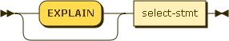

### EXPLAIN

An UNQL statement can be preceded with the keyword "EXPLAIN".  This causes the statement to return information about how the UNQL statement would have operated if the EXPLAIN keyword had been omitted.

The output from EXPLAIN is intended for analysis and troublehsooting only.  The details of the output format are subject to change.

### SELECT Core

Before looking at the full SELECT statement, let us start with a simpler subset:

select-core:

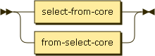

result-expr-list:

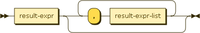

result-expr:

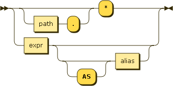

data-source:

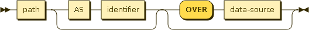

path:

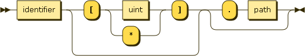

The SELECT statement is used to query a data source.  The result of a SELECT is an array containing zero or more result objects.

#### Select Procesing

The behavior of a SELECT query is best understood as a sequence of steps.  Output objects from a step become input objects to the next step.

1.  Data Source - the data source in the FROM clause describes which objects become the input source for the query
2.  Filtering - result objects are filtered by the WHERE clause 
3.  Result Object Generation - result objects are generated from GROUP BY, and HAVING clauses and the result expression list
4.  Duplicate removal - if this is a DISTINCT query, duplicate result objects are removed

##### Data Source

The FROM clause is optional.  When it is omitted, the input for the execution of the query is a single empty object.  This allows for the evaluation of UNQL expressions that do not depend on any data.

The most common form of the FROM clause is specifying a single identifier which identifies a database or bucket name.  In this form, an alias can optionally be specified with the AS clause.  When spcified this alias is the identifier used to explicitly refer to this data source in the query.  If omitted, the data source is referred to using the database name itself.

Another usage of the FROM clause specifies a path within a bucket.  In this form, for each document in the specified bucket, the sub-path is evaluated and that value becomes the input to the query.  If a literal integer array index is used it must be non-negative.  If any of the elements of the path are NULL or MISSING for a document in the bucket, that document will not contribute any canidate objects to the rest of the query.  For example:

    FROM organizations.address

In this example, a bucket named `organizations` contains documents describing each organization.  Each organization document has a field namd `address` which is an object.  Using this syntax each address object becomes the input to the query.

Finally, the most complex usage of the FROM clause allows for path joins within a document.  This feature is sometimes referred to as `OVER`, `FLATTEN` or `UNNEST`.  Conceptually, a document containing a nested array can have each of the members of this array joined with the document.  Each of these joined objectes become the input to the query.  If the element referenced by the OVER path is not an array (any scalar value, NULL or MISSING) then this document will not contribute any canidate objects to the rest of the query.  For example:

    FROM organizations AS organization OVER organization.employees AS employee

Using this sytnax, a single organization with two employees:

    {
      "name": "o1",
      "employees": [ e1, e2]
    }

Would result in two objectes forming the input for the execution of the query:

    {
      "organization": {
        "name": "o1",
        "employees": [ e1, e2]
      },
      "employee": e1
    }
    {
      "organization": {
        "name": "o1",
        "employees": [ e1, e2]
      },
      "employee": e2
    }

As the right hand side of a OVER is another data source, these OVERs may be chained together.  However, the OVER argument must always be path referring to the immediate left hand `AS` clause.  The following is a valid usage of multiple OVERs.

    FROM organization AS organizations OVER organization.employees AS employee OVER employee.addresses AS address

It is important to understand that the following two FROM clauses have different behaviors.

    FROM organization.employees

    FROM organization OVER employees AS employee

The first clause would make the input to the query be the array of employees.  The second clause would iterate over the employees array and join each element to the organization, and then make the resulting joined objects the inputs to the query.

##### Filtering

If a WHERE clause is specified, the expression is evaluated for each object.  All objects evluating to TRUE are included in the result array.

##### Result Object Generation

Result object generation depends on whether or not this is an aggregate query.  An aggregate query is any query which either contains a GROUP BY clause or references one or more aggregate functions in the result expression list.

* Non-aggregate query - each result expression in the result expression list is evaluated once for each object.
* Aggregate query without GROUP BY - each result expression in the result expression list is evaluated once for a single group containing all objects.
* Aggregate query with GROUP BY - each expression the GROUP BY clause is evaluated once for each row.  Based on this evaluation each row is assigned to a group.  If a HAVING clause was also specified, it is evaluated once for each group.  If the result of evaluation is false this group is discarded.  Finally, each result expression in the result expression list is evaluated once for each group.

Final projection of evaluated result expressions is as follows:

1.  If the result expression list included '*', the result object is the original item returned from the FROM clause.  Otherwise the result object starts empty.
2.  If the result expression list includes `<path>.*`, the path is evaluated.  If the result of this evaluation is an object, all the key/value pairs within this object are added to the result object.  If the result is not an object, nothing is added to the result object.
3.  For each remaining expression in the result expression list.  If an AS clause was specified, that identifier is used as the key in the result object and the value is the evaluated expression.  If no AS clause was specified, a default name is generated for the key.

Specifying the same identifier more than once in the result expression list, or using an identifer that conflicts with a field in the document returned by '*' is allowed, but it is only guaranteed that one value with that key is returned.  If duplicate key names are detected in the projection, a warning is returned along with the query results.

Returning complex object and arrays is possible by specifying literal JSON in the projection expression.

See Appendix 6 for some example projections.

##### Duplicate Removal

If the DISTINCT or UNIQUE keywords were specified duplicate result objects are removed from the result array.  If neither DISTINCT/UNIQUE keyword was specified, the statement returns all qualifying objects.

Two results are considered duplicate if the projected objects are the same (using the normal procedure for comparing objects).  See the ORDER BY section for more details about this process.

### SELECT Statement

Now, we can expand to consider the full SELECT statement:

select-stmt:

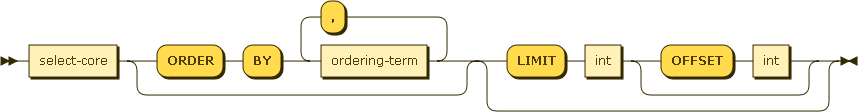

ordering-term:

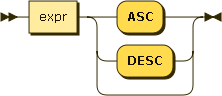

#### ORDER BY and LIMIT/OFFSET

If no ORDER BY clause is specified, the order in which the result objects are returned is undefined.

If an ORDER BY clause is specified, the order of items in the result array is determined by these expressions.  Objects are first sorted by the left-most expression in the list.  Any items with the same sort value are then sorted by the next expresion in the list.  This is repeated to break tie sort values until the end of the expression list is reached.  The order of objects with the same sort value for each sort expression is undefined.

As ORDER BY expressions can evaluate to any JSON value, it must define an ordering when comparing values of different types.  The following list describes the order by type (from lowest to highest):

* missing value
* null
* false
* true
* number
* string
* array (element by element comparison, longer arrays sort after)
* object (key/value by key/value comparison, keys are examined in sorted order using the normal ordering for strings, larger objects sort after)

The LIMIT clause imposes an upper bound on the number of objects returned by the SELECT statement.  The LIMIT clause must be an integer.

An OFFSET clause can optionally follow a LIMIT clause.  When specified, this many rows are omitted from the result prior to enforcing the specified LIMIT.  The OFFSET clause must be an integer.

### Expressions

expr:

literal-value:

The full specification for literal values can be found in Appendix 5.

identfier:

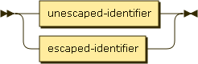

An identifier can either be escaped or unescaped.  Unescaped identifiers cannot support the full range of idenfiers allowed in a JSON document, but do support the most common ones with a simpler syntax.  Escaped identifiers are surrounded with backticks and support all identifiers allowed in JSON.  Using the backtick character within an escaped identifier can be accomplised by use two consecutive backtick characters.

unescaped-identfier:

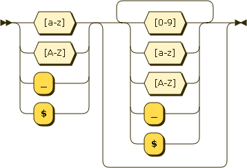

escaped-identfier:

An identifier is a symbolic reference to a particular value in the current context.

If the current context is the document:

    {
    	"name": "unql"
    }

Then the indentifier *name* would evaluate to the value unql.

nested-expr:

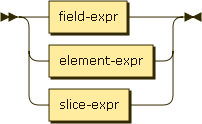

Nested expressions support using the dot (`.`) operator to access fields nested inside of other objects as well as using the bracket notation (`[index]`) to access elements inside an array or object.

Consider the following object:

    {
      "address": {
      	"city": "Mountain View"
      },
      "revisions": [2013]
    }

 The expression `address.city` evalutes to the value `"Mountain View"`.

 The expression `revisions[0]` evaluates to the value `2013`.

case-expr:

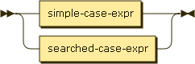

CASE/WHEN/THEN/ELSE/END statements allow for conditional logic within an expression.  The first WHEN expression is evaluated.  If TRUE, the result of this expression is the THEN expression.  If not, subsequent WHEN clauses are evaluated in the same manner.  If none of the WHEN clauses evaluate to TRUE, then the result of the expression is the ELSE expression.  If no ELSE expression was provided, the result is NULL.

collection-expr:

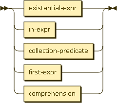

Collection expressions allow you to test boolean expressions against nested collections.  Two variants are supported ANY and ALL.

First, the input array is deteremined by the `path` in the  **OVER** clause.  Elements of the array are iterated through, and assigned the `identifier` in the **AS** clause.  This identifier is only valid while evalutating the expression in the **ANY** or **ALL** clause.

* ANY - if expression evaluates to an array and at least one element in the array satisifies the expression then return TRUE, otherwise FALSE
* ALL - if the expression evaluates to an array and all the elements of the array satisfy the expression, then return TRUE, otherwise FALSE.  if the array is empty, the result is TRUE.

For example, consider a document containing a nested array of addresses objects:

    ... WHERE ANY address.city = "Mountain View" OVER addresses AS address

This would evaluate to TRUE if any of the addresses have the field `city` = `Mountain View`

logical-term:

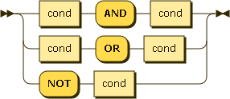

Logical terms allow for combining other expressions using boolean logic.  Standard AND, OR and NOT operators are supported.

### Four-valued logic

In UNQL boolean propositions could evaluate to NULL or MISSING.  The following table describes how these values relate to the logical operators:

<table>
  <tr>
  	<th>A</th>
  	<th>B</th>
  	<th>A and B</th>
  	<th>A or B</th>
  </tr>
  <tr>
  	<td>FALSE</td>
  	<td>FALSE</td>
  	<td>FALSE</td>
  	<td>FALSE</td>
  </tr>
  <tr>
  	<td>FALSE</td>
  	<td>NULL</td>
  	<td>FALSE</td>
  	<td>NULL</td>
  </tr>
  <tr>
  	<td>FALSE</td>
  	<td>MISSING</td>
  	<td>FALSE</td>
  	<td>MISSING</td>
  </tr>
   <tr>
  	<td>FALSE</td>
  	<td>TRUE</td>
  	<td>FALSE</td>
  	<td>TRUE</td>
  </tr>

  <tr>
  	<td>NULL</td>
  	<td>FALSE</td>
  	<td>FALSE</td>
  	<td>NULL</td>
  </tr>
  <tr>
  	<td>NULL</td>
  	<td>NULL</td>
  	<td>NULL</td>
  	<td>NULL</td>
  </tr>
  <tr>
  	<td>NULL</td>
  	<td>MISSING</td>
  	<td>MISSING</td>
  	<td>MISSING</td>
  </tr>
   <tr>
  	<td>NULL</td>
  	<td>TRUE</td>
  	<td>NULL</td>
  	<td>TRUE</td>
  </tr>

  <tr>
  	<td>MISSING</td>
  	<td>FALSE</td>
  	<td>FALSE</td>
  	<td>MISSING</td>
  </tr>
  <tr>
  	<td>MISSING</td>
  	<td>NULL</td>
  	<td>MISSING</td>
  	<td>MISSING</td>
  </tr>
  <tr>
  	<td>MISSING</td>
  	<td>MISSING</td>
  	<td>MISSING</td>
  	<td>MISSING</td>
  </tr>
   <tr>
  	<td>MISSING</td>
  	<td>TRUE</td>
  	<td>MISSING</td>
  	<td>TRUE</td>
  </tr>

  <tr>
  	<td>TRUE</td>
  	<td>FALSE</td>
  	<td>FALSE</td>
  	<td>TRUE</td>
  </tr>
  <tr>
  	<td>TRUE</td>
  	<td>NULL</td>
  	<td>NULL</td>
  	<td>TRUE</td>
  </tr>
  <tr>
  	<td>TRUE</td>
  	<td>MISSING</td>
  	<td>MISSING</td>
  	<td>TRUE</td>
  </tr>
   <tr>
  	<td>TRUE</td>
  	<td>TRUE</td>
  	<td>TRUE</td>
  	<td>TRUE</td>
  </tr>
</table>

<table>
	<tr>
		<th>A</th>
		<th>not A</th>
	</tr>
	<tr>
		<td>FALSE</td>
		<td>TRUE</td>
	</tr>
	<tr>
		<td>NULL</td>
		<td>NULL</td>
	</tr>
	<tr>
		<td>MISSING</td>
		<td>MISSING</td>
	</tr>
	<tr>
		<td>TRUE</td>
		<td>FALSE</td>
	</tr>
</table>

comparison-term:

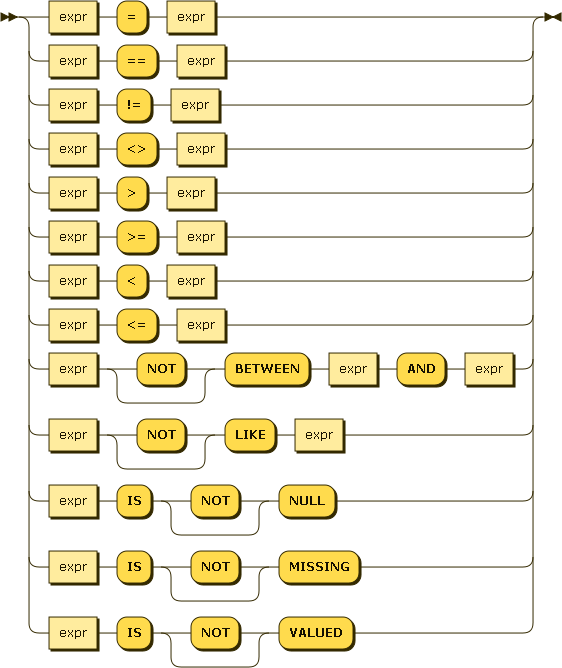

Comparison terms allow for comparing two expressions.  Standard "equal", "not equal", "greater than", "greater than or equal", "less than", and "less than or equal" are supported.

For equal (= and ==) and not equal (!= and <>) two forms are supported to aid in compatibility with other query languages.

If either operand in a comparison is MISSING, the result is MISSING.  Next, if either operand in a comparison is NULL, the result is NULL.  Otherwise the remaining rules for comparing values are followed.

In UNQL a comparison operator implicitly requires that both operands be of the same type.  If the operands are of different types it always evaluates to FALSE.

By default, string comparison is done using a raw collation (sometimes referred to as binary, C, or memcmp).  This collation is **case sensitive**.  Case insensitive comparisons can be performed using UPPER() or LOWER() functions.

The LIKE operator allows for wildcard matching of string values.  The right-hand side of the operator is a pattern, optionally containg '%' and '_' wildcard characters.  Percent (%) matches any string of zero or more characters, underscore (\_) matches any single character.

#### Comparing NULL and MISSING values

The normal comparison operators cannot be used to check for NULL or MISSING values because they do not contain type information.  Instead the following operators are designed specifically to work for these values.

* IS NULL - returns rows where the value of a property is explicitly set to NULL (not missing).
* IS NOT NULL - returns rows which contain a value (not NULL or missing).
* IS MISSING - returns rows where the value of a property is missing (not explicitly set to null).
* IS NOT MISSING - returns rows which contain a value or null.
* IS VALUED - synonym for IS NOT NULL
* IS NOT VALUED - synonym for IS NULL

**NOTE**: IS NULL/IS NOT NULL and IS MISSING/IS NOT MISSING are NOT inverse operators.  See table below:

<table>
	<tr>
		<th></th>
		<th colspan="3">Value</th>
	</tr>
	<tr>
		<th>Operator</th>
    <th>JSON value</th>
		<th>NULL</th>
		<th>MISSING</th>
	</tr>
    <tr>
    	<td>IS NULL</td>
      <td>FALSE</td>
    	<td>TRUE</td>
    	<td>FALSE</td>
    </tr>
    <tr>
    	<td>IS NOT NULL</td>
      <td>TRUE</td>
    	<td>FALSE</td>
    	<td>FALSE</td>
    </tr>
     <tr>
    	<td>IS MISSING</td>
      <td>FALSE</td>
    	<td>FALSE</td>
    	<td>TRUE</td>
    </tr>
    <tr>
    	<td>IS NOT MISSING</td>
      <td>TRUE</td>
    	<td>TRUE</td>
    	<td>FALSE</td>
    </tr>
     <tr>
      <td>IS VALUED</td>
      <td>TRUE</td>
      <td>FALSE</td>
      <td>FALSE</td>
    </tr>
    <tr>
      <td>IS NOT VALUED</td>
      <td>FALSE</td>
      <td>TRUE</td>
      <td>FALSE</td>
    </tr>
</table>

arithmetic-term:

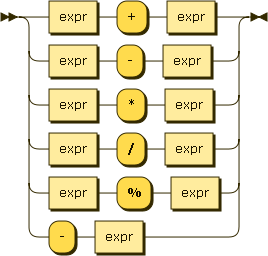

Arithemetic terms allow for performing basic arithmetic within an expression.  The standard addition, subtraction, multiplication, division, and modulo operators are supported.  Additionally, a negation operator will change the sign of the expression.

These arithmetic operators only operate on numeric values.  If either operand is not numeric it will evaluate to NULL.

string-term:

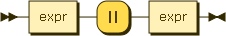

One compound string term is supported, the string concatenation operator.  If both operands are strings, the `||` operator concatenates these strings.  Otherwise the expression evaluates to NULL.

function:

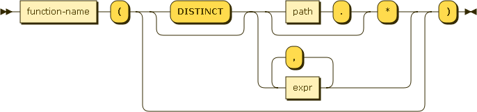

function-name:

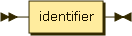

Function names are case in-sensitive.  See Appendix 2 for the list and definition of the supported functions.

### Expression Evaluation

As expressions are evaluated they could become any valid JSON value (or MISSING).

During some phases of executing a query the evaluated value must be considered in a **boolean** context.  These are:

* WHERE clause
* HAVING clause
* any application of BOOLEAN logic (AND, OR, NOT)

When interpretting a non-boolean value in a boolean context, the same rules used by JavaScript are followed.

See [ECMAScript Language Specification Chapter 11 Section 9](http://ecma-international.org/ecma-262/5.1/#sec-11.9)

## Appendix 1 - Identifier Scoping/Ambiguity

Identifiers appear in many places in an UNQL query.  Frequently identifiers are used to described paths within a document, but they are also used in `AS` clauses to introduce new identifiers.

* SELECT - `AS` identifiers in the projection create new names that may be referred to in the SELECT and ORDER BY clauses
* FROM - `AS` identifiers in the FROM clause create new names that may be referred to anywhere in the query
* ANY/ALL collection expressions - `AS` identifiers in collection expressions create names that can **ONLY** be used within this collection expression

Introducing the same identifier using `AS` multiple times in a query results in an error.

When an `AS` identifier collides with a document property in the same scope, the identifier always refers to the `AS` alias and **NOT** the document property.  This allows for consistent behavior in scenarios where an identifier only collides with some of the documents.

The left-most portion of a dotted identifier may refer to the name of the datasource.  For example:

    SELECT beer.name FROM beer

In this query `beer.name` is simply a more formal way of expressing `name`.

If the identifier is the name of a datasource, it refers to the whole object in the current context.  For example

    SELECT * FROM beer WHERE beer = {"name": "bud"}

  This query would perform an exact match of candidate documents from the beer datasource against the specified object literal.

## Appendix 2 - Functions

Function names are case in-sensitive.  The following functions are defined:

CEIL(value) - if value is numeric, returns the smallest integer not less than the value.  otherwise, NULL.

FLOOR(value) - if value is numeric, returns the largest integer not greater than the value.  otherwise, NULL.

GREATEST(expr, expr, ...) - returns the largest value of all the expressions.  if all values are NULL or MISSING returns NULL.

IFMISSING(expr1, expr2, ...) - returns the first non-MISSING value

IFMISSINGORNULL(expr1, expr2, ...) - returns the first non-NULL, non-MISSING value

IFNULL(epxr1, expr2, ...) - returns the first non-NULL value

META() - returns the meta data for the document in the current context

MISSINGIF(value1, value2) - if value1 = value 2, return MISSING, otherwise value1

LEAST(expr, expr, ...) - returns the smallest non-NULL, non-MISSING of all the expressions.  if all valus are NULL or MISSING returns NULL.

LENGTH(expr) - Returns the length of the value after evaluting the expression.  The exact meaning of length depends on the type of the value:

* string - the length of the string
* array - the number of items in the array
* object - the number of key/value pairs in the object
* anything else - null

LOWER(expr) - if expr is a string, the string is returned in all lower case.  otherwise NULL.

LTRIM(expr, character set) - remove the longest string containing only the characters in the specified character set starting at the beginning

NULLIF(value1, value2) - if value1 = value 2, return NULL, otherwise value1

ROUND(value) - if value is numeric, rounds to the nearest integer.  otherwise NULL.  same as ROUND(value, 0)

ROUND(value, digits) - if digits is an integer and value is numeric, rounds the value the specified number of digits. otherwise, NULL.

RTRIM(expr, character set) - remove the longest string containing only the characters in the specified character set starting at the end

SUBSTR(value, position) - if value is a string and position is numeric returns a substring from the position to the end of the string.  string positions always start with 1.  if position is 0, it behaves as if you specified 1.  if position is a positive integer, characters are counted from the begining of the string.  if position is negative, characters are counted from the end of the string.  if value is not a string or position is not an integer, returns NULL.

SUBSTR(value, position, length) - if length is a positive integer behaves identical to SUBSTR(value, position) but only returns at most length characters.  otherwise NULL.

TRIM(expr, character set) - synonym for LTRIM(RTRIM(expr, character set), character set)

TRUNC(value) - if the value is numeric, truncates towards zero.  otherwise NULL.  same as TRUNC(value, 0)

TRUNC(value, digits) - if digits is an integer and value is numeric, truncates to the specific number of digits.  otherwise, NULL.

UPPER(expr) - if expr is a string, the string is return in all upper case.  otherwise NULL.

VALUE() - returns the full value for the item in the current context

### Aggregate Functions

There are 5 aggregate functions, SUM, AVG, COUNT, MIN, and MAX.  Aggregate functions can only be used in SELECT, HAVING, and ORDER BY clauses.  When aggregate functions are used in expressions in these clauses, the query will operate as an aggregate query.  Aggregate functions take one argument, the value over which to compute the aggregate function.  The COUNT function can also take '*' as its argument.

##### Null/Missing/Non-numeric Elimination

If the argument the aggregate function is '*' all rows are considered.
If the argument to the aggregate function is anything else, then if the result of evaluating the expression is Null or Missing, that row is eliminated.

COUNT(expr) - always returns 0 or a positive integer

MIN(expr) - min returns the minimum value of all values in the group.  The minimum value is the first non-NULL, non-MISSING value that would result from an ORDER BY on the same expression.  min returns NULL if there are no non-NULL, non-MISSING values.

MAX(expr) - max returns the maximum values of all values in the group.  The maximum value is the last value that would be returned from an ORDER BY  on the same expression.  max returns NULL if there are no non-NULL, non-MISSING values

For, AVG, and SUM, any row where the result of the expression is non-numieric is also eliminated.

## Appendix 3 - Operator Precedence

The following operators are supported by UNQL.  The list is ordered from highest to lowest precedence.

* CASE/WHEN/THEN/ELSE/END
* . 
* [] 
* \-
* \* / %
* \+ \-
* IS NULL, IS MISSING, IS VALUED
* IS NOT NULL, IS NOT MISSING, IS NOT VALUED
* LIKE
* < <= > >=
* =
* NOT
* AND
* OR

Parentheses, while not strictly speaking an operator, allow for grouping expressions to override the order of operations.  (they have the highest precedence)

## Appendix 4 - Literal JSON Values

The following rules are the same as defined by [json.org](http://json.org/) with two changes:

1.  In standard JSON arrays and objects only contain nested values.  In UNQL, literal arrays and objects can contain nested expressions.
2.  In standard JSON "true", "false" and "null" are case-sensitive.  In UNQL, to be consistent with other keywords, they are defined to be case-insensitive.

literal-value:

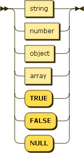

object:

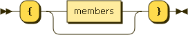

members:

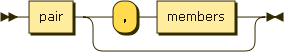

pair:

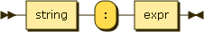

array:

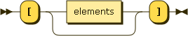

elements:

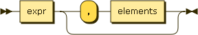

string:

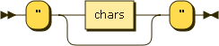

chars:

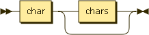

char:

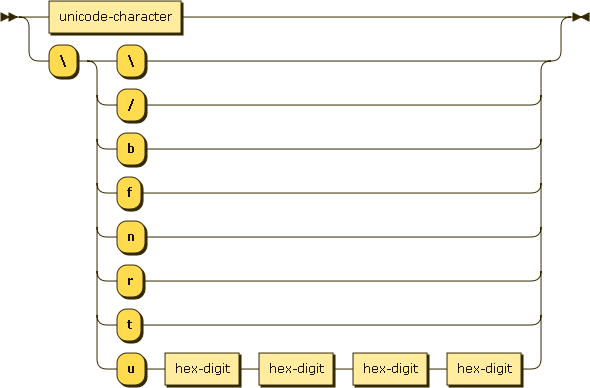

number:

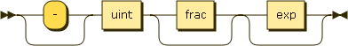

int:

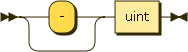

frac:

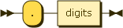

exp:

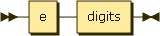

digits:

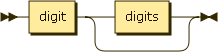

non-zero-digit:

digit:

e:

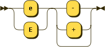

hex-digit:

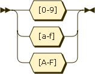

## Appendix 5 - Key/Reserved Words

The following keywords are reserved and cannot be used in document property paths.  All keywords are case-insensitive.

* ALL
* ALTER
* AND
* ANY
* AS
* ASC
* BETWEEN
* BUCKET
* BY
* CASE
* CAST
* COLLATE
* CREATE
* DATABASE
* DELETE
* DESC
* DISTINCT
* DROP
* EACH
* ELSE
* END
* EXCEPT
* EXISTS
* EXPLAIN
* FALSE
* FROM
* GROUP
* HAVING
* IF
* IN
* INLINE
* INSERT
* INTERSECT
* INTO
* IS
* JOIN
* LIKE
* LIMIT
* MISSING
* NOT
* NULL
* OFFSET
* ON
* OR
* ORDER
* OVER
* PATH
* SELECT
* THEN
* TRUE
* UNION
* UNIQUE
* UPDATE
* VALUED
* WHEN
* WHERE

## Appendix 6 - Sample Projections

For the following examples consider a bucket containing the following document with ID "unql-2013"

    {
      "name": "UNQL",
      "address": {
      	"city": "Mountain View"
      },
      "revisions": [2013]
    }

#### Selecting the whole document

`SELECT *`

    {
      "name": "UNQL",
      "address": {
      	"city": "Mountain View"
      },
      "revisions": [2013]
    }

#### Selecting individual field

`SELECT name`

    {
    	"name": "UNQL"
    }

#### Selecting a more complex expression

`SELECT revsions[0] - 13`

    {
    	"revisions[0]-13": 2000
    }

#### Selecting a more complex expression with custom identifier

`SELECT revsions[0] - 13 AS modified_revision`

    {
    	"modified_revision": 2000
    }

#### Selecting the whole document and adding meta-data

`SELECT *, META()`

    {
      "name": "UNQL",
      "address": {
      	"city": "Mountain View"
      },
      "revisions": [2013],
      "meta": {
      	"id": "unql-2013",
      	"cas": "8BADF00DDEADBEEF",
      	"flags": 0,
      	"expiration": 0
      }
    }

#### Selecting the whole document and adding meta-data with custom identifer (to avoid any collisions)

`SELECT *, META() AS custom_meta_field`

    {
      "name": "UNQL",
      "address": {
      	"city": "Mountain View"
      },
      "revisions": [2013],
      "custom_meta_field": {
      	"id": "unql-2013",
      	"cas": "8BADF00DDEADBEEF",
      	"flags": 0,
      	"expiration": 0
      }
    }

#### Building a complex object using literal JSON

SELECT {"thename": name} AS custom_obj

    {
      "custom_obj": {
        "thename": "UNQL"
      }
    }

## About this Document

The [grammar](https://github.com/couchbaselabs/tuqqedin/blob/master/docs/unql-2013.ebnf) forming the basis of this document is written in a [W3C dialect of EBNF](http://www.w3.org/TR/REC-xml/#sec-notation).

This grammar has not yet been converted to an actual implementation, ambiguities and conflicts may still be present.

Diagrams were generated by [Railroad Diagram Generator](http://railroad.my28msec.com/) 

### Document History

* 2013-04-25 - Initial Draft
* 2013-05-10 - Major Revisions based on feedback
    * Many more KEYWORDS documented for future compatibility
    * Document meta-data now accessed through META() function
    * Introduced means of escaping identifiers using backtick
    * Added Operator Precedence Appendix
    * Unified Boolean and Other Expressions, added section on evaluating in Boolean Contexts
    * More clearly documented 4-value logic, and truth values for operators
    * Documented default string collation algorithm
    * Added many commonly found utility functions
    * Documented MIN/MAX to be consistent with ORDER BY
    * Added conditional expressions CASE/WHEN/THEN/ELSE/END
    * Documented new input/output formats of projection
* 2013-05-14 - Minor Revisions based on feedback
    * Clarified object comparison, allowing for deterministic behavior
    * Clarified how DISTINCT values in a projection are determined
    * Added UNIQUE synonym for DISTINCT
    * Removed ALL projection qualifier
    * Duplicate keys in projection triggers warning
    * Changed behavior of IS NOT MISSING to be what users want
    * Clarified that function names are NOT case-senstitive
    * Renamed element_match_* functions to elementmatch*, more consistent with other function names
    * Clarified and gave example of projection containing literal JSON to build complex object
    * Added `||` operator for string concatenation
    * Renamed functions TOUPPER and TOLOWER to UPPER and LOWER
    * Added TRIM, LTRIM and RTRIM functions
    * Allow DISTINCT qualifier to expressions passed to aggregate functions
    * Clarified that COUNT() will never return NULL, always 0 or positive integer
* 2013-05-21 - Additional Revisions
    * Added collection expressions
    * Added FROM clause including OVER/PATH JOIN
    * Added appendinx describing identifier ambiguities
* 2013-05-24 - Additional Revisions
    * IS VALUED/IS NOT VALUED operators added
    * Truth values for all IS/IS NOT NULL/MISSING/VALUED changed
* 2013-05-29 - Additional Revisions
    * Changed to OVER syntax in FROM and collection expressions
    * Changed behavior of dotted expressions referring to arrays in FROM clause
    * Added syntax for dotted identifiers prefixing '*' in projection and function calls

### Open Issues

This meta-section records open issues in this document, and will eventually disappear.

1.  Is there a need to support an alternate projection that doesn not put items into a wrapper object.  (One name proposed for this is SELECT INLINE).  This allows for more streamlined responses, but it requires further specificaiton if the projection is a single value and it evaluates to MISSING (since there is no way to represent this in JSON)  There are further proposals to allow syntax that allows the query author to specify what to do with these undefined values.  Possiblyes

    SELECT INLINE abv WITH MISSING VALUES NULL ...

    SELECT INLINE abv WITH MISSING ELIMINATEd ...

2.  Review truth values for IS/IS NOT NULL/MISSING/VALUED - There is ongoing discussion about what the correct truth value should be.  Here are some of the points being discussed:
  *  Should IS/IS NOT NULL (the most familiar to SQL users) just do what you want, even if that deviates from the natural language meaning of the words
  *  Should IS/IS NOT versions of the operators always imply opposite truth values
  *  As currently defined, IS/IS NOT VALUED is not needed as its truth values are the same as IS NOT/IS NULL (respecitvely)

3.  Should some of the AS keywords be optional?  In SQL there are several places in the grammar where the AS keyword is option.

4.  Document handling of NaN and +/- infinity as these may arise during expression evaluation and cannot be represented in standard JSON.

5.  Introduce a function or operator like ELEMENTSMATCHING() - It should behave the like ANY/ALL collection expressions, but instead of returning a boolean, it returns the set of objects satisfying the sub-expression.

#### Proposal for Array Comprehensions

Array comprehensions are introduced to replace the ELEMENTMATCHING() and FIRSTELEMENTMATCHING() functions.  Unlike the ANY / ALL collection predicates, they return the actual matching elements, instead of a boolean truth value.

Array comprehensions are inspired by Python list comprehensions.  See http://docs.python.org/2/tutorial/datastructures.html#list-comprehensions.

We use 2 separate notations, one to return a single scalar value, and the other to return an array of matching values.

To return the first matching value:

    FIRST expr OVER path AS identifier IF expr

For example:

    FIRST c OVER children AS c IF c.age > 6

IF expr is optional.  OVER [IF] can be chained.

To return all matching values, we use a variant of the literal JSON array constructor:

    [ expr OVER path AS identifier IF expr ]

For example:

    [ c OVER children AS c IF c.age > 6 ]

The brackets [ ] are required.  IF expr is optional.  OVER [IF] can be chained.

To return a single matching element other than the first, use the array version and then subscript the result.  The syntax may be extended later to return at most N matching elements.  Perhaps a LIMIT clause.

NULL, MISSING, non-matching, and non-array inputs are handled in a manner consistent with the rest of the language spec.

NOTE: It’s not clear whether IF, WHEN, or WITH is best, or if more than one variant should be supported.  This is purely aesthetic.

NOTE: Python has the IF after the FOR.  This allows finer-grained filtering of multi-dimensional loops.
