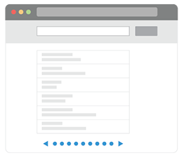

##  Shopper - Browsing products from page to page 

Don enjoys playing golf and he is looking for a driver that will bring a new swing to his game. 

He selects the "golf" category and browses through the available golf gear. The webpage shows 10 items at a time, paging through the result set.   

Get a list of all the golfing products limit by 10, and skip the first 10

<pre id="example">
    SELECT *
	FROM product 
	unnest product.categories as cat
		WHERE lower(cat) in ["golf"] LIMIT 10 OFFSET 10 
</pre>

