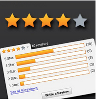

## Shopper - Listing the highest rated products

There are so many choices when it comes to finding the right products, and sometimes it gets overwhelming. To get an un-biased view, why not use product ratings?

Don wants to know the top 5 highly rated products. 

<pre id="example">
	SELECT product.name, round(avg(reviews.rating),1) as avg_rating 
	FROM reviews join product key reviews.productId 
	GROUP BY product 
	ORDER BY avg(reviews.rating) DESC LIMIT 5
</pre>

What you saw was just a handful of queries that were relevant to a shopper, but you can use N1QL for more advanced query scenarios in your applications. In the next few slides, we will go over queries from the merchant point of view. 

