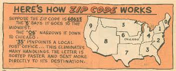

## Merchant - Reporting customers by region

dimestore wants to launch a regional marketing campaign and management wants a report of the number of customers
per region grouped by postal code
 

<pre id="example">
	SELECT count(customer) as customerCount, state
	FROM customer 
	GROUP BY state
	ORDER BY customerCount DESC
</pre>
