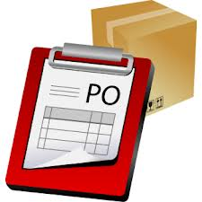

## Merchant - Preparing a purchase order 

Merchants need to keep an eye on important customers, special promotions, popular products and ensure orders are processing as they should be. Let us cover some of these scenarios and learn how N1QL can be used to query relevant data in each case. 

The dispatch team has been notified that an order has been placed and would like to review the purchase order.

<pre id="example">
	SELECT purchases, product, customer 
	FROM purchases KEY "purchase0" UNNEST purchases.lineItems AS items 
        JOIN product KEY items.product
        JOIN customer KEY purchases.customerId
</pre>
