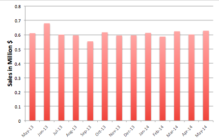

## Merchant - Generating the month-over-month sales report

Sonia, the general manager of dimestore, has asked her sales staff to put together a month-on-month sales report.

Rudy runs the N1QL query to generate the data needed for his report. Try it out.

<pre id="example">
SELECT substr(purchases.purchasedAt, 0, 7) as month, 
	round(sum(product.unitPrice * items.count)/1000000, 3) revenueMillion
FROM purchases unnest purchases.lineItems as items join product key items.product 
GROUP BY substr(purchases.purchasedAt, 0, 7) 
ORDER BY month 
</pre>
